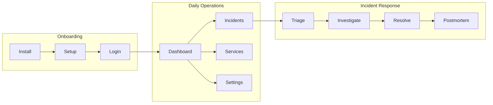
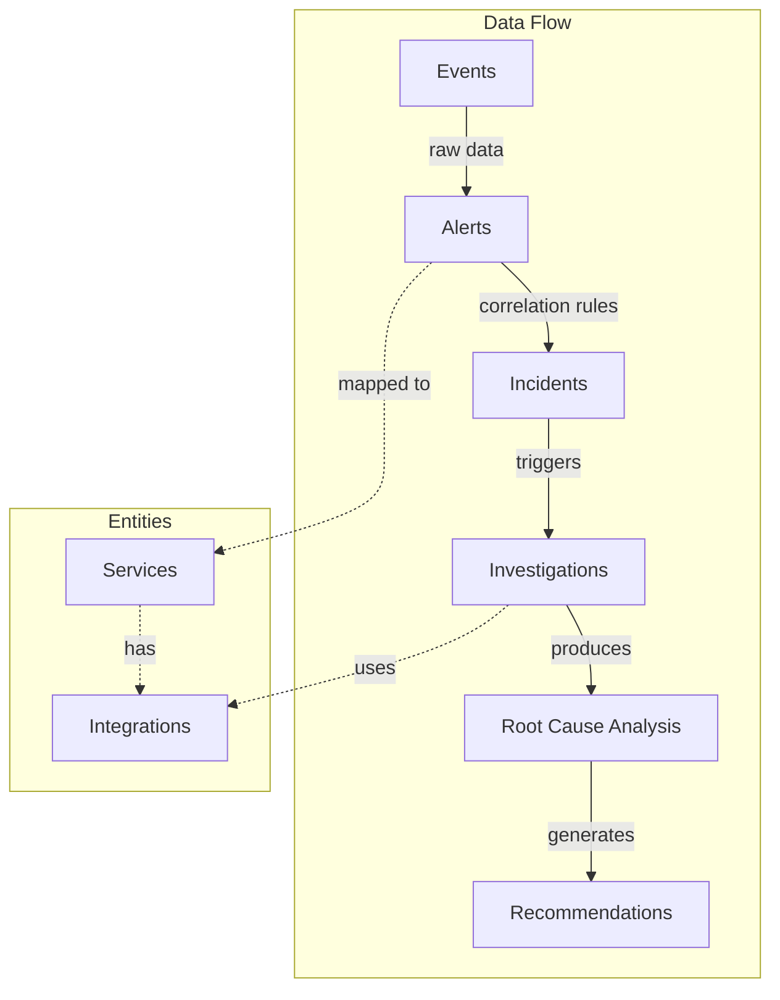
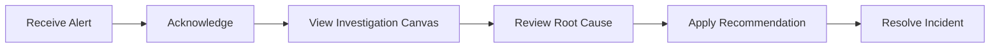
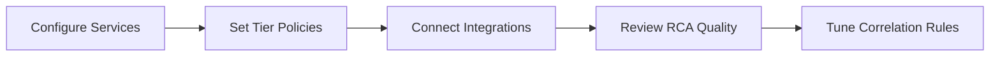
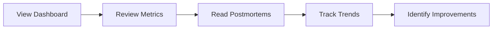

# PrismaLens Overview

## Product Vision

PrismaLens is an **AI-first, open-source incident management and root cause analysis (RCA) platform**. It automates the investigation of production incidents using LLM-powered agents that gather context, analyze patterns, and generate actionable recommendations.

### Key Differentiators

| Feature | PrismaLens | Traditional Tools |
|---------|------------|-------------------|
| **AI-First** | LangGraph agents investigate automatically | Manual runbooks |
| **Open Source** | Self-host, full control, no vendor lock-in | SaaS-only or limited OSS |
| **Topology-Aware** | Understands service dependencies | Flat alert lists |
| **Investigation Canvas** | Visual DAG of AI reasoning | Text-based logs |

## High-Level User Flow

## Core Data Model

### Entity Definitions

| Entity | Description |
|--------|-------------|
| **Event** | Raw data point from monitoring systems |
| **Alert** | Actionable notification derived from events |
| **Incident** | Grouped alerts requiring investigation |
| **Investigation** | AI-driven RCA process using LangGraph |
| **Recommendation** | Suggested action from AI analysis |
| **Postmortem** | Summary attached to resolved incidents |
| **Service** | Application component being monitored |
| **Integration** | Connected external tool (GitHub, Prometheus, Slack) |

## User Personas

PrismaLens serves three primary personas, each with distinct workflows:

### On-Call Engineer

**Goal**: Quickly acknowledge, understand, and resolve production incidents.

**Primary Screens**:
- Dashboard (active incidents)
- Incident Detail (investigation canvas)
- Recommendations panel

**Key Actions**:
- Acknowledge incident
- View AI investigation progress
- Apply or dismiss recommendations
- Resolve and add notes

---

### SRE / Platform Engineer

**Goal**: Configure services, set investigation policies, and improve system reliability.

**Primary Screens**:
- Services catalog
- Service detail (integrations, policies)
- Settings (AI provider, correlation rules)

**Key Actions**:
- Add/edit services with tier classification
- Configure auto-investigation policies
- Set up integrations (GitHub, Prometheus)
- Define correlation rules for alert grouping

---

### Engineering Manager

**Goal**: Monitor team performance, review trends, and ensure postmortems are completed.

**Primary Screens**:
- Dashboard (metrics widgets)
- Incidents list (historical)
- Postmortem reports

**Key Actions**:
- Monitor MTTR/MTTA metrics
- Review completed investigations
- Read and approve postmortems
- Identify recurring issues

---

## Application Routes

| Route | Purpose | Primary Persona |
|-------|---------|-----------------|
| `/` | Dashboard with widgets | All |
| `/setup` | First-time setup wizard | Owner |
| `/login` | Authentication | All |
| `/incidents` | Incidents list | On-call, Manager |
| `/incidents/:id` | Incident detail + canvas | On-call |
| `/services` | Services catalog | SRE |
| `/services/:id` | Service configuration | SRE |
| `/settings` | Global settings | SRE, Owner |
| `/settings/integrations` | Integration management | SRE |
| `/settings/team` | Team management | Owner, Manager |

## Community vs Cloud Edition

| Feature | Community Edition | Cloud Edition |
|---------|-------------------|---------------|
| Self-hosted | Yes | Managed |
| Organizations | Single (implicit) | Multi-org |
| Team members | Unlimited (local) | Unlimited + SSO |
| AI providers | Bring your own key | Included |
| Support | Community | Priority |

The Community Edition provides full functionality for self-hosted deployments with a single implicit organization. Users seeking multi-org support, SSO, and managed infrastructure can upgrade to the Cloud Edition.

## Technology Stack

| Layer | Technology |
|-------|------------|
| Frontend | TanStack Start (SSR), React, shadcn/ui |
| Backend | NestJS, oRPC |
| Database | PostgreSQL (prod), SQLite (dev) |
| AI Agents | LangChain, LangGraph |
| Auth | better-auth |
| Queue | BullMQ (optional) |

## Implementation Status

Track the implementation progress of each user story. Update this section as features are completed.

### Legend
- [x] Completed - UI implemented and functional
- [ ] Pending - Not yet implemented
- [~] Partial - Some features implemented

---

### Story 01: Installation
- [x] CLI quick start documentation
- [x] Docker Compose production setup
- [x] Environment variable configuration

### Story 02: Onboarding
- [ ] Setup wizard - Step 1: Create account
- [ ] Setup wizard - Step 2: Configure AI provider
- [ ] Setup wizard - Step 3: Connect integration
- [ ] Setup complete confirmation

### Story 03: Dashboard
- [x] Stats cards (active incidents, MTTR, alerts)
- [x] Recent incidents widget
- [x] Active investigations widget
- [x] Pending recommendations widget
- [x] Service health summary
- [ ] Empty state for new users

### Story 04: Alerts
- [x] Alerts list page with filters
- [x] Severity badges and status indicators
- [x] Quick actions (acknowledge, view incident)
- [ ] Alert mapping rules configuration
- [ ] Correlation rules configuration
- [ ] Alert detail page

### Story 05: Incidents
- [x] Incidents list page with filters
- [x] Incident detail page with tabs
- [x] Overview tab with correlated alerts
- [x] Timeline tab
- [x] Investigation progress display
- [x] Quick actions (acknowledge, investigate, resolve)
- [ ] Postmortem editor
- [ ] Postmortem auto-population from AI

### Story 06: Investigations
- [x] Investigations list page
- [x] Investigation detail/canvas page
- [x] Agent executions timeline
- [x] Tool execution details
- [x] Real-time status polling
- [ ] ReactFlow canvas visualization
- [ ] Human approval gates UI
- [ ] Node detail panel on click
- [ ] Export graph (PNG, JSON, Markdown)

### Story 07: Services
- [x] Services list page with filters
- [x] Service detail page with tabs
- [x] Overview tab with statistics
- [x] Dependencies tab (upstream/downstream)
- [ ] Create service form
- [ ] Edit service form
- [ ] Integrations tab (per-service)
- [ ] Investigation policy tab
- [ ] Service discovery from integrations

### Story 08: Team
- [ ] Team members list
- [ ] Invite member flow
- [ ] Role management (Owner, Admin, Member, Viewer)
- [ ] On-call schedules list
- [ ] Schedule detail with calendar
- [ ] Escalation policies
- [ ] Incident war room

### Story 09: Integrations
- [ ] Connected integrations list
- [ ] Add integration selection grid
- [ ] GitHub OAuth flow
- [ ] Slack OAuth flow
- [ ] Webhook URLs display (Prometheus, Generic)
- [ ] Integration configuration pages
- [ ] Test connection functionality

### Story 10: Settings
- [ ] AI provider selection (Gemini, OpenAI, Anthropic, Ollama)
- [ ] AI provider configuration form
- [ ] Test AI connection
- [ ] Investigation policies by tier
- [ ] Investigation limits configuration
- [ ] Default notification settings
- [ ] Severity routing configuration
- [ ] Data retention settings
- [ ] Storage usage display
- [ ] Data export functionality
- [ ] Danger zone (reset data, factory reset)

### Story 11: Notifications
- [ ] Notification channels list
- [ ] Add Slack channel (OAuth)
- [ ] Add Email channel (SMTP)
- [ ] Add PagerDuty channel (API key)
- [ ] Add MS Teams channel (webhook)
- [ ] Add Discord channel (webhook)
- [ ] Notification routing rules
- [ ] Event type configuration
- [ ] Quiet hours settings
- [ ] Notification templates

---

### Summary

| Story | Status | Progress |
|-------|--------|----------|
| 01 Installation | Complete | 100% |
| 02 Onboarding | Not Started | 0% |
| 03 Dashboard | Complete | 90% |
| 04 Alerts | Partial | 60% |
| 05 Incidents | Partial | 80% |
| 06 Investigations | Partial | 60% |
| 07 Services | Partial | 50% |
| 08 Team | Not Started | 0% |
| 09 Integrations | Not Started | 0% |
| 10 Settings | Not Started | 0% |
| 11 Notifications | Not Started | 0% |

**Overall Progress**: ~40% of UI features implemented

**Priority for Next Sprint**:
1. Story 02: Onboarding wizard (required for new users)
2. Story 09: Integrations (required for alert ingestion)
3. Story 10: Settings - AI provider (required for investigations)

---

## Next Steps

- [Installation](./01_Installation.md) - Deploy PrismaLens
- [Onboarding](./02_Onboarding.md) - First-time setup
- [Glossary](./13_Glossary.md) - Terminology reference
