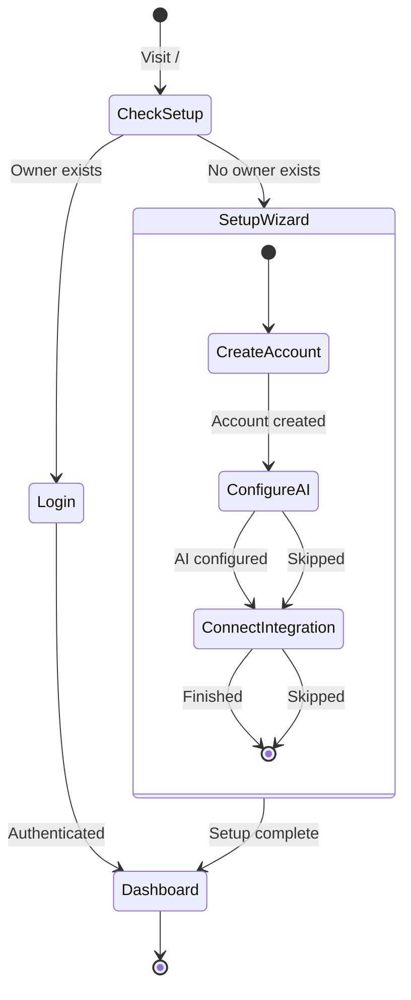

# Onboarding

First-time setup wizard for new PrismaLens installations.

## Overview

When a user opens PrismaLens for the first time, they are guided through a 3-step setup wizard to configure the essential settings before accessing the dashboard.

## User Flow

```mermaid
flowchart TD
    A[First Visit] --> B{Setup Complete?}
    B -->|No| C[/setup]
    B -->|Yes| D[/login]

    subgraph Setup Wizard
        C --> E[Step 1: Create Owner Account]
        E --> F[Step 2: Configure AI Provider]
        F --> G[Step 3: Connect Integration]
        G --> H{Skip?}
        H -->|Yes| I[Dashboard]
        H -->|No| J[OAuth Flow]
        J --> I
    end

    D --> K[Enter Credentials]
    K --> I

    subgraph Community Edition
        CE[Single implicit org]
        CE -.->|upgrade for| CLOUD[Multi-org, SSO, Teams]
    end
```

## Community vs Cloud Edition

| Feature | Community Edition | Cloud Edition |
|---------|-------------------|---------------|
| Organizations | Single (implicit) | Multiple |
| User management | Owner + local users | SSO, SCIM |
| Team invites | Direct add | Email invites |

The Community Edition creates a single implicit organization. Users seeking multi-tenant capabilities should consider the Cloud Edition.

---

## Screens

### Screen 1: Create Owner Account

- **Route**: `/setup`
- **When**: First visit, no users exist
- **Purpose**: Create the administrator account

```
+-------------------------------------------------------------+
|  Welcome to PrismaLens                                       |
|                                                              |
|  AI-powered incident investigation for your applications     |
|                                                              |
|  ---------------------------------------------------------  |
|                                                              |
|  Step 1 of 3: Create Owner Account                          |
|                                                              |
|  Create the administrator account for this instance.         |
|                                                              |
|  +-------------------------------------------------------+  |
|  | Name:      [John Doe                              ]   |  |
|  | Email:     [admin@example.com                     ]   |  |
|  | Password:  [************************              ]   |  |
|  +-------------------------------------------------------+  |
|                                                              |
|                         [Create Account]                     |
|                                                              |
|  ---------------------------------------------------------  |
|  Already have an account? [Log In]                          |
+-------------------------------------------------------------+
```

**Components**:
- Card with header
- Form with Input fields (name, email, password)
- Button (primary)
- Link to login

**Validation**:
- Email: Valid format, unique
- Password: Minimum 8 characters
- Name: Required

**API Interaction**:
- `POST /api/auth/sign-up` - Create owner account

---

### Screen 2: Configure AI Provider

- **Route**: `/setup?step=ai`
- **When**: After account creation
- **Purpose**: Configure the LLM for AI investigations

```
+-------------------------------------------------------------+
|  Step 2 of 3: Configure AI Provider                          |
|                                                              |
|  PrismaLens uses LLMs to analyze incidents. Choose your      |
|  provider and enter your API key.                            |
|                                                              |
|  +-------------------------------------------------------+  |
|  | Provider:  [Google Gemini v]                          |  |
|  |            (*) Google Gemini (Recommended)            |  |
|  |            ( ) OpenAI                                 |  |
|  |            ( ) Anthropic                              |  |
|  |            ( ) Azure OpenAI                           |  |
|  |            ( ) Ollama (Local)                         |  |
|  +-------------------------------------------------------+  |
|                                                              |
|  +-------------------------------------------------------+  |
|  | API Key:   [******************************]           |  |
|  |            Get a key: https://aistudio.google.com     |  |
|  +-------------------------------------------------------+  |
|                                                              |
|  +-------------------------------------------------------+  |
|  | Model:     [gemini-2.0-flash v]                       |  |
|  +-------------------------------------------------------+  |
|                                                              |
|                    [Test Connection]  [Continue]             |
|                                                              |
|  ---------------------------------------------------------  |
|  [Skip and configure later]                                 |
+-------------------------------------------------------------+
```

**Components**:
- Card with stepper
- RadioGroup for provider selection
- Input (password type) for API key
- Select for model
- Button (test connection)
- Button (primary, continue)
- Link (skip)

**Provider Options**:

| Provider | API Key Required | Models |
|----------|------------------|--------|
| Google Gemini | Yes | gemini-2.0-flash, gemini-2.0-pro |
| OpenAI | Yes | gpt-4o, gpt-4o-mini |
| Anthropic | Yes | claude-sonnet-4-20250514, claude-3-5-haiku-20241022 |
| Azure OpenAI | Yes + Endpoint | Configurable |
| Ollama | No (local) | llama3.2, mistral, etc. |

**API Interaction**:
- `POST /api/settings` - Save AI provider configuration
- `POST /api/settings/ai/test` - Test connection

---

### Screen 3: Connect First Integration (Optional)

- **Route**: `/setup?step=integration`
- **When**: After AI provider configuration
- **Purpose**: Quick-start by connecting a data source

```
+-------------------------------------------------------------+
|  Step 3 of 3: Connect Your First Tool (Optional)            |
|                                                              |
|  Connect a tool to give PrismaLens context for analysis.     |
|                                                              |
|  +--------------+  +--------------+  +--------------+       |
|  |   GitHub     |  |  Prometheus  |  |    Slack     |       |
|  |   [icon]     |  |    [icon]    |  |    [icon]    |       |
|  |  Code/Git    |  |   Metrics    |  | Notifications|       |
|  |  [Connect]   |  |  [Connect]   |  |  [Connect]   |       |
|  +--------------+  +--------------+  +--------------+       |
|                                                              |
|  You can add more integrations later in Settings.            |
|                                                              |
|             [Skip for now]    [Go to Dashboard]              |
+-------------------------------------------------------------+
```

**Components**:
- Card grid with integration options
- Each card: Icon, title, description, connect button
- Skip button
- Primary button (finish)

**Integration Options**:

| Integration | Purpose | Connection Method |
|-------------|---------|-------------------|
| GitHub | Code context, commits | OAuth |
| Prometheus | Metrics queries | Webhook URL |
| Slack | Notifications | OAuth |

**API Interaction**:
- `GET /api/oauth/:provider/authorize` - Start OAuth flow
- `POST /api/integrations/connections` - Save connection

---

### Screen: Login

- **Route**: `/login`
- **When**: Setup complete, user needs to authenticate
- **Purpose**: Authenticate returning users

```
+-------------------------------------------------------------+
|  Welcome back to PrismaLens                                  |
|                                                              |
|  +-------------------------------------------------------+  |
|  | Email:     [admin@example.com                     ]   |  |
|  | Password:  [************************              ]   |  |
|  +-------------------------------------------------------+  |
|                                                              |
|  [x] Remember me                                            |
|                                                              |
|                           [Sign In]                          |
|                                                              |
|  ---------------------------------------------------------  |
|  [Forgot password?]                                         |
+-------------------------------------------------------------+
```

**Components**:
- Card with logo
- Form (email, password)
- Checkbox (remember me)
- Button (primary)
- Link (forgot password)

**API Interaction**:
- `POST /api/auth/sign-in` - Authenticate user

---

## State Machine



---

## API Interactions

| Endpoint | Method | Purpose | Status |
|----------|--------|---------|--------|
| `/api/setup/status` | GET | Check if setup complete | Needs Implementation |
| `/api/auth/sign-up` | POST | Create owner account | Implemented (better-auth) |
| `/api/auth/sign-in` | POST | Authenticate user | Implemented (better-auth) |
| `/api/settings` | POST | Save AI provider config | Implemented |
| `/api/settings/ai/test` | POST | Test AI connection | Needs Implementation |
| `/api/oauth/:provider/authorize` | GET | Start OAuth flow | Implemented |

---

## Acceptance Criteria

- [ ] User can create owner account with email/password
- [ ] User can configure AI provider with API key
- [ ] User can test AI connection before continuing
- [ ] User can skip AI configuration and configure later
- [ ] User can connect GitHub, Prometheus, or Slack integrations
- [ ] User can skip integration step
- [ ] After setup, user is redirected to dashboard
- [ ] Returning users see login screen, not setup wizard
- [ ] Invalid API keys show clear error message

---

## Test Scenarios

1. **Happy path - Full setup**
   - Create account -> Configure Gemini -> Connect GitHub -> Dashboard

2. **Minimal setup**
   - Create account -> Skip AI -> Skip integration -> Dashboard (limited functionality)

3. **Returning user**
   - Visit / -> Redirected to /login -> Sign in -> Dashboard

4. **Invalid API key**
   - Enter invalid key -> Test connection -> Show error -> Allow retry

5. **OAuth failure**
   - Start GitHub OAuth -> Cancel -> Return to integration step

---

## Related Documentation

- [Installation](./01_Installation.md) - Deploy PrismaLens first
- [Settings](./10_Settings.md) - Configure AI provider later
- [Integrations](./09_Integrations.md) - Add more integrations
