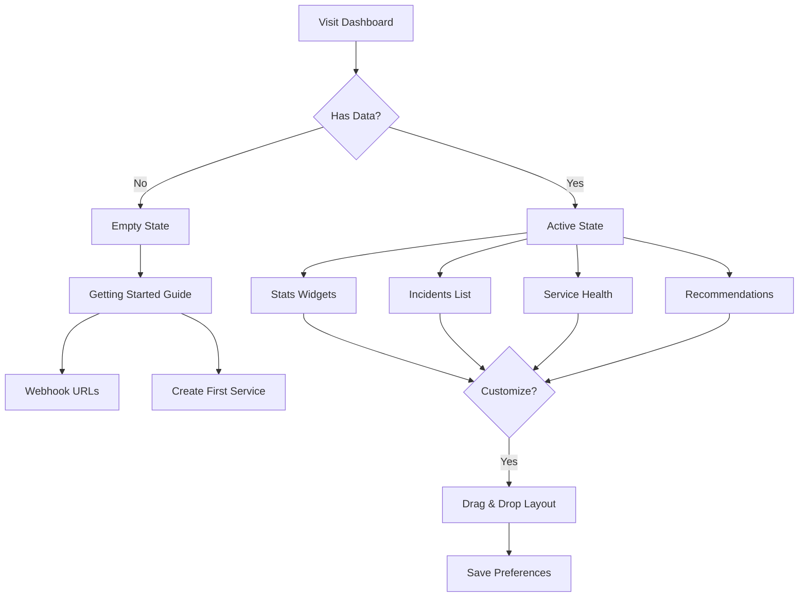

# Dashboard

The main dashboard provides an at-a-glance view of system health, active incidents, and AI investigations.

## Overview

The dashboard uses a **default template layout** that users can customize later. Widgets display real-time data from the PrismaLens API.

## User Flow



---

## Default Template Layout

The dashboard starts with a default widget arrangement that users can customize:

```
+-------------------+-------------------+
| Active Incidents  | Service Health    |
| (Stats Card)      | (Health Matrix)   |
+-------------------+-------------------+
| Recent Alerts     | AI Investigations |
| (Timeline)        | (Queue)           |
+-------------------+-------------------+
| Recommendations Pending               |
| (Action List)                         |
+---------------------------------------+
```

### Widget Customization

- **Drag & drop** to rearrange widgets
- **Resize** widgets (1x1, 2x1, 1x2, 2x2)
- **Add/remove** widgets from available set
- Layout saved per user in local storage

---

## Screens

### Empty State Dashboard

- **Route**: `/`
- **When**: Fresh install, no alerts/incidents yet
- **Purpose**: Guide users to set up their first integration

```
+-------------------------------------------------------------+
|  [Logo] PrismaLens    Dashboard  Incidents  Services  Settings
+---------------------------------------------------------+---+
|                                                              |
|  +--------------------------------------------------------+ |
|  |  Welcome to PrismaLens!                                 | |
|  |                                                          | |
|  |  Get started by setting up your first webhook:          | |
|  |                                                          | |
|  |  1. Create a Service for your application               | |
|  |  2. Copy the webhook URL                                | |
|  |  3. Configure your monitoring tool to send alerts       | |
|  |                                                          | |
|  |  [Create First Service]    [View Documentation]         | |
|  +--------------------------------------------------------+ |
|                                                              |
|  +--------------------------------------------------------+ |
|  |  Webhook Endpoints                                      | |
|  |  --------------------------------------------------------| |
|  |  Generic:    POST /api/webhooks/generic         [Copy]  | |
|  |  Prometheus: POST /api/webhooks/prometheus      [Copy]  | |
|  |  GitHub:     POST /api/webhooks/github          [Copy]  | |
|  +--------------------------------------------------------+ |
|                                                              |
+-------------------------------------------------------------+
```

**Components**:
- Card (welcome message)
- Button (create service)
- Button (documentation link)
- Card (webhook endpoints with copy buttons)

---

### Active State Dashboard

- **Route**: `/`
- **When**: System has active incidents/alerts
- **Purpose**: Overview of current system state

```
+-------------------------------------------------------------+
|  [Logo] PrismaLens    Dashboard  Incidents  Services  Settings
+---------------------------------------------------------+---+
|                                                              |
|  +------------+ +------------+ +------------+ +-----------+  |
|  | Active     | | Investigating| | Resolved  | | MTTR     |  |
|  | Incidents  | |             | | Today     | |          |  |
|  |    12      | |      3      | |    8      | |   23min  |  |
|  | +4 from    | |             | |           | | -12% from|  |
|  | yesterday  | |             | |           | | last week|  |
|  +------------+ +------------+ +------------+ +-----------+  |
|                                                              |
|  +---------------------------+ +---------------------------+ |
|  | Recent Incidents   [All]  | | Service Health            | |
|  |---------------------------| |---------------------------| |
|  | * INC-42 High CPU         | | * api-gateway    [***-] 3 | |
|  |   Critical - 12 min ago   | | * user-service   [**--] 2 | |
|  |   [Investigating]         | | * payment-api    [----] 0 | |
|  |                           | | * bg-jobs        [*---] 1 | |
|  | * INC-41 DB Timeouts      | |                           | |
|  |   High - 28 min ago       | |                           | |
|  |   [Triggered]             | |                           | |
|  +---------------------------+ +---------------------------+ |
|                                                              |
|  +---------------------------+ +---------------------------+ |
|  | AI Investigations         | | Pending Recommendations   | |
|  |---------------------------| |---------------------------| |
|  | * INC-42 Analyzing...     | | 5 recommendations await   | |
|  |   87% complete            | | your review               | |
|  | * INC-41 Gathering...     | |                           | |
|  |   23% complete            | | [Review All]              | |
|  +---------------------------+ +---------------------------+ |
|                                                              |
+-------------------------------------------------------------+
```

**Components**:
- Stats cards (4x grid)
- Recent incidents list with status badges
- Service health matrix (bar indicators)
- AI investigation queue with progress
- Pending recommendations card

---

## Available Widgets

| Widget | Size | Description | API |
|--------|------|-------------|-----|
| **Stats Cards** | 4x1 | Active, Investigating, Resolved, MTTR | `/api/incidents/stats` |
| **Recent Incidents** | 1x2 | Latest incidents with status | `/api/incidents?limit=5` |
| **Service Health** | 1x1 | Services with active alert count | `/api/services` |
| **AI Investigations** | 1x1 | In-progress investigations | `/api/investigations?status=active` |
| **Pending Recommendations** | 1x1 | Unreviewed AI suggestions | `/api/recommendations?status=pending` |
| **Recent Alerts** | 1x1 | Alert timeline | `/api/alerts?limit=10` |
| **MTTR Trend** | 1x1 | Resolution time chart | `/api/metrics/mttr` |
| **Incidents by Severity** | 1x1 | Pie chart breakdown | `/api/incidents/stats` |

---

## Stats Cards Detail

### Active Incidents
- Count of incidents in Triggered or Acknowledged state
- Comparison to previous day
- Color: Red if > threshold

### Investigating
- Count of incidents with active AI investigation
- No comparison (real-time only)

### Resolved Today
- Count of incidents resolved in last 24h
- Comparison to same day last week

### MTTR (Mean Time to Resolve)
- Average resolution time in minutes
- Trend arrow and percentage change

---

## Service Health Widget

Shows active incident count per service:

```
+---------------------------+
| Service Health            |
|---------------------------|
| api-gateway    [****] 4   |  <- Critical (red)
| user-service   [**--] 2   |  <- Warning (yellow)
| payment-api    [----] 0   |  <- Healthy (green)
| background-jobs[*---] 1   |  <- Warning (yellow)
+---------------------------+
```

**Health Thresholds**:
- 0 incidents: Green (healthy)
- 1-2 incidents: Yellow (warning)
- 3+ incidents: Red (critical)

---

## AI Investigations Widget

Shows active LangGraph investigations:

```
+---------------------------+
| AI Investigations         |
|---------------------------|
| INC-42 High CPU           |
| Analyzer: 87% [========>] |
| Root cause identified     |
|                           |
| INC-41 DB Timeouts        |
| Gatherer: 23% [==>      ] |
| Collecting logs...        |
+---------------------------+
```

**States**:
- Gathering (yellow)
- Analyzing (blue)
- Recommending (green)
- Waiting Approval (purple)

---

## API Interactions

| Endpoint | Method | Purpose | Status |
|----------|--------|---------|--------|
| `/api/incidents/stats` | GET | Incident statistics | Implemented |
| `/api/incidents` | GET | Recent incidents | Implemented |
| `/api/services` | GET | Service list with health | Implemented |
| `/api/investigations` | GET | Active investigations | Implemented |
| `/api/recommendations` | GET | Pending recommendations | Implemented |
| `/api/alerts` | GET | Recent alerts | Implemented |
| `/api/metrics/mttr` | GET | MTTR metrics | Needs Implementation |

---

## Acceptance Criteria

- [ ] Empty state shows welcome message and webhook URLs
- [ ] Active state shows stats cards with real-time data
- [ ] Clicking incident navigates to incident detail
- [ ] Clicking service navigates to service detail
- [ ] Widgets refresh automatically (polling or WebSocket)
- [ ] User can drag-drop to rearrange widgets
- [ ] Layout persists after page refresh
- [ ] Mobile view stacks widgets vertically

---

## Test Scenarios

1. **Fresh install**
   - Dashboard shows empty state
   - Webhook URLs are copyable
   - "Create First Service" navigates to /services/new

2. **Active incidents**
   - Stats cards show correct counts
   - Incidents list shows most recent first
   - Status badges are color-coded

3. **Widget customization**
   - Drag widget to new position
   - Refresh page -> layout preserved
   - Reset layout -> returns to default

4. **Real-time updates**
   - New incident appears without refresh
   - Investigation progress updates live

---

## Related Documentation

- [Incidents](./05_Incidents.md) - Incident management
- [Investigations](./06_Investigations.md) - AI investigation canvas
- [Services](./07_Services.md) - Service configuration
