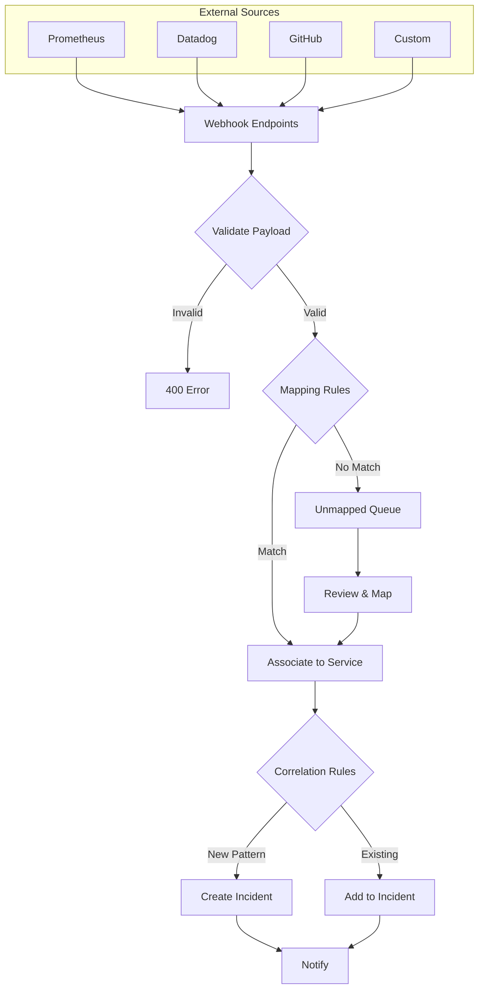
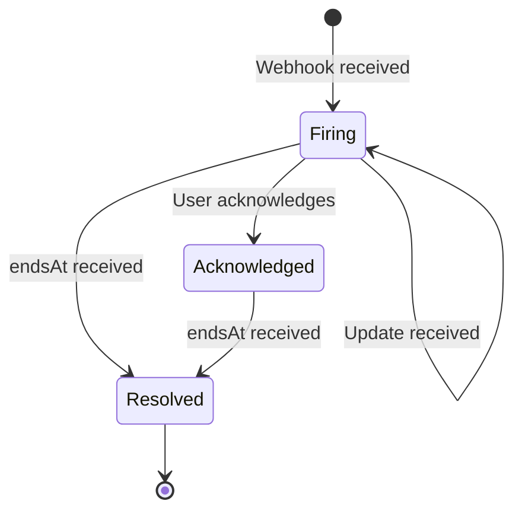
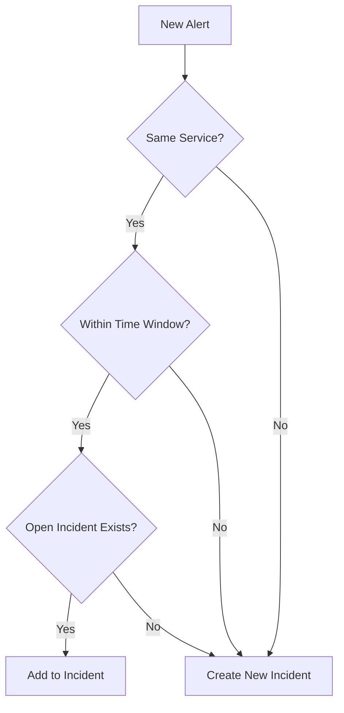

# Alerts

Alert ingestion, mapping, and correlation into incidents.

## Overview

Alerts are the primary input to PrismaLens. They arrive via webhooks from external monitoring systems (Prometheus, Datadog, etc.) and are mapped to services, then correlated into incidents.

## User Flow



---

## Webhook Endpoints

PrismaLens provides global webhook endpoints for alert ingestion:

| Endpoint | Format | Source |
|----------|--------|--------|
| `POST /api/webhooks/generic` | JSON | Any system |
| `POST /api/webhooks/prometheus` | AlertManager | Prometheus |
| `POST /api/webhooks/github` | GitHub Events | GitHub |

### Generic Webhook Payload

```json
{
  "alertName": "HighCPUUsage",
  "severity": "critical",
  "status": "firing",
  "labels": {
    "service": "api-gateway",
    "instance": "api-01",
    "env": "production"
  },
  "annotations": {
    "summary": "CPU usage above 90%",
    "description": "Instance api-01 CPU at 94%"
  },
  "startsAt": "2025-01-01T10:00:00Z",
  "endsAt": null
}
```

### Prometheus AlertManager Payload

```json
{
  "status": "firing",
  "alerts": [
    {
      "status": "firing",
      "labels": {
        "alertname": "HighCPUUsage",
        "severity": "critical",
        "service": "api-gateway"
      },
      "annotations": {
        "summary": "CPU usage above 90%"
      },
      "startsAt": "2025-01-01T10:00:00Z",
      "generatorURL": "http://prometheus:9090/graph"
    }
  ]
}
```

---

## Alert States



| State | Description |
|-------|-------------|
| `firing` | Alert is active, condition present |
| `acknowledged` | User has seen the alert |
| `resolved` | Alert condition no longer present |

---

## Screens

### Alerts List

- **Route**: `/alerts`
- **Purpose**: View and filter incoming alerts

```
+-------------------------------------------------------------+
|  Alerts                                    [Filters] [Export] |
+-------------------------------------------------------------+
|  Status: [All v]  Severity: [All v]  Service: [All v]       |
|  Date Range: [Last 24h v]                                    |
+-------------------------------------------------------------+
|                                                              |
|  * HighCPUUsage                              12 min ago     |
|    api-gateway - Critical - Firing                           |
|    CPU usage above 90%                                       |
|    [View] [Link to Incident]                                 |
|                                                              |
|  * DatabaseTimeout                           28 min ago     |
|    user-service - High - Acknowledged                        |
|    Connection timeout after 30s                              |
|    [View] [Link to Incident]                                 |
|                                                              |
|  * MemoryLeak                                1 hour ago     |
|    background-jobs - Medium - Resolved                       |
|    Memory usage exceeds 85%                                  |
|    [View]                                                    |
|                                                              |
+-------------------------------------------------------------+
|  Showing 1-10 of 156 alerts          [<] [1] [2] [3] [>]    |
+-------------------------------------------------------------+
```

**Components**:
- Filter bar (status, severity, service, date range)
- Alert cards with metadata
- Pagination
- Export button

**Filters**:
- Status: All, Firing, Acknowledged, Resolved
- Severity: All, Critical, High, Medium, Low, Info
- Service: Dropdown of all services
- Date Range: Last hour, 24h, 7 days, 30 days, Custom

---

### Alert Detail

- **Route**: `/alerts/:id`
- **Purpose**: View full alert details and linked incident

```
+-------------------------------------------------------------+
|  Alert: HighCPUUsage                                        |
|  Status: Firing    Severity: Critical    Service: api-gateway|
+-------------------------------------------------------------+
|                                                              |
|  Summary                                                     |
|  -------                                                     |
|  CPU usage above 90%                                         |
|                                                              |
|  Description                                                 |
|  -----------                                                 |
|  Instance api-01 CPU at 94% for the last 5 minutes          |
|                                                              |
|  Labels                                                      |
|  ------                                                      |
|  service: api-gateway                                        |
|  instance: api-01                                            |
|  env: production                                             |
|  region: us-east-1                                           |
|                                                              |
|  Timeline                                                    |
|  --------                                                    |
|  10:00:00  Alert received                                    |
|  10:00:01  Mapped to service: api-gateway                    |
|  10:00:02  Correlated to incident: INC-42                    |
|  10:05:00  Update received (still firing)                    |
|                                                              |
|  Linked Incident                                             |
|  ---------------                                             |
|  [INC-42] High CPU usage on api-gateway          [View]     |
|                                                              |
+-------------------------------------------------------------+
```

**Components**:
- Header with status badge
- Metadata cards (summary, description, labels)
- Timeline of events
- Link to incident

---

## Alert Mapping Rules

Mapping rules associate incoming alerts to services based on label values.

### Mapping Rules Screen

- **Route**: `/settings/alert-mapping`
- **Purpose**: Configure how alerts map to services

```
+-------------------------------------------------------------+
|  Alert Mapping Rules                              [Add Rule] |
+-------------------------------------------------------------+
|                                                              |
|  Rule 1: Service Label                                      |
|  Condition: labels.service == <service_name>                |
|  Priority: 1 (highest)                                       |
|  Matches: 95% of alerts                           [Edit] [X] |
|                                                              |
|  Rule 2: App Label                                          |
|  Condition: labels.app == <service_name>                    |
|  Priority: 2                                                 |
|  Matches: 3% of alerts                            [Edit] [X] |
|                                                              |
|  Rule 3: Job Label (Prometheus)                             |
|  Condition: labels.job == <service_name>                    |
|  Priority: 3                                                 |
|  Matches: 2% of alerts                            [Edit] [X] |
|                                                              |
+-------------------------------------------------------------+
|  Unmapped Alerts: 5                    [Review Unmapped]    |
+-------------------------------------------------------------+
```

### Default Mapping Rules

| Priority | Condition | Description |
|----------|-----------|-------------|
| 1 | `labels.service` | Direct service name match |
| 2 | `labels.app` | Kubernetes app label |
| 3 | `labels.job` | Prometheus job name |

### Unmapped Alerts

When an alert doesn't match any mapping rule:
1. Alert goes to "Unmapped" queue
2. User can manually assign to service
3. User can create new mapping rule

---

## Correlation Rules

Correlation rules group related alerts into a single incident.

### Correlation Rules Screen

- **Route**: `/settings/correlation-rules`
- **Purpose**: Configure alert grouping

```
+-------------------------------------------------------------+
|  Correlation Rules                                [Add Rule] |
+-------------------------------------------------------------+
|                                                              |
|  Rule 1: Same Service + Time Window                         |
|  Group alerts from same service within 5 minutes            |
|  Creates: 1 incident per service per window                 |
|                                               [Edit] [X]     |
|                                                              |
|  Rule 2: Same Alert Name                                    |
|  Group alerts with same alertname across services           |
|  Creates: 1 incident per unique alert                       |
|                                               [Edit] [X]     |
|                                                              |
+-------------------------------------------------------------+
```

### Correlation Logic



---

## API Interactions

| Endpoint | Method | Purpose | Status |
|----------|--------|---------|--------|
| `/api/webhooks/generic` | POST | Receive generic alerts | Implemented |
| `/api/webhooks/prometheus` | POST | Receive AlertManager alerts | Needs Implementation |
| `/api/webhooks/github` | POST | Receive GitHub events | Implemented |
| `/api/alerts` | GET | List alerts | Implemented |
| `/api/alerts/:id` | GET | Get alert detail | Implemented |
| `/api/alert-mapping-rules` | GET | List mapping rules | Implemented |
| `/api/alert-mapping-rules` | POST | Create mapping rule | Implemented |
| `/api/correlation-rules` | GET | List correlation rules | Implemented |
| `/api/correlation-rules` | POST | Create correlation rule | Implemented |

---

## Acceptance Criteria

- [ ] Webhook endpoints accept and validate payloads
- [ ] Alerts are mapped to services using rules
- [ ] Unmapped alerts appear in review queue
- [ ] Correlated alerts create/update incidents
- [ ] Alert list supports filtering and pagination
- [ ] Alert detail shows full metadata and timeline
- [ ] Users can create custom mapping rules
- [ ] Users can create custom correlation rules

---

## Test Scenarios

1. **Valid Prometheus alert**
   - POST to /api/webhooks/prometheus
   - Alert created with correct labels
   - Mapped to service via `service` label
   - Incident created or updated

2. **Unmapped alert**
   - POST alert with unknown service label
   - Alert goes to unmapped queue
   - User manually assigns to service
   - Creates new mapping rule

3. **Alert correlation**
   - POST multiple alerts for same service within 5 min
   - All alerts grouped into single incident
   - Incident alert count updates

4. **Alert resolution**
   - POST alert with status: resolved
   - Alert state changes to resolved
   - If all alerts resolved, incident can be resolved

---

## Related Documentation

- [Incidents](./05_Incidents.md) - Incident lifecycle
- [Services](./07_Services.md) - Service configuration
- [Integrations](./09_Integrations.md) - Webhook setup
