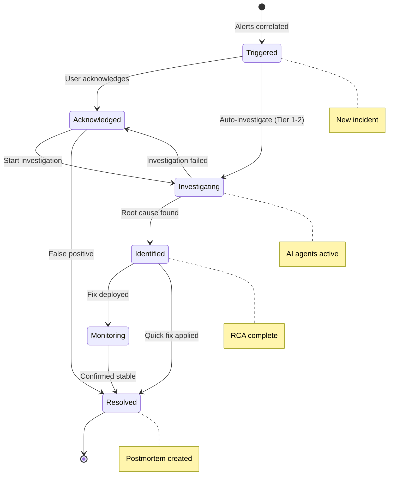
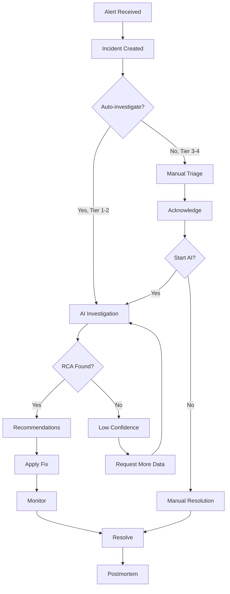

# Incidents

Incident management from creation through resolution and postmortem.

## Overview

Incidents are the primary unit of work in PrismaLens. They are created when alerts are correlated, investigated by AI agents, and resolved with recommendations and postmortems.

## Incident Lifecycle



### Status Definitions

| Status | Icon | Description |
|--------|------|-------------|
| `triggered` | ⚪ | New incident, awaiting acknowledgment |
| `acknowledged` | 🟡 | User has seen the incident |
| `investigating` | 🔄 | AI investigation in progress |
| `identified` | 🎯 | Root cause found |
| `monitoring` | 👁️ | Fix deployed, monitoring stability |
| `resolved` | ✅ | Incident closed |

---

## User Flow



---

## Screens

### Incidents List

- **Route**: `/incidents`
- **Purpose**: View and filter all incidents

```
+-------------------------------------------------------------+
|  Incidents                                         [Export]  |
+-------------------------------------------------------------+
|  [All] [Active] [Investigating] [Resolved]     Search...    |
|                                                              |
|  Filters: [Severity v] [Service v] [Date Range v] [Clear]   |
+-------------------------------------------------------------+
|                                                              |
|  # | Title                    | Severity | Service   |Status|
|  --|--------------------------|----------|-----------|------|
|  42| High CPU usage on api-gw | Critical | api-gateway| [*] |
|  41| DB connection timeouts   | High     | user-svc  | [O]  |
|  40| Memory leak in worker    | Medium   | bg-jobs   | [v]  |
|  39| Slow response times      | Low      | api-gw    | [v]  |
|                                                              |
+-------------------------------------------------------------+
|  Showing 1-10 of 42 incidents          [<] [1] [2] [3] [>]  |
+-------------------------------------------------------------+

Legend: [*] = Investigating  [O] = Triggered  [v] = Resolved
```

**Components**:
- Tab bar (status filters)
- Search input
- Filter dropdowns (severity, service, date)
- Data table with sortable columns
- Pagination

**Columns**:
- ID (link to detail)
- Title
- Severity (badge with color)
- Service (link)
- Status (icon + text)
- Created (relative time)
- Alerts count

---

### Incident Detail - Before Investigation

- **Route**: `/incidents/:id`
- **When**: Incident not yet investigated
- **Purpose**: View incident details and start investigation

```
+-------------------------------------------------------------+
|  <- Back to Incidents                                        |
|                                                              |
|  INC-42: High CPU usage on api-gateway                      |
|  ========================================================== |
|                                                              |
|  Status: Triggered    Severity: Critical    Priority: P1    |
|  Service: api-gateway    Created: Dec 31, 2025 10:42 AM     |
|                                                              |
|  +--------------------------------------------------------+ |
|  | [Investigate with AI]    [Acknowledge]    [Resolve]     | |
|  +--------------------------------------------------------+ |
|                                                              |
|  [Overview] [Alerts (5)] [Timeline] [Settings]              |
|  ---------------------------------------------------------- |
|                                                              |
|  Description                                                 |
|  -----------                                                 |
|  CPU usage on api-gateway pods exceeded 90% threshold       |
|  for more than 5 minutes. Multiple pods affected.           |
|                                                              |
|  Correlated Alerts                                          |
|  -----------------                                          |
|  * HighCPUUsage - pod-1 - 95% CPU (5 min ago)              |
|  * HighCPUUsage - pod-2 - 92% CPU (4 min ago)              |
|  * HighMemory - pod-1 - 88% memory (3 min ago)             |
|  * SlowResponse - /api/users - p99 > 2s (2 min ago)        |
|  * ErrorRate - 5xx errors > 5% (1 min ago)                 |
|                                                              |
|  Affected Service                                           |
|  ----------------                                           |
|  api-gateway (Tier 1 - Critical)                           |
|  Repository: org/api-gateway                                |
|  Team: Platform Team                                        |
|                                                              |
+-------------------------------------------------------------+
```

**Components**:
- Back navigation
- Header with incident ID and title
- Status badges
- Action buttons (Investigate, Acknowledge, Resolve)
- Tab navigation (Overview, Alerts, Timeline, Settings)
- Alert list with expandable details
- Service card with links

---

### Incident Detail - Investigation In Progress

- **Route**: `/incidents/:id`
- **When**: AI investigation running
- **Purpose**: Monitor investigation progress

```
+-------------------------------------------------------------+
|  INC-42: High CPU usage on api-gateway                      |
|  ========================================================== |
|                                                              |
|  Status: Investigating    Severity: Critical                |
|                                                              |
|  +--------------------------------------------------------+ |
|  |  AI Investigation in Progress                           | |
|  |  ====================================================== | |
|  |                                                          | |
|  |  [==============================>          ] 72%        | |
|  |                                                          | |
|  |  Current: Analyzing root cause...                       | |
|  |                                                          | |
|  |  [v] Alert validation completed                         | |
|  |  [v] Context gathered (logs, code, metrics)             | |
|  |  [*] Analyzing root cause...                            | |
|  |  [ ] Generating recommendations                         | |
|  |                                                          | |
|  |  Started: 2 min ago                     [Cancel]        | |
|  +--------------------------------------------------------+ |
|                                                              |
|  Live Agent Activity                                        |
|  -------------------                                        |
|  10:44:32  Gatherer: Reading file src/routes/users.ts      |
|  10:44:31  Gatherer: Searching for "memory leak"           |
|  10:44:28  Gatherer: Fetching recent commits               |
|  10:44:25  Alert Agent: Normalized 5 alerts                |
|  10:44:22  Investigation started                           |
|                                                              |
|  [View Full Canvas]                                         |
|                                                              |
+-------------------------------------------------------------+
```

**Components**:
- Progress bar with percentage
- Step checklist
- Live activity log (auto-scrolling)
- Cancel button
- Link to full canvas view

---

### Incident Detail - Investigation Complete

- **Route**: `/incidents/:id`
- **When**: RCA found, recommendations generated
- **Purpose**: Review findings and take action

```
+-------------------------------------------------------------+
|  INC-42: High CPU usage on api-gateway                      |
|  ========================================================== |
|                                                              |
|  Status: Identified    Severity: Critical    Confidence: 87%|
|                                                              |
|  [Overview] [Investigation] [Recommendations] [Timeline]    |
|  ---------------------------------------------------------- |
|                                                              |
|  Root Cause Analysis                                        |
|  ===================                                        |
|                                                              |
|  Category: Code    Confidence: 87%                          |
|                                                              |
|  The CPU spike is caused by an inefficient database         |
|  query in the /api/users endpoint. A recent commit          |
|  (abc123) introduced a N+1 query pattern that loads         |
|  all user preferences for each user in the list.            |
|                                                              |
|  Related Files:                                             |
|  * src/routes/users.ts:142                                  |
|  * src/services/UserService.ts:89                           |
|                                                              |
|  Related Commit:                                            |
|  abc1234 - "Add user preferences to list" (2 days ago)      |
|                                                              |
|  ---------------------------------------------------------- |
|                                                              |
|  Recommendations (3)                                        |
|  ===================                                        |
|                                                              |
|  1. [Critical] Fix N+1 Query in UserService                 |
|     Add eager loading for user preferences                  |
|     Effort: Hours   Status: [ ] Pending                     |
|     [Mark Complete] [Dismiss]                               |
|                                                              |
|  2. [High] Add Database Query Monitoring                    |
|     Implement query performance logging                     |
|     Effort: Hours   Status: [ ] Pending                     |
|     [Mark Complete] [Dismiss]                               |
|                                                              |
|  3. [Medium] Consider Pagination                            |
|     Limit users returned per request                        |
|     Effort: Days    Status: [ ] Pending                     |
|     [Mark Complete] [Dismiss]                               |
|                                                              |
|  ---------------------------------------------------------- |
|                                                              |
|  [Re-investigate]  [Mark as Resolved]  [Create Postmortem]  |
|                                                              |
+-------------------------------------------------------------+
```

**Components**:
- RCA summary card
- Related files (clickable links to code)
- Related commits (link to GitHub)
- Recommendations list with actions
- Action buttons

---

### Postmortem

- **Route**: `/incidents/:id/postmortem`
- **Purpose**: Document incident summary and learnings

```
+-------------------------------------------------------------+
|  Postmortem: INC-42                                         |
|  ========================================================== |
|                                                              |
|  Incident: High CPU usage on api-gateway                    |
|  Duration: 45 minutes (10:42 - 11:27)                       |
|  Severity: Critical    Impact: API latency increased 10x    |
|                                                              |
|  ---------------------------------------------------------- |
|                                                              |
|  Summary                                                    |
|  -------                                                    |
|  +--------------------------------------------------------+ |
|  | [Textarea: Brief summary of what happened...]          | |
|  +--------------------------------------------------------+ |
|                                                              |
|  Timeline                                                   |
|  --------                                                   |
|  +--------------------------------------------------------+ |
|  | 10:42 - Alerts triggered for high CPU                  | |
|  | 10:45 - AI investigation started                       | |
|  | 10:50 - Root cause identified (N+1 query)              | |
|  | 11:15 - Fix deployed                                   | |
|  | 11:27 - Incident resolved                              | |
|  | [+ Add Entry]                                          | |
|  +--------------------------------------------------------+ |
|                                                              |
|  Root Cause                                                 |
|  ----------                                                 |
|  +--------------------------------------------------------+ |
|  | [Auto-populated from AI analysis, editable]           | |
|  +--------------------------------------------------------+ |
|                                                              |
|  Action Items                                               |
|  ------------                                               |
|  [ ] Implement query monitoring (owner: @alice, due: Jan 5) |
|  [ ] Add load testing for user endpoints                   |
|  [+ Add Item]                                              |
|                                                              |
|  Lessons Learned                                            |
|  ---------------                                            |
|  +--------------------------------------------------------+ |
|  | [Textarea: What we learned...]                         | |
|  +--------------------------------------------------------+ |
|                                                              |
|  [Save Draft]    [Publish]                                  |
|                                                              |
+-------------------------------------------------------------+
```

**Components**:
- Header with incident metadata
- Summary textarea
- Editable timeline
- Root cause (pre-populated from AI)
- Action items checklist
- Lessons learned textarea
- Save/Publish buttons

---

## Quick Actions

Actions available from the incident detail page:

| Action | From Status | To Status | Description |
|--------|-------------|-----------|-------------|
| Acknowledge | triggered | acknowledged | Mark as seen |
| Investigate | triggered, acknowledged | investigating | Start AI investigation |
| Cancel Investigation | investigating | acknowledged | Stop AI agents |
| Mark Identified | investigating | identified | Manual RCA |
| Start Monitoring | identified | monitoring | Fix deployed |
| Resolve | any | resolved | Close incident |
| Reopen | resolved | triggered | Incident recurred |
| Escalate | any | any | Notify on-call |
| Snooze | any | any | Suppress for N minutes |
| Merge | any | - | Combine with another incident |

---

## API Interactions

| Endpoint | Method | Purpose | Status |
|----------|--------|---------|--------|
| `/api/incidents` | GET | List incidents | Implemented |
| `/api/incidents/:id` | GET | Get incident detail | Implemented |
| `/api/incidents` | POST | Create incident | Implemented |
| `/api/incidents/:id` | PATCH | Update incident | Implemented |
| `/api/incidents/:id/acknowledge` | POST | Acknowledge | Implemented |
| `/api/incidents/:id/investigate` | POST | Start investigation | Implemented |
| `/api/incidents/:id/resolve` | POST | Resolve incident | Implemented |
| `/api/incidents/:id/escalate` | POST | Escalate to on-call | Needs Implementation |
| `/api/incidents/:id/postmortem` | GET | Get postmortem | Needs Implementation |
| `/api/incidents/:id/postmortem` | POST | Create/update postmortem | Needs Implementation |
| `/api/timeline/incident/:id` | GET | Get timeline | Implemented |
| `/api/alerts?incidentId=:id` | GET | Get related alerts | Implemented |
| `/api/recommendations?incidentId=:id` | GET | Get recommendations | Implemented |

---

## Acceptance Criteria

- [ ] Incident list shows all incidents with filters
- [ ] Incident detail shows alerts, timeline, and service info
- [ ] User can acknowledge incident
- [ ] User can start AI investigation
- [ ] Investigation progress shows in real-time
- [ ] RCA and recommendations display after investigation
- [ ] User can mark recommendations complete/dismissed
- [ ] User can resolve incident
- [ ] Postmortem can be created and saved
- [ ] Postmortem auto-populates from AI analysis

---

## Test Scenarios

1. **New incident flow**
   - Alert arrives -> Incident created
   - User views incident list -> sees new incident
   - User clicks incident -> sees detail with alerts

2. **Manual investigation**
   - Acknowledge incident
   - Click "Investigate with AI"
   - See progress updates
   - Review RCA and recommendations

3. **Auto-investigation (Tier 1)**
   - Alert for Tier 1 service arrives
   - Investigation starts automatically
   - User notified when RCA ready

4. **Postmortem flow**
   - Resolve incident
   - Click "Create Postmortem"
   - AI analysis pre-populates fields
   - User edits and publishes

---

## Related Documentation

- [Alerts](./04_Alerts.md) - Alert ingestion
- [Investigations](./06_Investigations.md) - AI investigation canvas
- [Services](./07_Services.md) - Tier configuration
- [Notifications](./11_Notifications.md) - Alert notifications
