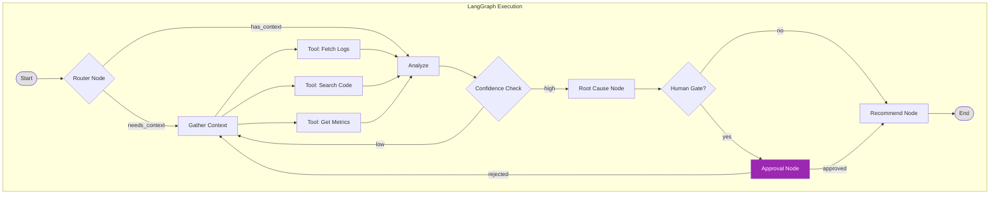
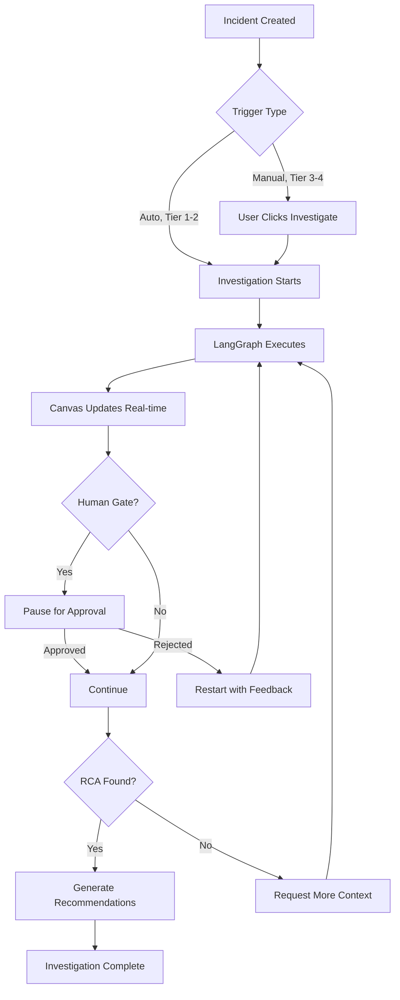
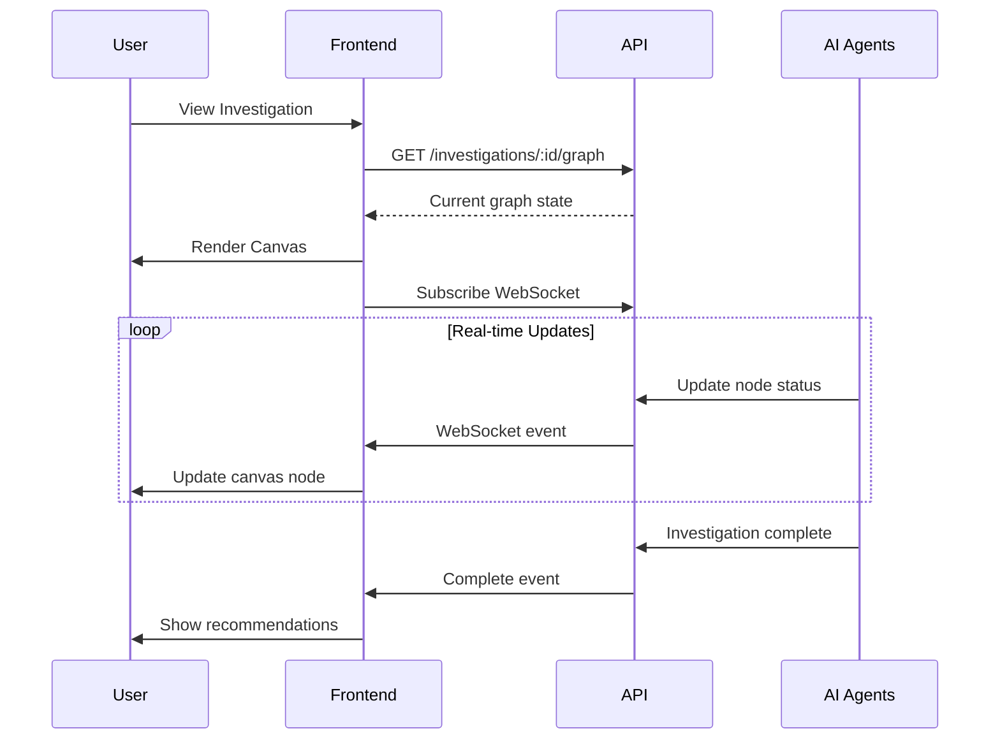

# Investigations

AI-powered root cause analysis using LangGraph agent workflows.

## Overview

Investigations are the core AI capability of PrismaLens. When an incident is created, LangGraph orchestrates a multi-agent workflow to gather context, analyze patterns, and generate actionable recommendations.

**Key Concept**: The investigation canvas renders the **actual LangGraph execution graph**, not a hardcoded visualization. Node types and structure are dynamically determined by the agent configuration.

## LangGraph Integration



**Note**: This is a conceptual example. The actual graph is dynamically generated from LangGraph execution.

---

## User Flow



---

## Screens

### Investigation Canvas

- **Route**: `/incidents/:id/investigation` or `/investigations/:id`
- **Purpose**: Visualize the LangGraph execution graph

```
+-------------------------------------------------------------+
|  Investigation Canvas                   [Fullscreen] [Export]|
+-------------------------------------------------------------+
|                                                              |
|  +--------------------------------------------------------+ |
|  |                                                          | |
|  |           +---------------------+                        | |
|  |           | [*] Start           |                        | |
|  |           | 10:42:00            |                        | |
|  |           +----------+----------+                        | |
|  |                      |                                   | |
|  |                      v                                   | |
|  |           +---------------------+                        | |
|  |           | Router Node         |                        | |
|  |           | needs_context       |                        | |
|  |           +----------+----------+                        | |
|  |                      |                                   | |
|  |                      v                                   | |
|  |           +---------------------+                        | |
|  |           | Gather Context      |                        | |
|  |           | 10:42:15 - 87%      |                        | |
|  |           +----------+----------+                        | |
|  |                      |                                   | |
|  |          +-----------+-----------+                       | |
|  |          v           v           v                       | |
|  |  +------------+ +------------+ +------------+            | |
|  |  | Fetch Logs | | Search Code| | Get Metrics|            | |
|  |  | v 234 lines| | v 3 files  | | * running  |            | |
|  |  +------------+ +------------+ +------------+            | |
|  |                      |                                   | |
|  |                      v                                   | |
|  |           +---------------------+                        | |
|  |           | Analyze             |                        | |
|  |           | [ ] pending         |                        | |
|  |           +---------------------+                        | |
|  |                                                          | |
|  +--------------------------------------------------------+ |
|                                                              |
|  Zoom: [-] 100% [+]    Pan: Drag canvas    [MiniMap]        |
|                                                              |
+-------------------------------------------------------------+
```

**Components**:
- ReactFlow canvas
- Node cards with status
- Edge connections
- Zoom/pan controls
- MiniMap navigation
- Fullscreen toggle
- Export button

---

### Node Detail Panel

- **Trigger**: Click on any node
- **Purpose**: View node execution details

```
+-------------------------------------------------------------+
|  Investigation Canvas                                        |
+-------------------------------------------------------------+
|                                                              |
|  +---------------------------+ +---------------------------+ |
|  |                           | | Node Details           [X]| |
|  |   [Canvas with            | | ------------------------- | |
|  |    selected node          | |                           | |
|  |    highlighted]           | | Gather Context            | |
|  |                           | | Status: Completed         | |
|  |         +----------+      | | Duration: 2m 15s          | |
|  |         | Selected |      | | Started: 10:42:15         | |
|  |         |  ======= |      | | Finished: 10:44:30        | |
|  |         +----------+      | |                           | |
|  |                           | | Data Collected:           | |
|  |                           | | ------------------------- | |
|  |                           | | * Logs: 412 lines         | |
|  |                           | | * Files read: 5           | |
|  |                           | | * Commits analyzed: 3     | |
|  |                           | | * Metrics fetched: 12     | |
|  |                           | |                           | |
|  |                           | | Key Files:                | |
|  |                           | | * src/routes/users.ts     | |
|  |                           | | * src/services/UserSvc.ts | |
|  |                           | |                           | |
|  |                           | | Log Snippet:              | |
|  |                           | | +------------------------+| |
|  |                           | | | [ERR] Query timeout    || |
|  |                           | | | SELECT * FROM users... || |
|  |                           | | +------------------------+| |
|  |                           | |                           | |
|  |                           | | [View Full Logs] [Re-run] | |
|  +---------------------------+ +---------------------------+ |
|                                                              |
+-------------------------------------------------------------+
```

**Components**:
- Split view (canvas + detail)
- Node metadata
- Data collected summary
- Log snippets (expandable)
- Action buttons (re-run, view full)

---

### Human Approval Gate

- **Trigger**: Investigation reaches approval node
- **Purpose**: Require human review before proceeding

```
+-------------------------------------------------------------+
|  Investigation Canvas                                        |
+-------------------------------------------------------------+
|                                                              |
|  +--------------------------------------------------------+ |
|  |                                                          | |
|  |           +---------------------+                        | |
|  |           | Analyze             |                        | |
|  |           | v Root cause found  |                        | |
|  |           +----------+----------+                        | |
|  |                      |                                   | |
|  |                      v                                   | |
|  |  +====================================================+ | |
|  |  ||         APPROVAL REQUIRED                        || | |
|  |  ||  ================================================|| | |
|  |  ||  Review analysis before generating recommendations|| | |
|  |  ||                                                   || | |
|  |  ||  Root Cause: N+1 query in UserService            || | |
|  |  ||  Confidence: 87%                                  || | |
|  |  ||                                                   || | |
|  |  ||  Evidence:                                        || | |
|  |  ||  * 412 log lines analyzed                        || | |
|  |  ||  * 3 suspicious files found                      || | |
|  |  ||  * Recent commit matches pattern                 || | |
|  |  ||                                                   || | |
|  |  ||          [Approve & Continue]  [Reject]          || | |
|  |  +====================================================+ | |
|  |                      |                                   | |
|  |                      v (pending)                         | |
|  |           +---------------------+                        | |
|  |           | [ ] Recommend       |                        | |
|  |           |     (waiting)       |                        | |
|  |           +---------------------+                        | |
|  |                                                          | |
|  +--------------------------------------------------------+ |
|                                                              |
+-------------------------------------------------------------+
```

**Components**:
- Highlighted approval node
- Summary of analysis so far
- Evidence list
- Approve/Reject buttons
- Downstream nodes shown as pending

**Approval Actions**:
- **Approve**: Continue to recommendations
- **Reject**: Return to gather stage with feedback

---

### Export Options

```
+------------------------+
|  Export Investigation  |
|  --------------------  |
|  [PNG] Image           |
|  [SVG] Vector          |
|  [JSON] Data           |
|  [MD] Markdown Report  |
+------------------------+
```

**JSON Export Structure**:
```json
{
  "investigationId": "inv_abc123",
  "incidentId": "inc_42",
  "status": "completed",
  "nodes": [
    {
      "id": "start",
      "type": "start",
      "status": "completed",
      "timestamp": "2025-01-01T10:42:00Z",
      "data": {}
    },
    {
      "id": "gather",
      "type": "agent",
      "name": "Gather Context",
      "status": "completed",
      "timestamp": "2025-01-01T10:42:15Z",
      "duration": "2m 15s",
      "data": {
        "logsCollected": 412,
        "filesRead": 5,
        "commitsAnalyzed": 3
      }
    }
  ],
  "edges": [
    { "source": "start", "target": "gather" },
    { "source": "gather", "target": "analyze" }
  ],
  "summary": {
    "rootCause": "N+1 query in UserService",
    "confidence": 0.87,
    "duration": "4m 30s",
    "toolExecutions": 15
  }
}
```

---

## Canvas Interactions

| Action | Trigger | Result |
|--------|---------|--------|
| Click node | Left-click | Open detail panel |
| Hover node | Mouse over | Show tooltip with status |
| Right-click node | Right-click | Context menu |
| Pan | Drag canvas | Move view |
| Zoom | Scroll/buttons | Zoom in/out |
| MiniMap click | Click area | Navigate to section |
| Fullscreen | Click button | Expand to full window |
| Export | Click button | Download graph |

### Context Menu

```
+---------------------------+
|  Rerun from this step     |
|  ------------------------ |
|  Copy output              |
|  Export node data         |
|  ------------------------ |
|  View full details        |
+---------------------------+
```

---

## Real-time Updates

The canvas updates in real-time as the investigation progresses:



**WebSocket Events**:
- `node:started` - Node execution began
- `node:progress` - Progress update (percentage)
- `node:completed` - Node finished successfully
- `node:failed` - Node execution failed
- `investigation:complete` - All nodes finished
- `investigation:waiting` - Waiting for approval

---

## API Interactions

| Endpoint | Method | Purpose | Status |
|----------|--------|---------|--------|
| `/api/investigations` | GET | List investigations | Implemented |
| `/api/investigations/:id` | GET | Get investigation detail | Implemented |
| `/api/investigations/:id/graph` | GET | Get LangGraph state | Implemented |
| `/api/investigations/:id/nodes/:nodeId` | GET | Get node detail | Needs Implementation |
| `/api/investigations/:id/approve` | POST | Approve human gate | Needs Implementation |
| `/api/investigations/:id/reject` | POST | Reject and restart | Needs Implementation |
| `/api/investigations/:id/retry` | POST | Retry from node | Needs Implementation |
| `/api/investigations/:id/export` | GET | Export graph data | Needs Implementation |

---

## Acceptance Criteria

- [ ] Canvas renders actual LangGraph execution graph
- [ ] Nodes update in real-time during investigation
- [ ] Clicking node opens detail panel
- [ ] Human approval gates pause investigation
- [ ] User can approve or reject at gates
- [ ] User can re-run from specific nodes
- [ ] Graph can be exported in multiple formats
- [ ] Zoom, pan, and minimap work correctly

---

## Test Scenarios

1. **Simple investigation**
   - Trigger investigation
   - Watch nodes update in real-time
   - Verify final state matches expectations

2. **Human approval gate**
   - Configure service with approval gate
   - Trigger investigation
   - Verify investigation pauses at gate
   - Approve -> verify continues
   - Reject -> verify restarts gather

3. **Node re-run**
   - Complete investigation
   - Right-click on gather node
   - Select "Rerun from this step"
   - Verify downstream nodes re-execute

4. **Export graph**
   - Complete investigation
   - Export as JSON
   - Verify structure matches schema
   - Export as PNG
   - Verify image renders correctly

---

## Related Documentation

- [Incidents](./05_Incidents.md) - Incident lifecycle
- [Services](./07_Services.md) - Human gate configuration
- [Glossary](./13_Glossary.md) - LangGraph terminology
