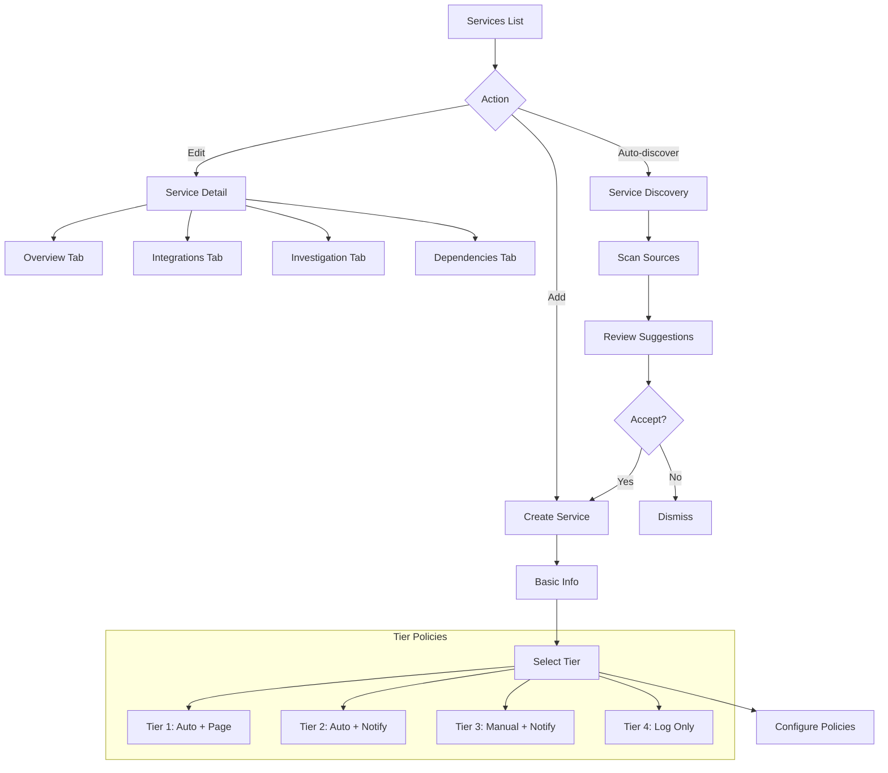

# Services

Service catalog with per-service and per-tier configuration.

## Overview

Services are the organizational unit for grouping alerts, incidents, and integrations. Each service has a tier classification that determines default investigation policies.

## User Flow



---

## Service Tiers

Tiers classify services by criticality and determine default investigation policies:

| Tier | Criticality | Auto-Investigate | Notification | Response |
|------|-------------|------------------|--------------|----------|
| **Tier 1** | Critical | Always | Page on-call | Immediate |
| **Tier 2** | High | Always | Notify channel | < 30 min |
| **Tier 3** | Medium | Manual trigger | Notify channel | < 2 hours |
| **Tier 4** | Low | Never | Log only | Best effort |

### Tier Policy Details

**Tier 1 - Critical**
- Revenue-impacting services
- Customer-facing APIs
- Auto-investigate all incidents
- Page on-call immediately
- Human approval gates enabled

**Tier 2 - High**
- Important internal services
- Databases, queues
- Auto-investigate Critical/High severity
- Notify Slack channel
- Optional human approval gates

**Tier 3 - Medium**
- Background services
- Batch processing
- Manual investigation only
- Notify Slack channel
- No approval gates

**Tier 4 - Low**
- Development/staging
- Non-production
- No auto-investigation
- Log only
- No notifications

---

## Service Types

| Type | Icon | Description |
|------|------|-------------|
| **Gateway** | `GatewayIcon` | API gateway, load balancer |
| **Service** | `ServiceIcon` | Application microservice |
| **Database** | `DatabaseIcon` | PostgreSQL, MongoDB, Redis |
| **Queue** | `QueueIcon` | Kafka, RabbitMQ, SQS |
| **Cache** | `CacheIcon` | Redis, Memcached |
| **External** | `ExternalIcon` | Third-party API dependency |

---

## Screens

### Services List

- **Route**: `/services`
- **Purpose**: View and manage all services

```
+-------------------------------------------------------------+
|  Services                           [+ Add Service] [Discover]|
+-------------------------------------------------------------+
|                                                              |
|  Your service catalog. Connect integrations for richer       |
|  AI-powered investigations.                                  |
|                                                              |
|  Filters: [Type v] [Tier v] [Team v]            Search...   |
|                                                              |
+-------------------------------------------------------------+
|                                                              |
|  +--------------------------------------------------------+ |
|  | [Gateway] api-gateway                          Tier 1   | |
|  | --------------------------------------------------------| |
|  | Type: Gateway   Team: Platform                          | |
|  | Integrations: GitHub v  Prometheus v  Slack v           | |
|  | Active Incidents: 1   Auto-investigate: Always          | |
|  |                                           [Configure]   | |
|  +--------------------------------------------------------+ |
|                                                              |
|  +--------------------------------------------------------+ |
|  | [Service] user-service                         Tier 2   | |
|  | --------------------------------------------------------| |
|  | Type: Service   Team: Backend                           | |
|  | Integrations: GitHub v  Prometheus v                    | |
|  | Active Incidents: 1   Auto-investigate: High+           | |
|  |                                           [Configure]   | |
|  +--------------------------------------------------------+ |
|                                                              |
|  +--------------------------------------------------------+ |
|  | [Service] background-jobs                      Tier 3   | |
|  | --------------------------------------------------------| |
|  | Type: Service   Team: Backend                           | |
|  | Integrations: GitHub v                                  | |
|  | Active Incidents: 0   Auto-investigate: Manual          | |
|  |                                           [Configure]   | |
|  +--------------------------------------------------------+ |
|                                                              |
+-------------------------------------------------------------+
```

**Components**:
- Add service button
- Discover services button
- Filter dropdowns
- Service cards with status
- Integration badges

---

### Create Service

- **Route**: `/services/new`
- **Purpose**: Add a new service to the catalog

```
+-------------------------------------------------------------+
|  Create Service                                              |
+-------------------------------------------------------------+
|                                                              |
|  Basic Information                                          |
|  -----------------                                          |
|  Name:         [                              ]  (required) |
|  Display Name: [                              ]             |
|  Description:  [                              ]             |
|               [                              ]             |
|                                                              |
|  Classification                                             |
|  --------------                                             |
|  Type:  [Service v]                                        |
|         (*) Service  ( ) Gateway  ( ) Database             |
|         ( ) Queue    ( ) Cache    ( ) External             |
|                                                              |
|  Tier:  [Tier 2 - High v]                                  |
|         Tier 1 - Critical: Auto-investigate, page on-call  |
|         Tier 2 - High: Auto-investigate, notify channel    |
|         Tier 3 - Medium: Manual investigate, notify        |
|         Tier 4 - Low: Log only                             |
|                                                              |
|  Ownership                                                  |
|  ---------                                                  |
|  Team:       [Backend                    ]                 |
|  Repository: [org/user-service           ]                 |
|  Slack:      [#backend-alerts            ]                 |
|                                                              |
|                          [Cancel]  [Create Service]         |
|                                                              |
+-------------------------------------------------------------+
```

---

### Service Detail - General Tab

- **Route**: `/services/:id`
- **Purpose**: View and edit service configuration

```
+-------------------------------------------------------------+
|  <- Back to Services                                         |
|                                                              |
|  api-gateway                                         Tier 1 |
|  ========================================================== |
|                                                              |
|  [General] [Integrations] [Investigation] [Dependencies]    |
|  ---------------------------------------------------------- |
|                                                              |
|  Basic Information                             [Edit]       |
|  -----------------                                          |
|  Name:         api-gateway                                  |
|  Display Name: API Gateway                                  |
|  Type:         Gateway                                      |
|  Team:         Platform                                     |
|  Repository:   org/api-gateway                              |
|                                                              |
|  Description                                                |
|  -----------                                                |
|  Main API gateway for all public endpoints. Handles         |
|  authentication, rate limiting, and request routing.        |
|                                                              |
|  Statistics                                                 |
|  ----------                                                 |
|  Active Incidents:    1                                     |
|  Resolved (30 days):  12                                    |
|  MTTR:                23 min                                |
|  Total Alerts:        156                                   |
|                                                              |
+-------------------------------------------------------------+
```

---

### Service Detail - Integrations Tab

- **Route**: `/services/:id?tab=integrations`
- **Purpose**: Manage per-service integrations

```
+-------------------------------------------------------------+
|  api-gateway                                         Tier 1 |
|  ========================================================== |
|                                                              |
|  [General] [Integrations] [Investigation] [Dependencies]    |
|  ---------------------------------------------------------- |
|                                                              |
|  Service Integrations                          [+ Connect]  |
|  ====================                                       |
|                                                              |
|  These integrations are used when investigating incidents   |
|  for this service. They override global integrations.       |
|                                                              |
|  +--------------------------------------------------------+ |
|  | [GitHub]  GitHub - org/api-gateway                      | |
|  | --------------------------------------------------------| |
|  | Status: * Connected    Auth: OAuth                      | |
|  | Repository: org/api-gateway (specific, not org-wide)    | |
|  | Last used: 10 minutes ago                               | |
|  |                               [Test] [Edit] [Remove]    | |
|  +--------------------------------------------------------+ |
|                                                              |
|  +--------------------------------------------------------+ |
|  | [Prometheus]  Prometheus - Production Cluster           | |
|  | --------------------------------------------------------| |
|  | Status: * Connected    Auth: API Key                    | |
|  | Default Query: container="api-gateway"                  | |
|  | Last used: 3 minutes ago                                | |
|  |                               [Test] [Edit] [Remove]    | |
|  +--------------------------------------------------------+ |
|                                                              |
|  +--------------------------------------------------------+ |
|  | [Slack]  Slack - #platform-alerts                       | |
|  | --------------------------------------------------------| |
|  | Status: * Connected    Auth: Webhook                    | |
|  | Channel: #platform-alerts                               | |
|  |                               [Test] [Edit] [Remove]    | |
|  +--------------------------------------------------------+ |
|                                                              |
+-------------------------------------------------------------+
```

---

### Service Detail - Investigation Tab

- **Route**: `/services/:id?tab=investigation`
- **Purpose**: Configure AI investigation settings

```
+-------------------------------------------------------------+
|  api-gateway                                         Tier 1 |
|  ========================================================== |
|                                                              |
|  [General] [Integrations] [Investigation] [Dependencies]    |
|  ---------------------------------------------------------- |
|                                                              |
|  Investigation Policy                                       |
|  ====================                                       |
|                                                              |
|  Auto-Investigation                                         |
|  ------------------                                         |
|  Automatically start AI investigation when incidents are    |
|  created for this service.                                  |
|                                                              |
|  (*) Always auto-investigate                                |
|  ( ) Only for Critical and High severity                    |
|  ( ) Only for Critical severity                             |
|  ( ) Never (manual trigger only)                            |
|                                                              |
|  Human Approval Gates                                       |
|  --------------------                                       |
|  [x] Require approval before generating recommendations     |
|  [ ] Require approval before any automated actions          |
|                                                              |
|  Notification Settings                                      |
|  --------------------                                       |
|  [x] Send Slack notification when investigation completes   |
|  [x] Include root cause summary in notification             |
|  [x] Mention on-call for Critical recommendations           |
|                                                              |
|  Analysis Context                                           |
|  ----------------                                           |
|  Additional context to provide to AI during investigation:  |
|  +--------------------------------------------------------+ |
|  | This is the main API gateway. It handles all public     | |
|  | traffic and routes to internal microservices. Common    | |
|  | issues include rate limiting, upstream service          | |
|  | failures, and SSL certificate problems.                 | |
|  +--------------------------------------------------------+ |
|                                                              |
|                          [Cancel]  [Save Changes]           |
|                                                              |
+-------------------------------------------------------------+
```

---

### Service Detail - Dependencies Tab

- **Route**: `/services/:id?tab=dependencies`
- **Purpose**: View and manage service topology

```
+-------------------------------------------------------------+
|  api-gateway                                         Tier 1 |
|  ========================================================== |
|                                                              |
|  [General] [Integrations] [Investigation] [Dependencies]    |
|  ---------------------------------------------------------- |
|                                                              |
|  Service Dependencies                         [+ Add Dep]   |
|  ====================                                       |
|                                                              |
|  Upstream (services that depend on this)                    |
|  ----------------------------------------                   |
|  (none - this is a top-level gateway)                       |
|                                                              |
|  Downstream (services this depends on)                      |
|  --------------------------------------                     |
|  +--------------------------------------------------------+ |
|  | user-service                               Tier 2       | |
|  | Type: Service   Impact: Critical path                   | |
|  |                                        [View] [Remove]  | |
|  +--------------------------------------------------------+ |
|  | auth-service                               Tier 1       | |
|  | Type: Service   Impact: Critical path                   | |
|  |                                        [View] [Remove]  | |
|  +--------------------------------------------------------+ |
|  | postgres-main                              Tier 1       | |
|  | Type: Database  Impact: Data store                      | |
|  |                                        [View] [Remove]  | |
|  +--------------------------------------------------------+ |
|                                                              |
|  Topology Graph                                             |
|  --------------                                             |
|  +--------------------------------------------------------+ |
|  |                                                          | |
|  |         [api-gateway]                                   | |
|  |              |                                          | |
|  |    +---------+---------+                                | |
|  |    |         |         |                                | |
|  |    v         v         v                                | |
|  | [user-svc] [auth-svc] [postgres]                       | |
|  |                                                          | |
|  +--------------------------------------------------------+ |
|                                                              |
+-------------------------------------------------------------+
```

---

### Service Discovery

- **Route**: `/services/discover`
- **Purpose**: Auto-discover services from connected integrations

```
+-------------------------------------------------------------+
|  Service Discovery                                           |
+-------------------------------------------------------------+
|                                                              |
|  Scan your connected integrations for services to add.      |
|                                                              |
|  [Scan GitHub]  [Scan Kubernetes]  [Scan Prometheus]        |
|                                                              |
|  ---------------------------------------------------------- |
|                                                              |
|  Discovered Services (5)                                    |
|  =======================                                    |
|                                                              |
|  +--------------------------------------------------------+ |
|  | [x] payment-service                                     | |
|  |     Source: GitHub - org/payment-service                | |
|  |     Suggested Tier: Tier 1 (has production deployment)  | |
|  +--------------------------------------------------------+ |
|                                                              |
|  +--------------------------------------------------------+ |
|  | [x] notification-worker                                 | |
|  |     Source: Kubernetes - notification-worker deployment | |
|  |     Suggested Tier: Tier 3 (background worker)          | |
|  +--------------------------------------------------------+ |
|                                                              |
|  +--------------------------------------------------------+ |
|  | [ ] test-service                                        | |
|  |     Source: GitHub - org/test-service                   | |
|  |     Suggested Tier: Tier 4 (no production deployment)   | |
|  +--------------------------------------------------------+ |
|                                                              |
|                          [Cancel]  [Add Selected (2)]       |
|                                                              |
+-------------------------------------------------------------+
```

---

## API Interactions

| Endpoint | Method | Purpose | Status |
|----------|--------|---------|--------|
| `/api/services` | GET | List services | Implemented |
| `/api/services/:id` | GET | Get service detail | Implemented |
| `/api/services` | POST | Create service | Implemented |
| `/api/services/:id` | PATCH | Update service | Implemented |
| `/api/services/:id` | DELETE | Delete service | Implemented |
| `/api/services/:id/integrations` | GET | List service integrations | Implemented |
| `/api/services/:id/integrations` | POST | Add integration | Implemented |
| `/api/services/:id/integrations/:connId` | DELETE | Remove integration | Implemented |
| `/api/services/:id/dependencies` | GET | List dependencies | Implemented |
| `/api/services/:id/dependencies` | POST | Add dependency | Implemented |
| `/api/service-discovery/suggest` | POST | Discover services | Implemented |

---

## Acceptance Criteria

- [ ] Services list shows all services with filters
- [ ] User can create service with tier selection
- [ ] User can edit service configuration
- [ ] Per-service integrations override globals
- [ ] Investigation policy configurable per service
- [ ] Human approval gates can be enabled
- [ ] Analysis context is passed to AI
- [ ] Dependencies visualized in topology graph
- [ ] Service discovery finds services from integrations

---

## Test Scenarios

1. **Create Tier 1 service**
   - Create service with Tier 1
   - Verify auto-investigate: Always
   - Trigger alert -> auto-investigation starts

2. **Per-service integration**
   - Add GitHub integration to service
   - Set specific repository
   - Trigger investigation -> uses service repo, not global

3. **Human approval gate**
   - Enable approval gate on service
   - Trigger investigation
   - Verify investigation pauses at approval

4. **Service discovery**
   - Connect GitHub organization
   - Run discovery
   - Review suggestions
   - Add selected services

---

## Related Documentation

- [Alerts](./04_Alerts.md) - Alert mapping to services
- [Investigations](./06_Investigations.md) - Investigation policies
- [Integrations](./09_Integrations.md) - Integration setup
