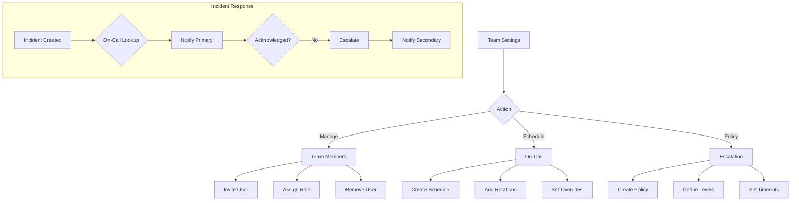

# Team

Team collaboration features including on-call schedules, escalation, and war rooms.

## Overview

PrismaLens supports team collaboration for incident response. Features include team management, on-call schedules, escalation policies, and incident war rooms.

**Note**: Full team features are available in Community Edition with local users. Cloud Edition adds SSO, SCIM, and advanced role management.

## User Flow



---

## Team Roles

| Role | Permissions |
|------|-------------|
| **Owner** | Full access, billing, delete instance |
| **Admin** | Manage team, integrations, settings |
| **Member** | View all, manage incidents, services |
| **Viewer** | Read-only access |

---

## Screens

### Team Members

- **Route**: `/settings/team`
- **Purpose**: Manage team members and roles

```
+-------------------------------------------------------------+
|  Settings > Team                                             |
+-------------------------------------------------------------+
|                                                              |
|  Team Members                                 [+ Invite]    |
|  ============                                               |
|                                                              |
|  +--------------------------------------------------------+ |
|  | [Avatar]  John Doe (you)                    Owner       | |
|  |           john@example.com                              | |
|  |           Joined: Jan 1, 2025                           | |
|  +--------------------------------------------------------+ |
|                                                              |
|  +--------------------------------------------------------+ |
|  | [Avatar]  Alice Smith                       Admin       | |
|  |           alice@example.com                             | |
|  |           Joined: Jan 5, 2025                           | |
|  |                              [Change Role] [Remove]     | |
|  +--------------------------------------------------------+ |
|                                                              |
|  +--------------------------------------------------------+ |
|  | [Avatar]  Bob Johnson                       Member      | |
|  |           bob@example.com                               | |
|  |           Joined: Jan 10, 2025                          | |
|  |                              [Change Role] [Remove]     | |
|  +--------------------------------------------------------+ |
|                                                              |
|  Pending Invites                                            |
|  ---------------                                            |
|  +--------------------------------------------------------+ |
|  | carol@example.com                           Member      | |
|  | Invited: 2 days ago                                     | |
|  |                              [Resend] [Cancel]          | |
|  +--------------------------------------------------------+ |
|                                                              |
+-------------------------------------------------------------+
```

**Components**:
- Member list with avatars
- Role badges
- Invite button
- Pending invites section

---

### Invite Member

- **Route**: `/settings/team/invite`
- **Purpose**: Add new team member

```
+-------------------------------------------------------------+
|  Invite Team Member                                          |
+-------------------------------------------------------------+
|                                                              |
|  Email:  [                              ]                   |
|                                                              |
|  Role:   (*) Member - View all, manage incidents            |
|          ( ) Admin - Manage team and settings               |
|          ( ) Viewer - Read-only access                      |
|                                                              |
|  Services Access:                                           |
|  [x] All services                                           |
|  [ ] Specific services only:                                |
|      [ ] api-gateway                                        |
|      [ ] user-service                                       |
|      [ ] background-jobs                                    |
|                                                              |
|                          [Cancel]  [Send Invite]            |
|                                                              |
+-------------------------------------------------------------+
```

---

### On-Call Schedules

- **Route**: `/settings/on-call`
- **Purpose**: Manage on-call rotations

```
+-------------------------------------------------------------+
|  Settings > On-Call                                          |
+-------------------------------------------------------------+
|                                                              |
|  On-Call Schedules                           [+ Create]     |
|  =================                                          |
|                                                              |
|  +--------------------------------------------------------+ |
|  | Platform Team Schedule                                  | |
|  | --------------------------------------------------------| |
|  | Services: api-gateway, auth-service                     | |
|  | Rotation: Weekly                                        | |
|  |                                                          | |
|  | Current On-Call:                                        | |
|  | [Avatar] Alice Smith - until Jan 15 9:00 AM             | |
|  |                                                          | |
|  | Next:                                                   | |
|  | [Avatar] Bob Johnson - Jan 15 - Jan 22                  | |
|  |                                                          | |
|  |                         [View Schedule] [Edit]          | |
|  +--------------------------------------------------------+ |
|                                                              |
|  +--------------------------------------------------------+ |
|  | Backend Team Schedule                                   | |
|  | --------------------------------------------------------| |
|  | Services: user-service, background-jobs                 | |
|  | Rotation: Daily                                         | |
|  |                                                          | |
|  | Current On-Call:                                        | |
|  | [Avatar] Carol Davis - until Jan 13 9:00 AM             | |
|  |                                                          | |
|  |                         [View Schedule] [Edit]          | |
|  +--------------------------------------------------------+ |
|                                                              |
+-------------------------------------------------------------+
```

---

### Schedule Detail

- **Route**: `/settings/on-call/:id`
- **Purpose**: View and edit schedule details

```
+-------------------------------------------------------------+
|  Platform Team Schedule                                      |
+-------------------------------------------------------------+
|                                                              |
|  Schedule Settings                             [Edit]       |
|  =================                                          |
|  Name:       Platform Team Schedule                         |
|  Timezone:   America/New_York                               |
|  Services:   api-gateway, auth-service                      |
|                                                              |
|  Rotation                                                   |
|  --------                                                   |
|  Type:       Weekly                                         |
|  Handoff:    Monday 9:00 AM                                 |
|                                                              |
|  Members in Rotation:                                       |
|  1. Alice Smith                                             |
|  2. Bob Johnson                                             |
|  3. Carol Davis                                             |
|                                                              |
|  Calendar View                                              |
|  =============                                              |
|  +--------------------------------------------------------+ |
|  | Jan 2025                              [< Prev] [Next >] | |
|  | --------------------------------------------------------| |
|  | Mon | Tue | Wed | Thu | Fri | Sat | Sun |               | |
|  | --------------------------------------------------------| |
|  |  6  |  7  |  8  |  9  | 10  | 11  | 12  | Alice        | |
|  | 13  | 14  | 15  | 16  | 17  | 18  | 19  | Bob          | |
|  | 20  | 21  | 22  | 23  | 24  | 25  | 26  | Carol        | |
|  | 27  | 28  | 29  | 30  | 31  |     |     | Alice        | |
|  +--------------------------------------------------------+ |
|                                                              |
|  Overrides                                   [+ Add]        |
|  ---------                                                  |
|  Jan 17-18: Bob -> Alice (swap)                            |
|                                                              |
+-------------------------------------------------------------+
```

---

### Escalation Policies

- **Route**: `/settings/escalation`
- **Purpose**: Configure escalation rules

```
+-------------------------------------------------------------+
|  Settings > Escalation Policies                              |
+-------------------------------------------------------------+
|                                                              |
|  Escalation Policies                         [+ Create]     |
|  ===================                                        |
|                                                              |
|  +--------------------------------------------------------+ |
|  | Default Escalation                         [Default]    | |
|  | --------------------------------------------------------| |
|  | Used for: All Tier 1 and Tier 2 services                | |
|  |                                                          | |
|  | Level 1: On-call primary                                | |
|  |          Timeout: 5 minutes                             | |
|  |                                                          | |
|  | Level 2: On-call secondary                              | |
|  |          Timeout: 10 minutes                            | |
|  |                                                          | |
|  | Level 3: Team lead                                      | |
|  |          Timeout: 15 minutes                            | |
|  |                                                          | |
|  | Level 4: Engineering manager                            | |
|  |          (no timeout - final)                           | |
|  |                                                          | |
|  |                                        [View] [Edit]    | |
|  +--------------------------------------------------------+ |
|                                                              |
+-------------------------------------------------------------+
```

---

### Incident War Room

- **Route**: `/incidents/:id/warroom`
- **Purpose**: Collaborate during active incident

```
+-------------------------------------------------------------+
|  War Room: INC-42 - High CPU on api-gateway                 |
+-------------------------------------------------------------+
|                                                              |
|  Participants (3)                             [+ Invite]    |
|  [Avatar] Alice (On-call)  [Avatar] Bob  [Avatar] Carol     |
|                                                              |
|  ---------------------------------------------------------- |
|                                                              |
|  Timeline                                                   |
|  --------                                                   |
|  10:42  Incident created                                    |
|  10:42  Alice paged (on-call)                               |
|  10:43  Alice acknowledged                                  |
|  10:45  AI investigation started                            |
|  10:50  Root cause identified: N+1 query                    |
|  10:52  Bob joined war room                                 |
|  10:55  Carol joined war room                               |
|                                                              |
|  Activity                                                   |
|  --------                                                   |
|  +--------------------------------------------------------+ |
|  | Alice: Looking at the query now, will have fix in 10min| |
|  | 10:56 AM                                                | |
|  +--------------------------------------------------------+ |
|  | Bob: I can help review the PR when ready               | |
|  | 10:57 AM                                                | |
|  +--------------------------------------------------------+ |
|  | System: AI recommendation applied: Add eager loading   | |
|  | 11:05 AM                                                | |
|  +--------------------------------------------------------+ |
|                                                              |
|  +--------------------------------------------------------+ |
|  | Type a message...                            [Send]    | |
|  +--------------------------------------------------------+ |
|                                                              |
|  Quick Actions                                              |
|  [Escalate]  [Add Note]  [Update Status]  [Resolve]        |
|                                                              |
+-------------------------------------------------------------+
```

**Components**:
- Participant avatars
- Timeline of events
- Chat-style activity feed
- Quick action buttons
- Message input

---

## API Interactions

| Endpoint | Method | Purpose | Status |
|----------|--------|---------|--------|
| `/api/team/members` | GET | List team members | Needs Implementation |
| `/api/team/invite` | POST | Invite member | Needs Implementation |
| `/api/team/members/:id` | DELETE | Remove member | Needs Implementation |
| `/api/team/members/:id/role` | PATCH | Change role | Needs Implementation |
| `/api/on-call` | GET | List schedules | Needs Implementation |
| `/api/on-call` | POST | Create schedule | Needs Implementation |
| `/api/on-call/:id` | GET | Get schedule | Needs Implementation |
| `/api/on-call/:id` | PATCH | Update schedule | Needs Implementation |
| `/api/on-call/current` | GET | Get current on-call | Needs Implementation |
| `/api/escalation` | GET | List policies | Needs Implementation |
| `/api/escalation` | POST | Create policy | Needs Implementation |
| `/api/incidents/:id/escalate` | POST | Escalate incident | Needs Implementation |
| `/api/incidents/:id/warroom` | GET | Get war room data | Needs Implementation |
| `/api/incidents/:id/warroom/message` | POST | Send message | Needs Implementation |

---

## Acceptance Criteria

- [ ] Owner can invite team members by email
- [ ] Roles restrict access appropriately
- [ ] On-call schedules can be created and edited
- [ ] Current on-call user shown on dashboard
- [ ] Escalation policies trigger notifications
- [ ] War room shows real-time activity
- [ ] Users can chat in war room
- [ ] @mentions notify specific users

---

## Test Scenarios

1. **Invite and role change**
   - Owner invites member by email
   - New user accepts invite
   - Owner changes role to Admin
   - Verify permissions change

2. **On-call rotation**
   - Create weekly schedule
   - Add 3 team members
   - Verify handoff happens at scheduled time
   - Add override for vacation

3. **Escalation**
   - Incident triggers for Tier 1 service
   - Primary on-call notified
   - No acknowledgment in 5 min
   - Secondary on-call notified

4. **War room collaboration**
   - Open war room for active incident
   - Multiple users join
   - Send messages
   - Verify real-time updates

---

## Related Documentation

- [Notifications](./11_Notifications.md) - Notification channels
- [Incidents](./05_Incidents.md) - Incident lifecycle
- [Services](./07_Services.md) - Service ownership
