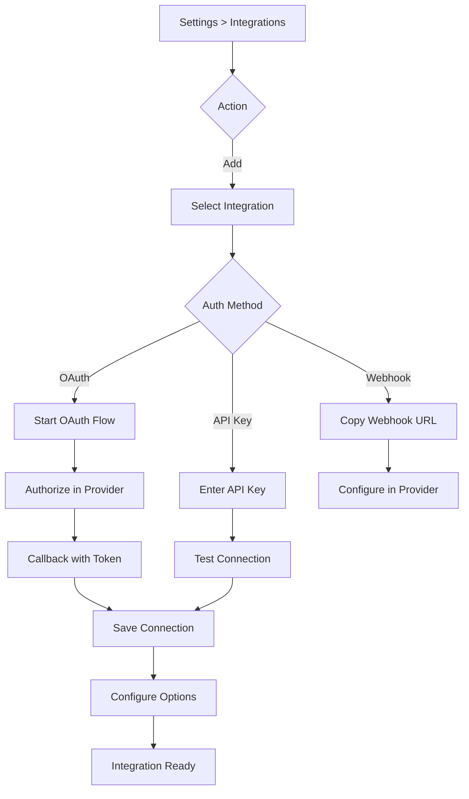

# Integrations

Connect external tools for alert ingestion, context gathering, and notifications.

## Overview

Integrations provide PrismaLens with data for AI investigations and enable notifications. They can be configured globally or per-service.

## Integration Categories

```mermaid
flowchart TD
    subgraph Data Sources
        P[Prometheus]
        D[Datadog]
        CW[CloudWatch]
    end

    subgraph Code/Git
        GH[GitHub]
        GL[GitLab]
    end

    subgraph Communication
        SL[Slack]
        MT[MS Teams]
        DC[Discord]
        EM[Email]
    end

    subgraph Ticketing
        JI[Jira]
        LI[Linear]
    end

    subgraph On-Call
        PD[PagerDuty]
        OG[Opsgenie]
    end

    Data Sources --> WEBHOOKS[Webhooks]
    Code/Git --> OAUTH[OAuth]
    Communication --> OAUTH
    Ticketing --> OAUTH
    On-Call --> API[API Keys]
```

---

## Integration Types

| Category | Integration | Auth Method | Purpose |
|----------|-------------|-------------|---------|
| **Data Sources** | Prometheus | Webhook | Alert ingestion |
| | Datadog | API Key | Alert ingestion, metrics |
| | CloudWatch | AWS Credentials | Alert ingestion, metrics |
| **Code/Git** | GitHub | OAuth | Code context, commits |
| | GitLab | OAuth | Code context, commits |
| **Communication** | Slack | OAuth | Notifications |
| | MS Teams | Webhook | Notifications |
| | Discord | Webhook | Notifications |
| | Email | SMTP | Notifications |
| **Ticketing** | Jira | OAuth | Ticket creation |
| | Linear | OAuth | Ticket creation |
| **On-Call** | PagerDuty | API Key | Escalation |
| | Opsgenie | API Key | Escalation |

---

## User Flow



---

## Screens

### Integrations List

- **Route**: `/settings/integrations`
- **Purpose**: Manage global integrations

```
+-------------------------------------------------------------+
|  Settings > Integrations                                     |
+-------------------------------------------------------------+
|                                                              |
|  Connected Integrations                      [+ Connect]    |
|  ======================                                     |
|                                                              |
|  +--------------------------------------------------------+ |
|  | [GitHub Logo]  GitHub                        Connected  | |
|  | --------------------------------------------------------| |
|  | Organization: prismalens-org                            | |
|  | Repositories: All (42)                                  | |
|  | Last sync: 5 minutes ago                                | |
|  |                               [Test] [Configure] [X]    | |
|  +--------------------------------------------------------+ |
|                                                              |
|  +--------------------------------------------------------+ |
|  | [Slack Logo]  Slack                          Connected  | |
|  | --------------------------------------------------------| |
|  | Workspace: PrismaLens                                   | |
|  | Channels: #incidents, #platform-alerts                  | |
|  | Last used: 1 hour ago                                   | |
|  |                               [Test] [Configure] [X]    | |
|  +--------------------------------------------------------+ |
|                                                              |
|  +--------------------------------------------------------+ |
|  | [Prometheus Logo]  Prometheus                Connected  | |
|  | --------------------------------------------------------| |
|  | Endpoint: https://prometheus.example.com                | |
|  | Labels: env=production                                  | |
|  |                               [Test] [Configure] [X]    | |
|  +--------------------------------------------------------+ |
|                                                              |
|  Webhook Endpoints                                          |
|  =================                                          |
|  Copy these URLs into your monitoring tools:                |
|                                                              |
|  Generic:    POST /api/webhooks/generic          [Copy]    |
|  Prometheus: POST /api/webhooks/prometheus       [Copy]    |
|  GitHub:     POST /api/webhooks/github           [Copy]    |
|                                                              |
+-------------------------------------------------------------+
```

---

### Add Integration

- **Route**: `/settings/integrations/add`
- **Purpose**: Connect a new integration

```
+-------------------------------------------------------------+
|  Add Integration                                             |
+-------------------------------------------------------------+
|                                                              |
|  Select an integration to connect:                          |
|                                                              |
|  Data Sources                                               |
|  ------------                                               |
|  +------------+ +------------+ +------------+               |
|  | Prometheus | | Datadog    | | CloudWatch |               |
|  | [icon]     | | [icon]     | | [icon]     |               |
|  | Webhooks   | | API Key    | | AWS Creds  |               |
|  +------------+ +------------+ +------------+               |
|                                                              |
|  Code & Git                                                 |
|  ----------                                                 |
|  +------------+ +------------+                              |
|  | GitHub     | | GitLab     |                              |
|  | [icon]     | | [icon]     |                              |
|  | OAuth      | | OAuth      |                              |
|  +------------+ +------------+                              |
|                                                              |
|  Communication                                              |
|  -------------                                              |
|  +------------+ +------------+ +------------+ +------------+|
|  | Slack      | | MS Teams   | | Discord    | | Email      ||
|  | [icon]     | | [icon]     | | [icon]     | | [icon]     ||
|  | OAuth      | | Webhook    | | Webhook    | | SMTP       ||
|  +------------+ +------------+ +------------+ +------------+|
|                                                              |
|  Ticketing                                                  |
|  ---------                                                  |
|  +------------+ +------------+                              |
|  | Jira       | | Linear     |                              |
|  | [icon]     | | [icon]     |                              |
|  | OAuth      | | OAuth      |                              |
|  +------------+ +------------+                              |
|                                                              |
|  On-Call                                                    |
|  -------                                                    |
|  +------------+ +------------+                              |
|  | PagerDuty  | | Opsgenie   |                              |
|  | [icon]     | | [icon]     |                              |
|  | API Key    | | API Key    |                              |
|  +------------+ +------------+                              |
|                                                              |
+-------------------------------------------------------------+
```

---

### GitHub OAuth Flow

```
+-------------------------------------------------------------+
|  Connect GitHub                                              |
+-------------------------------------------------------------+
|                                                              |
|  Step 1: Authorize PrismaLens                               |
|  ============================                               |
|                                                              |
|  PrismaLens needs access to your GitHub repositories to:    |
|                                                              |
|  * Read repository code for context                         |
|  * Search for related commits                               |
|  * Access GitHub issues and PRs                             |
|                                                              |
|  Click below to authorize with GitHub:                      |
|                                                              |
|                    [Authorize with GitHub]                   |
|                                                              |
|  ---------------------------------------------------------- |
|                                                              |
|  Step 2: Select Scope (after auth)                          |
|  =================================                          |
|                                                              |
|  (*) All repositories in prismalens-org                     |
|  ( ) Select specific repositories:                          |
|      [ ] api-gateway                                        |
|      [ ] user-service                                       |
|      [ ] background-jobs                                    |
|                                                              |
|                          [Cancel]  [Complete Setup]         |
|                                                              |
+-------------------------------------------------------------+
```

---

### Slack Configuration

- **Route**: `/settings/integrations/slack`
- **Purpose**: Configure Slack notification settings

```
+-------------------------------------------------------------+
|  Slack Configuration                                         |
+-------------------------------------------------------------+
|                                                              |
|  Connection                                                 |
|  ----------                                                 |
|  Workspace:  PrismaLens                                     |
|  Bot User:   @prismalens-bot                                |
|  Status:     * Connected                                    |
|                                                              |
|  Default Notification Channel                               |
|  ----------------------------                               |
|  Channel:    [#incidents v]                                 |
|                                                              |
|  Notification Rules                                         |
|  ------------------                                         |
|                                                              |
|  +--------------------------------------------------------+ |
|  | Critical incidents                                      | |
|  | Channel: #incidents                                     | |
|  | [x] Mention @oncall                                     | |
|  +--------------------------------------------------------+ |
|                                                              |
|  +--------------------------------------------------------+ |
|  | High incidents                                          | |
|  | Channel: #incidents                                     | |
|  | [ ] Mention @oncall                                     | |
|  +--------------------------------------------------------+ |
|                                                              |
|  +--------------------------------------------------------+ |
|  | Investigation complete                                  | |
|  | Channel: #incidents                                     | |
|  | [x] Include root cause summary                          | |
|  +--------------------------------------------------------+ |
|                                                              |
|  [+ Add Rule]                                               |
|                                                              |
|                          [Cancel]  [Save]                   |
|                                                              |
+-------------------------------------------------------------+
```

---

### Webhook Configuration (Prometheus Example)

```
+-------------------------------------------------------------+
|  Prometheus Webhook Setup                                    |
+-------------------------------------------------------------+
|                                                              |
|  Copy this webhook URL into your Prometheus AlertManager:   |
|                                                              |
|  +--------------------------------------------------------+ |
|  | POST https://prismalens.example.com/api/webhooks/prom  | |
|  |                                              [Copy]     | |
|  +--------------------------------------------------------+ |
|                                                              |
|  AlertManager Configuration                                 |
|  --------------------------                                 |
|  Add this to your alertmanager.yml:                         |
|                                                              |
|  +--------------------------------------------------------+ |
|  | receivers:                                              | |
|  |   - name: 'prismalens'                                  | |
|  |     webhook_configs:                                    | |
|  |       - url: 'https://prismalens.example.com/api/      | |
|  |               webhooks/prometheus'                      | |
|  |         send_resolved: true                             | |
|  |                                              [Copy]     | |
|  +--------------------------------------------------------+ |
|                                                              |
|  Test Webhook                                               |
|  ------------                                               |
|  Send a test alert to verify configuration:                 |
|                                                              |
|  [Send Test Alert]                                          |
|                                                              |
|  Last received: 5 minutes ago                              |
|  Total alerts: 156                                          |
|                                                              |
+-------------------------------------------------------------+
```

---

## Global vs Per-Service Integrations

| Scope | Use Case | Example |
|-------|----------|---------|
| **Global** | Default for all services | GitHub organization |
| **Per-Service** | Override for specific service | Specific repository |

When an investigation runs:
1. Check for per-service integration
2. Fall back to global integration
3. Skip if neither configured

---

## API Interactions

| Endpoint | Method | Purpose | Status |
|----------|--------|---------|--------|
| `/api/integrations` | GET | List integration definitions | Implemented |
| `/api/integrations/connections` | GET | List connections | Implemented |
| `/api/integrations/connections` | POST | Create connection | Implemented |
| `/api/integrations/connections/:id` | DELETE | Remove connection | Implemented |
| `/api/integrations/connections/:id/test` | POST | Test connection | Implemented |
| `/api/oauth/:provider/authorize` | GET | Start OAuth | Implemented |
| `/api/oauth/:provider/callback` | GET | OAuth callback | Implemented |
| `/api/webhooks/generic` | POST | Receive generic alert | Implemented |
| `/api/webhooks/prometheus` | POST | Receive Prometheus alert | Needs Implementation |
| `/api/webhooks/github` | POST | Receive GitHub event | Implemented |

---

## Acceptance Criteria

- [ ] User can connect GitHub via OAuth
- [ ] User can connect Slack via OAuth
- [ ] User can configure Prometheus webhook
- [ ] User can test connections
- [ ] Webhook URLs copyable from UI
- [ ] Global integrations work for all services
- [ ] Per-service integrations override globals
- [ ] Integration status shown (connected/error)

---

## Test Scenarios

1. **GitHub OAuth**
   - Click "Connect GitHub"
   - Authorize in GitHub
   - Return to PrismaLens
   - Verify repositories accessible

2. **Prometheus webhook**
   - Copy webhook URL
   - Configure AlertManager
   - Send test alert
   - Verify alert received in PrismaLens

3. **Per-service override**
   - Connect GitHub org globally
   - Add specific repo to service
   - Trigger investigation
   - Verify specific repo used

4. **Connection test**
   - Connect integration
   - Click "Test"
   - Verify success/failure shown

---

## Related Documentation

- [Alerts](./04_Alerts.md) - Alert ingestion via webhooks
- [Services](./07_Services.md) - Per-service integrations
- [Notifications](./11_Notifications.md) - Notification configuration
