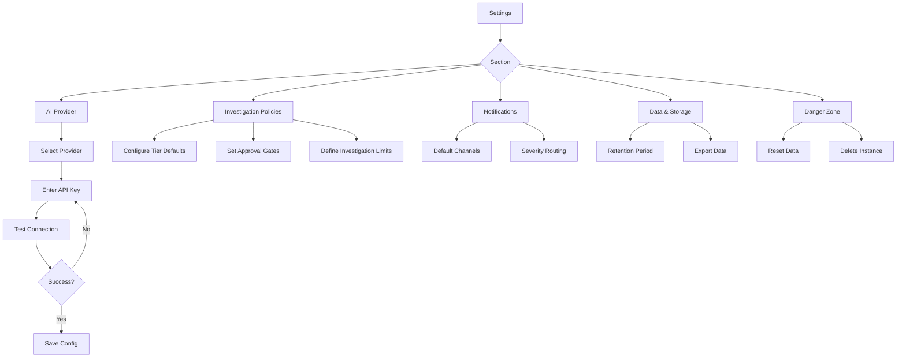

# Settings

Global configuration for AI providers, investigation policies, notifications, and data management.

## Overview

Settings allow administrators to configure PrismaLens at the instance level. These settings apply globally unless overridden at the service level.

## User Flow



---

## Settings Navigation

```
+-------------------------------------------------------------+
|  Settings                                                    |
+-------------------------------------------------------------+
|                                                              |
|  +------------------+  +----------------------------------+  |
|  | AI Provider      |  |                                  |  |
|  | Investigation    |  |  Content area for selected      |  |
|  | Notifications    |  |  settings section               |  |
|  | Data & Storage   |  |                                  |  |
|  | Danger Zone      |  |                                  |  |
|  +------------------+  +----------------------------------+  |
|                                                              |
+-------------------------------------------------------------+
```

---

## Screens

### AI Provider Configuration

- **Route**: `/settings/ai`
- **Purpose**: Configure LLM provider for AI investigations

```
+-------------------------------------------------------------+
|  Settings > AI Provider                                      |
+-------------------------------------------------------------+
|                                                              |
|  AI Provider Configuration                                   |
|  =========================                                   |
|                                                              |
|  PrismaLens uses AI to investigate incidents and generate   |
|  root cause analysis. Configure your preferred provider.    |
|                                                              |
|  Current Status: * Connected                                |
|                                                              |
|  Provider Selection                                          |
|  ------------------                                          |
|  (*) Google Gemini (Recommended)                            |
|  ( ) OpenAI                                                  |
|  ( ) Anthropic Claude                                        |
|  ( ) Azure OpenAI                                            |
|  ( ) Ollama (Local)                                          |
|                                                              |
|  ---------------------------------------------------------- |
|                                                              |
|  Google Gemini Configuration                                 |
|  ---------------------------                                 |
|  API Key:    [•••••••••••••••••••••••]      [Show]          |
|  Model:      [gemini-2.0-flash-exp v]                       |
|                                                              |
|  Available Models:                                          |
|  - gemini-2.0-flash-exp (Fast, recommended)                 |
|  - gemini-1.5-pro (More capable, slower)                    |
|  - gemini-1.5-flash (Balanced)                              |
|                                                              |
|  [ ] Save API key to .env file                              |
|      (Persists across restarts)                             |
|                                                              |
|                    [Test Connection]    [Save]              |
|                                                              |
+-------------------------------------------------------------+
```

**Provider Options**:

| Provider | Model Options | Notes |
|----------|---------------|-------|
| **Google Gemini** | gemini-2.0-flash-exp, gemini-1.5-pro, gemini-1.5-flash | Recommended, good balance of speed/quality |
| **OpenAI** | gpt-4o, gpt-4o-mini, gpt-4-turbo | Most capable, higher cost |
| **Anthropic Claude** | claude-3-5-sonnet, claude-3-opus, claude-3-haiku | Strong reasoning |
| **Azure OpenAI** | Deployment-based | Enterprise compliance |
| **Ollama** | llama3, mistral, mixtral, etc. | Local, no API costs |

---

### OpenAI Configuration

```
+-------------------------------------------------------------+
|  OpenAI Configuration                                        |
|  --------------------                                        |
|  API Key:    [sk-•••••••••••••••••••••••]   [Show]          |
|  Model:      [gpt-4o v]                                     |
|                                                              |
|  Available Models:                                          |
|  - gpt-4o (Most capable, multimodal)                        |
|  - gpt-4o-mini (Fast, cost-effective)                       |
|  - gpt-4-turbo (Previous generation)                        |
|                                                              |
|  Organization ID (optional):                                |
|  [org-xxxxxxxxxxxx                     ]                    |
|                                                              |
+-------------------------------------------------------------+
```

---

### Azure OpenAI Configuration

```
+-------------------------------------------------------------+
|  Azure OpenAI Configuration                                  |
|  --------------------------                                  |
|  Endpoint:        [https://your-resource.openai.azure.com ] |
|  API Key:         [•••••••••••••••••••••••]      [Show]     |
|  Deployment Name: [gpt-4o-deployment              ]         |
|  API Version:     [2024-02-15-preview v]                    |
|                                                              |
+-------------------------------------------------------------+
```

---

### Ollama (Local) Configuration

```
+-------------------------------------------------------------+
|  Ollama Configuration (Local)                                |
|  ----------------------------                                |
|  Base URL:   [http://localhost:11434          ]             |
|  Model:      [llama3.1 v]                                   |
|                                                              |
|  Available Models (from Ollama):                            |
|  - llama3.1 (8B, balanced)                                  |
|  - mistral (7B, fast)                                       |
|  - mixtral (8x7B, capable)                                  |
|  - codellama (Code-focused)                                 |
|                                                              |
|  Note: Ensure Ollama is running locally.                    |
|  Install: https://ollama.ai                                 |
|                                                              |
+-------------------------------------------------------------+
```

---

### Investigation Policies

- **Route**: `/settings/investigation`
- **Purpose**: Configure default investigation behavior by tier

```
+-------------------------------------------------------------+
|  Settings > Investigation Policies                           |
+-------------------------------------------------------------+
|                                                              |
|  Default Investigation Policies                              |
|  ==============================                              |
|                                                              |
|  These policies apply to services unless overridden at      |
|  the service level.                                          |
|                                                              |
|  Tier 1 - Critical Services                                 |
|  --------------------------                                  |
|  Auto-investigate:    [Always v]                            |
|  Human approval gate: [x] Enabled                           |
|  Notify:              [x] Page on-call                      |
|                       [x] Post to Slack                     |
|                                                              |
|  Tier 2 - High Priority Services                            |
|  -------------------------------                            |
|  Auto-investigate:    [Critical and High severity v]        |
|  Human approval gate: [ ] Disabled                          |
|  Notify:              [ ] Page on-call                      |
|                       [x] Post to Slack                     |
|                                                              |
|  Tier 3 - Medium Priority Services                          |
|  ---------------------------------                          |
|  Auto-investigate:    [Manual only v]                       |
|  Human approval gate: [ ] Disabled                          |
|  Notify:              [ ] Page on-call                      |
|                       [x] Post to Slack                     |
|                                                              |
|  Tier 4 - Low Priority Services                             |
|  ------------------------------                              |
|  Auto-investigate:    [Never v]                             |
|  Human approval gate: [ ] Disabled                          |
|  Notify:              [ ] Page on-call                      |
|                       [ ] Post to Slack                     |
|                                                              |
|  ---------------------------------------------------------- |
|                                                              |
|  Investigation Limits                                        |
|  --------------------                                        |
|  Max concurrent investigations:    [5            ]          |
|  Investigation timeout (minutes):  [30           ]          |
|  Max tool calls per investigation: [50           ]          |
|                                                              |
|                                         [Save Changes]       |
|                                                              |
+-------------------------------------------------------------+
```

---

### Notification Settings

- **Route**: `/settings/notifications`
- **Purpose**: Configure default notification channels and routing

```
+-------------------------------------------------------------+
|  Settings > Notifications                                    |
+-------------------------------------------------------------+
|                                                              |
|  Default Notification Settings                               |
|  =============================                               |
|                                                              |
|  These settings define where notifications are sent by      |
|  default. Services can override these settings.             |
|                                                              |
|  Default Channels                               [+ Add]     |
|  ----------------                                           |
|  +--------------------------------------------------------+ |
|  | [Slack]  #incidents                        [Default]   | |
|  |          Used for: All incident notifications          | |
|  |                                    [Configure] [Remove]| |
|  +--------------------------------------------------------+ |
|                                                              |
|  +--------------------------------------------------------+ |
|  | [Email]  ops-team@company.com                          | |
|  |          Used for: Critical incidents only             | |
|  |                                    [Configure] [Remove]| |
|  +--------------------------------------------------------+ |
|                                                              |
|  Severity Routing                                           |
|  ----------------                                           |
|                                                              |
|  Critical:  [x] Slack  [x] Email  [x] PagerDuty            |
|  High:      [x] Slack  [ ] Email  [ ] PagerDuty            |
|  Medium:    [x] Slack  [ ] Email  [ ] PagerDuty            |
|  Low:       [ ] Slack  [ ] Email  [ ] PagerDuty            |
|                                                              |
|  Notification Events                                        |
|  -------------------                                        |
|  [x] Incident created                                       |
|  [x] Incident acknowledged                                  |
|  [x] Investigation started                                  |
|  [x] Investigation completed                                |
|  [x] Root cause identified                                  |
|  [x] Recommendation generated                               |
|  [ ] Alert received (noisy)                                 |
|                                                              |
|                                         [Save Changes]       |
|                                                              |
+-------------------------------------------------------------+
```

---

### Data & Storage

- **Route**: `/settings/data`
- **Purpose**: Configure data retention and export options

```
+-------------------------------------------------------------+
|  Settings > Data & Storage                                   |
+-------------------------------------------------------------+
|                                                              |
|  Data Retention                                              |
|  ==============                                              |
|                                                              |
|  Configure how long PrismaLens keeps historical data.       |
|                                                              |
|  Events (raw webhook data):    [30 days v]                  |
|  Alerts:                       [90 days v]                  |
|  Resolved Incidents:           [1 year v]                   |
|  Investigations:               [1 year v]                   |
|  Audit Logs:                   [Forever v]                  |
|                                                              |
|  Note: Data older than retention period is automatically    |
|  purged. Active incidents are never purged.                 |
|                                                              |
|  ---------------------------------------------------------- |
|                                                              |
|  Storage Usage                                               |
|  =============                                               |
|                                                              |
|  Database size:  245 MB                                     |
|  Events:         12,456 records                             |
|  Alerts:         1,234 records                              |
|  Incidents:      156 records                                |
|  Investigations: 89 records                                 |
|                                                              |
|  ---------------------------------------------------------- |
|                                                              |
|  Data Export                                                 |
|  ===========                                                 |
|                                                              |
|  Export all data for backup or migration.                   |
|                                                              |
|  [Export All Data (JSON)]  [Export Incidents (CSV)]        |
|                                                              |
+-------------------------------------------------------------+
```

---

### Danger Zone

- **Route**: `/settings/danger`
- **Purpose**: Destructive operations with confirmation

```
+-------------------------------------------------------------+
|  Settings > Danger Zone                                      |
+-------------------------------------------------------------+
|                                                              |
|  +--------------------------------------------------------+ |
|  |  DANGER ZONE                                            | |
|  |  ========================================================| |
|  |                                                          | |
|  |  These actions are irreversible. Please be certain.     | |
|  |                                                          | |
|  |  Reset All Data                                         | |
|  |  ---------------                                        | |
|  |  Delete all alerts, incidents, and investigations.      | |
|  |  Services and integrations will be preserved.           | |
|  |                                                          | |
|  |  [Reset All Data]                                       | |
|  |                                                          | |
|  |  --------------------------------------------------------| |
|  |                                                          | |
|  |  Delete All Integrations                                | |
|  |  -----------------------                                | |
|  |  Remove all connected integrations. You will need to    | |
|  |  reconnect them to receive alerts.                      | |
|  |                                                          | |
|  |  [Delete All Integrations]                              | |
|  |                                                          | |
|  |  --------------------------------------------------------| |
|  |                                                          | |
|  |  Factory Reset                                          | |
|  |  -------------                                          | |
|  |  Delete ALL data and return to initial setup state.     | |
|  |  This cannot be undone.                                 | |
|  |                                                          | |
|  |  [Factory Reset]                                        | |
|  |                                                          | |
|  +--------------------------------------------------------+ |
|                                                              |
+-------------------------------------------------------------+
```

---

### Confirmation Modal

```
+-------------------------------------------------------------+
|  +--------------------------------------------------------+ |
|  |                                                          | |
|  |  Confirm Factory Reset                              [X] | |
|  |  ======================                                 | |
|  |                                                          | |
|  |  This will permanently delete:                          | |
|  |                                                          | |
|  |  * All alerts (1,234)                                   | |
|  |  * All incidents (156)                                  | |
|  |  * All investigations (89)                              | |
|  |  * All services (12)                                    | |
|  |  * All integrations (5)                                 | |
|  |  * All users except owner (3)                           | |
|  |  * All settings                                         | |
|  |                                                          | |
|  |  Type "RESET" to confirm:                               | |
|  |  [                              ]                       | |
|  |                                                          | |
|  |                    [Cancel]    [Confirm Reset]          | |
|  |                                                          | |
|  +--------------------------------------------------------+ |
+-------------------------------------------------------------+
```

---

## API Interactions

| Endpoint | Method | Purpose | Status |
|----------|--------|---------|--------|
| `/api/settings` | GET | Get all settings | Implemented |
| `/api/settings` | PATCH | Update settings | Implemented |
| `/api/settings/ai` | GET | Get AI config | Implemented |
| `/api/settings/ai` | PATCH | Update AI config | Implemented |
| `/api/settings/ai/test` | POST | Test AI connection | Implemented |
| `/api/settings/investigation` | GET | Get investigation policies | Needs Implementation |
| `/api/settings/investigation` | PATCH | Update investigation policies | Needs Implementation |
| `/api/settings/notifications` | GET | Get notification settings | Needs Implementation |
| `/api/settings/notifications` | PATCH | Update notification settings | Needs Implementation |
| `/api/settings/data/retention` | GET | Get retention settings | Needs Implementation |
| `/api/settings/data/retention` | PATCH | Update retention | Needs Implementation |
| `/api/settings/data/export` | POST | Export data | Needs Implementation |
| `/api/settings/data/stats` | GET | Get storage stats | Needs Implementation |
| `/api/settings/reset` | POST | Reset all data | Needs Implementation |
| `/api/settings/factory-reset` | POST | Factory reset | Needs Implementation |

---

## Acceptance Criteria

- [ ] User can select from multiple AI providers
- [ ] API key is stored securely (encrypted)
- [ ] Test connection validates provider configuration
- [ ] Investigation policies are configurable per tier
- [ ] Human approval gates can be enabled per tier
- [ ] Notification routing configurable by severity
- [ ] Data retention periods are configurable
- [ ] Data export generates downloadable files
- [ ] Danger zone actions require confirmation
- [ ] Factory reset requires typing confirmation text

---

## Test Scenarios

1. **Configure AI provider**
   - Select OpenAI
   - Enter API key
   - Test connection
   - Verify investigations use OpenAI

2. **Update investigation policy**
   - Enable human approval for Tier 2
   - Create Tier 2 service incident
   - Verify investigation pauses for approval

3. **Change notification routing**
   - Set Critical to page on-call
   - Trigger critical incident
   - Verify page sent

4. **Export data**
   - Click Export All Data
   - Verify JSON file downloads
   - Verify file contains all records

5. **Factory reset**
   - Click Factory Reset
   - Type confirmation
   - Verify redirected to setup wizard

---

## Related Documentation

- [Onboarding](./02_Onboarding.md) - Initial AI provider setup
- [Investigations](./06_Investigations.md) - Investigation policies in action
- [Notifications](./11_Notifications.md) - Notification channel configuration
- [Services](./07_Services.md) - Per-service settings override
