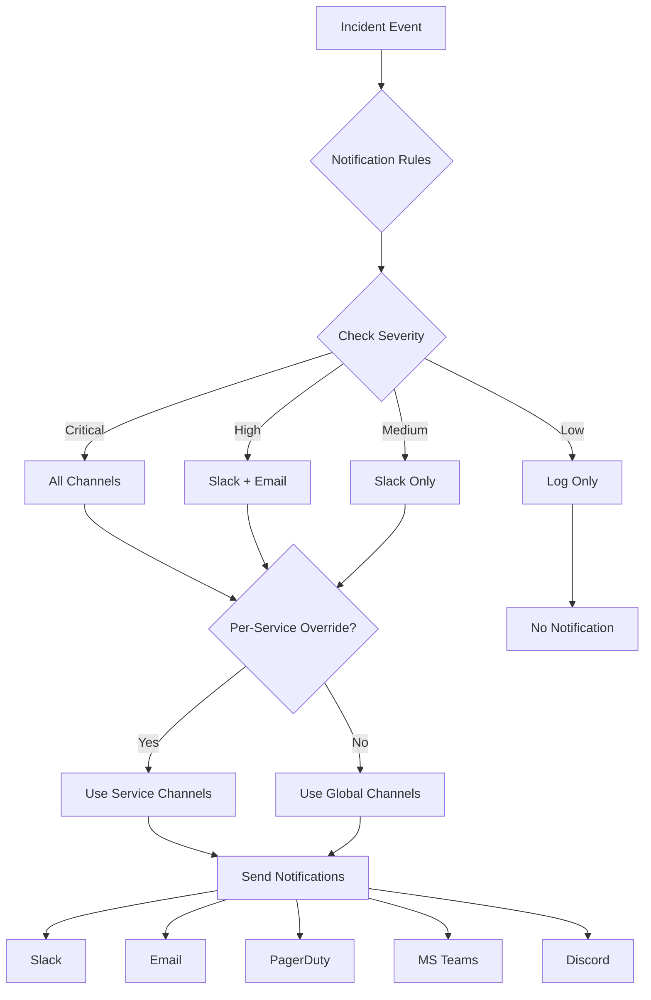

# Notifications

Configure notification channels and routing for incidents and investigations.

## Overview

PrismaLens supports multiple notification channels to alert teams about incidents, investigation progress, and recommendations. Notifications can be configured globally or per-service.

## User Flow



---

## Notification Channels

| Channel | Auth Method | Use Cases |
|---------|-------------|-----------|
| **Slack** | OAuth | Real-time alerts, investigation updates |
| **Email** | SMTP | Summaries, escalations, reports |
| **PagerDuty** | API Key | On-call paging, escalation |
| **MS Teams** | Webhook | Real-time alerts |
| **Discord** | Webhook | Real-time alerts |

---

## Screens

### Notification Channels

- **Route**: `/settings/notifications/channels`
- **Purpose**: Manage connected notification channels

```
+-------------------------------------------------------------+
|  Settings > Notifications > Channels                         |
+-------------------------------------------------------------+
|                                                              |
|  Notification Channels                          [+ Connect]  |
|  =====================                                       |
|                                                              |
|  Connect channels to receive incident notifications.         |
|                                                              |
|  +--------------------------------------------------------+ |
|  | [Slack Logo]  Slack                         Connected   | |
|  | --------------------------------------------------------| |
|  | Workspace: PrismaLens Engineering                       | |
|  | Default Channel: #incidents                             | |
|  | Connected by: admin@company.com                         | |
|  | Last used: 5 minutes ago                                | |
|  |                               [Test] [Configure] [X]    | |
|  +--------------------------------------------------------+ |
|                                                              |
|  +--------------------------------------------------------+ |
|  | [Email Logo]  Email (SMTP)                  Connected   | |
|  | --------------------------------------------------------| |
|  | Server: smtp.company.com:587                            | |
|  | From: prismalens@company.com                            | |
|  | Last used: 2 hours ago                                  | |
|  |                               [Test] [Configure] [X]    | |
|  +--------------------------------------------------------+ |
|                                                              |
|  +--------------------------------------------------------+ |
|  | [PagerDuty Logo]  PagerDuty                 Connected   | |
|  | --------------------------------------------------------| |
|  | Service: Platform Team                                  | |
|  | Integration Key: ••••••••                               | |
|  | Last used: 1 day ago                                    | |
|  |                               [Test] [Configure] [X]    | |
|  +--------------------------------------------------------+ |
|                                                              |
|  +--------------------------------------------------------+ |
|  | [MS Teams Logo]  Microsoft Teams         Not Connected  | |
|  | --------------------------------------------------------| |
|  | Send notifications to MS Teams channels via webhooks    | |
|  |                                            [Connect]    | |
|  +--------------------------------------------------------+ |
|                                                              |
|  +--------------------------------------------------------+ |
|  | [Discord Logo]  Discord                  Not Connected  | |
|  | --------------------------------------------------------| |
|  | Send notifications to Discord channels via webhooks     | |
|  |                                            [Connect]    | |
|  +--------------------------------------------------------+ |
|                                                              |
+-------------------------------------------------------------+
```

---

### Add Slack Channel

- **Route**: `/settings/notifications/channels/slack`
- **Purpose**: Connect Slack workspace via OAuth

```
+-------------------------------------------------------------+
|  Connect Slack                                               |
+-------------------------------------------------------------+
|                                                              |
|  Step 1: Authorize PrismaLens                               |
|  ============================                               |
|                                                              |
|  PrismaLens will request access to:                         |
|                                                              |
|  * Post messages to channels                                 |
|  * Send direct messages to users                            |
|  * Read channel list                                        |
|                                                              |
|                    [Authorize with Slack]                   |
|                                                              |
|  ---------------------------------------------------------- |
|                                                              |
|  Step 2: Configure (after auth)                             |
|  ==============================                             |
|                                                              |
|  Default Channel:                                           |
|  [#incidents v]                                             |
|                                                              |
|  Available Channels:                                        |
|  #incidents, #platform-alerts, #engineering, #general       |
|                                                              |
|  Message Format:                                            |
|  (*) Rich (with buttons and actions)                        |
|  ( ) Simple (text only)                                     |
|                                                              |
|  [x] Include @channel mention for Critical                  |
|  [x] Include investigation progress updates                 |
|  [ ] Include all alert details (verbose)                    |
|                                                              |
|                          [Cancel]  [Save Configuration]     |
|                                                              |
+-------------------------------------------------------------+
```

---

### Add Email Channel (SMTP)

- **Route**: `/settings/notifications/channels/email`
- **Purpose**: Configure SMTP for email notifications

```
+-------------------------------------------------------------+
|  Configure Email (SMTP)                                      |
+-------------------------------------------------------------+
|                                                              |
|  SMTP Server Configuration                                   |
|  =========================                                   |
|                                                              |
|  SMTP Host:     [smtp.company.com               ]           |
|  SMTP Port:     [587            ]                           |
|                                                              |
|  Security:      (*) TLS (recommended)                       |
|                 ( ) SSL                                      |
|                 ( ) None                                     |
|                                                              |
|  Authentication                                              |
|  --------------                                              |
|  Username:      [notifications@company.com      ]           |
|  Password:      [••••••••••••••••               ]           |
|                                                              |
|  Email Settings                                              |
|  --------------                                              |
|  From Name:     [PrismaLens                     ]           |
|  From Email:    [prismalens@company.com         ]           |
|  Reply-To:      [ops-team@company.com           ]           |
|                                                              |
|  Default Recipients                                          |
|  ------------------                                          |
|  [ops-team@company.com                          ]           |
|  [platform@company.com                          ] [+ Add]   |
|                                                              |
|                    [Test Email]  [Save Configuration]       |
|                                                              |
+-------------------------------------------------------------+
```

---

### Add PagerDuty Channel

- **Route**: `/settings/notifications/channels/pagerduty`
- **Purpose**: Connect PagerDuty for on-call paging

```
+-------------------------------------------------------------+
|  Connect PagerDuty                                           |
+-------------------------------------------------------------+
|                                                              |
|  PagerDuty Integration                                       |
|  =====================                                       |
|                                                              |
|  Create a PagerDuty Events API v2 integration:              |
|                                                              |
|  1. Go to PagerDuty > Services > Your Service               |
|  2. Click Integrations tab                                  |
|  3. Add "Events API v2" integration                         |
|  4. Copy the Integration Key below                          |
|                                                              |
|  Integration Key:                                           |
|  [                                              ]           |
|                                                              |
|  Routing Key (optional):                                    |
|  [                                              ]           |
|                                                              |
|  Severity Mapping                                            |
|  ----------------                                            |
|  PrismaLens Critical  →  [Critical v]                       |
|  PrismaLens High      →  [Error v]                          |
|  PrismaLens Medium    →  [Warning v]                        |
|  PrismaLens Low       →  [Info v]                           |
|                                                              |
|  [x] Auto-resolve PagerDuty incident when resolved          |
|  [ ] Include investigation details in incident              |
|                                                              |
|                    [Test Alert]  [Save Configuration]       |
|                                                              |
+-------------------------------------------------------------+
```

---

### Add MS Teams Channel

- **Route**: `/settings/notifications/channels/teams`
- **Purpose**: Configure MS Teams webhook

```
+-------------------------------------------------------------+
|  Connect Microsoft Teams                                     |
+-------------------------------------------------------------+
|                                                              |
|  MS Teams Webhook                                            |
|  ================                                            |
|                                                              |
|  Create an incoming webhook in your Teams channel:          |
|                                                              |
|  1. Open MS Teams channel                                   |
|  2. Click (...) > Connectors                                |
|  3. Add "Incoming Webhook"                                  |
|  4. Copy the webhook URL below                              |
|                                                              |
|  Webhook URL:                                               |
|  [https://company.webhook.office.com/webhookb2/... ]        |
|                                                              |
|  Channel Name (for display):                                |
|  [#platform-incidents                           ]           |
|                                                              |
|  Message Options                                             |
|  ---------------                                             |
|  [x] Use Adaptive Cards (rich formatting)                   |
|  [x] Include action buttons                                 |
|  [ ] Mention @channel for Critical                          |
|                                                              |
|                    [Test Message]  [Save Configuration]     |
|                                                              |
+-------------------------------------------------------------+
```

---

### Add Discord Channel

- **Route**: `/settings/notifications/channels/discord`
- **Purpose**: Configure Discord webhook

```
+-------------------------------------------------------------+
|  Connect Discord                                             |
+-------------------------------------------------------------+
|                                                              |
|  Discord Webhook                                             |
|  ===============                                             |
|                                                              |
|  Create a webhook in your Discord channel:                  |
|                                                              |
|  1. Open Discord channel settings                           |
|  2. Go to Integrations > Webhooks                           |
|  3. Create New Webhook                                      |
|  4. Copy the webhook URL below                              |
|                                                              |
|  Webhook URL:                                               |
|  [https://discord.com/api/webhooks/123456789/...  ]         |
|                                                              |
|  Bot Name (optional):                                       |
|  [PrismaLens                                    ]           |
|                                                              |
|  Message Options                                             |
|  ---------------                                             |
|  [x] Use Discord embeds (rich formatting)                   |
|  [x] Include severity color coding                          |
|  [ ] Mention @everyone for Critical                         |
|                                                              |
|                    [Test Message]  [Save Configuration]     |
|                                                              |
+-------------------------------------------------------------+
```

---

### Notification Rules

- **Route**: `/settings/notifications/rules`
- **Purpose**: Configure when and where to send notifications

```
+-------------------------------------------------------------+
|  Settings > Notifications > Rules                            |
+-------------------------------------------------------------+
|                                                              |
|  Notification Rules                                          |
|  ==================                                          |
|                                                              |
|  Configure which events trigger notifications and where     |
|  they are sent.                                              |
|                                                              |
|  Severity Routing                              [Edit]       |
|  ----------------                                           |
|                                                              |
|  +--------------------------------------------------------+ |
|  | Severity  | Slack | Email | PagerDuty | Teams | Discord| |
|  |-----------|-------|-------|-----------|-------|--------| |
|  | Critical  |  [x]  |  [x]  |    [x]    |  [x]  |  [ ]   | |
|  | High      |  [x]  |  [x]  |    [ ]    |  [x]  |  [ ]   | |
|  | Medium    |  [x]  |  [ ]  |    [ ]    |  [ ]  |  [ ]   | |
|  | Low       |  [ ]  |  [ ]  |    [ ]    |  [ ]  |  [ ]   | |
|  +--------------------------------------------------------+ |
|                                                              |
|  Event Types                                   [Edit]       |
|  -----------                                                |
|                                                              |
|  +--------------------------------------------------------+ |
|  | Event                    | Notify | Channels           | |
|  |--------------------------|--------|--------------------| |
|  | Incident created         |  [x]   | All configured     | |
|  | Incident acknowledged    |  [x]   | Slack, Teams       | |
|  | Investigation started    |  [x]   | Slack              | |
|  | Investigation complete   |  [x]   | All configured     | |
|  | Root cause identified    |  [x]   | All configured     | |
|  | Recommendation ready     |  [x]   | Slack, Email       | |
|  | Incident resolved        |  [x]   | All configured     | |
|  | Escalation triggered     |  [x]   | PagerDuty, Email   | |
|  +--------------------------------------------------------+ |
|                                                              |
|  Quiet Hours                                   [Edit]       |
|  -----------                                                |
|  Non-Critical: 10 PM - 8 AM (except Critical)              |
|  Weekend: Disabled                                          |
|                                                              |
+-------------------------------------------------------------+
```

---

### Notification Templates

- **Route**: `/settings/notifications/templates`
- **Purpose**: Customize notification message formats

```
+-------------------------------------------------------------+
|  Settings > Notifications > Templates                        |
+-------------------------------------------------------------+
|                                                              |
|  Notification Templates                         [+ Create]   |
|  ======================                                      |
|                                                              |
|  Customize how notifications appear in each channel.        |
|                                                              |
|  +--------------------------------------------------------+ |
|  | Incident Created                              [Default] | |
|  | --------------------------------------------------------| |
|  | Slack: [View Template] [Edit]                           | |
|  | Email: [View Template] [Edit]                           | |
|  | PagerDuty: [View Template] [Edit]                       | |
|  +--------------------------------------------------------+ |
|                                                              |
|  +--------------------------------------------------------+ |
|  | Investigation Complete                        [Default] | |
|  | --------------------------------------------------------| |
|  | Slack: [View Template] [Edit]                           | |
|  | Email: [View Template] [Edit]                           | |
|  +--------------------------------------------------------+ |
|                                                              |
|  Available Variables                                         |
|  -------------------                                         |
|  {{incident.id}}          - Incident ID                     |
|  {{incident.title}}       - Incident title                  |
|  {{incident.severity}}    - Severity level                  |
|  {{incident.status}}      - Current status                  |
|  {{incident.service}}     - Affected service                |
|  {{incident.url}}         - Link to incident                |
|  {{investigation.status}} - Investigation status            |
|  {{investigation.rca}}    - Root cause (if identified)      |
|  {{recommendation.text}}  - Recommendation text             |
|                                                              |
+-------------------------------------------------------------+
```

---

## Notification Message Examples

### Slack Notification

```
+-------------------------------------------------------------+
|  PrismaLens                                     12:42 PM    |
+-------------------------------------------------------------+
|  :rotating_light: New Critical Incident                     |
|                                                              |
|  *INC-42: High CPU usage on api-gateway*                    |
|                                                              |
|  Service: api-gateway                                        |
|  Severity: Critical                                          |
|  Status: Triggered                                          |
|                                                              |
|  AI investigation has started automatically.                |
|                                                              |
|  [View Incident]  [Acknowledge]  [Assign to Me]            |
+-------------------------------------------------------------+
```

### Slack Investigation Complete

```
+-------------------------------------------------------------+
|  PrismaLens                                     12:58 PM    |
+-------------------------------------------------------------+
|  :white_check_mark: Investigation Complete                  |
|                                                              |
|  *INC-42: High CPU usage on api-gateway*                    |
|                                                              |
|  Root Cause Identified:                                     |
|  N+1 query in /api/users endpoint causing excessive DB load |
|                                                              |
|  Confidence: 92%                                            |
|                                                              |
|  Recommendation:                                             |
|  Add eager loading for user relationships in UserService    |
|                                                              |
|  [View Details]  [Apply Recommendation]  [Dismiss]         |
+-------------------------------------------------------------+
```

### Email Notification

```
Subject: [CRITICAL] INC-42: High CPU usage on api-gateway

PrismaLens Incident Alert
─────────────────────────

Incident: INC-42
Title: High CPU usage on api-gateway
Severity: Critical
Service: api-gateway
Status: Triggered

Time: January 12, 2026 at 12:42 PM

Description:
CPU usage exceeded 90% threshold for more than 5 minutes

AI investigation has started automatically.

─────────────────────────
View Incident: https://prismalens.example.com/incidents/42
Acknowledge: https://prismalens.example.com/incidents/42/ack

You received this because you are subscribed to Critical alerts.
Manage preferences: https://prismalens.example.com/settings/notifications
```

---

## API Interactions

| Endpoint | Method | Purpose | Status |
|----------|--------|---------|--------|
| `/api/notifications/channels` | GET | List channels | Needs Implementation |
| `/api/notifications/channels` | POST | Create channel | Needs Implementation |
| `/api/notifications/channels/:id` | PATCH | Update channel | Needs Implementation |
| `/api/notifications/channels/:id` | DELETE | Remove channel | Needs Implementation |
| `/api/notifications/channels/:id/test` | POST | Test channel | Needs Implementation |
| `/api/notifications/rules` | GET | Get routing rules | Needs Implementation |
| `/api/notifications/rules` | PATCH | Update rules | Needs Implementation |
| `/api/notifications/templates` | GET | List templates | Needs Implementation |
| `/api/notifications/templates/:id` | PATCH | Update template | Needs Implementation |
| `/api/notifications/send` | POST | Send notification | Needs Implementation |

---

## Acceptance Criteria

- [ ] User can connect Slack via OAuth
- [ ] User can configure SMTP for email
- [ ] User can add PagerDuty integration
- [ ] User can add MS Teams webhook
- [ ] User can add Discord webhook
- [ ] Severity routing is configurable
- [ ] Event types can be enabled/disabled
- [ ] Test notifications work for all channels
- [ ] Notifications include actionable buttons (Slack)
- [ ] Auto-resolve syncs with PagerDuty
- [ ] Quiet hours prevent non-critical notifications

---

## Test Scenarios

1. **Slack notification**
   - Connect Slack workspace
   - Trigger Critical incident
   - Verify message posted to channel
   - Click "Acknowledge" button
   - Verify incident status updates

2. **Email notification**
   - Configure SMTP
   - Send test email
   - Trigger incident
   - Verify email received

3. **PagerDuty escalation**
   - Connect PagerDuty
   - Trigger Critical incident
   - Verify PagerDuty alert created
   - Resolve incident
   - Verify PagerDuty auto-resolved

4. **Severity routing**
   - Configure Critical → all channels
   - Configure Low → no channels
   - Trigger Low incident
   - Verify no notifications sent

5. **Quiet hours**
   - Enable quiet hours 10 PM - 8 AM
   - Trigger High incident at 11 PM
   - Verify notification suppressed
   - Trigger Critical incident at 11 PM
   - Verify notification sent (Critical overrides)

---

## Related Documentation

- [Settings](./10_Settings.md) - Global notification settings
- [Integrations](./09_Integrations.md) - Integration connections
- [Incidents](./05_Incidents.md) - Incident notifications
- [Investigations](./06_Investigations.md) - Investigation notifications
