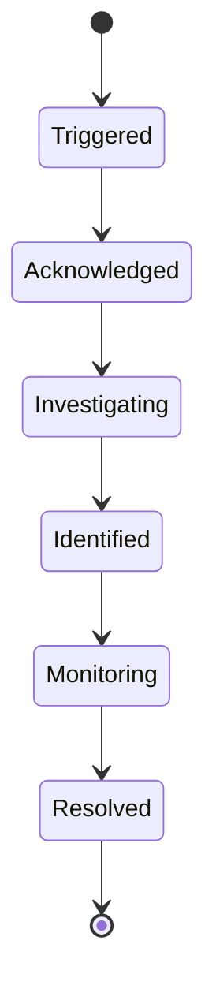

# Glossary

Terminology reference for PrismaLens concepts and entities.

## Core Concepts

### Alert
An actionable notification derived from monitoring events. Alerts are the primary input to PrismaLens, received via webhooks from external systems like Prometheus, Datadog, or custom integrations.

**States**:
- `firing` - Alert is active
- `acknowledged` - User has seen the alert
- `resolved` - Alert condition no longer present

**Example**: "High CPU usage on api-gateway exceeds 90%"

---

### Correlation Rule
A rule that groups related alerts into a single incident. Correlation prevents alert fatigue by combining symptoms of the same underlying issue.

**Criteria types**:
- Time-based (alerts within N minutes)
- Label-based (same service, same severity)
- Pattern-based (regex matching)

---

### Event
A raw data point from monitoring systems. Events are the lowest-level data, typically not surfaced directly to users but used to generate alerts.

**Examples**: Log entry, metric data point, trace span

---

### Human Gate
A checkpoint in the AI investigation workflow that requires human approval before proceeding. Used for critical services or when AI confidence is low.

**Configured per**: Service or globally

---

### Incident
A grouped collection of correlated alerts that represents a production issue requiring investigation. Incidents are the primary unit of work in PrismaLens.

**Lifecycle**:

**Severity levels**: Critical, High, Medium, Low, Info

---

### Integration
A connection to an external tool that provides context for investigations or enables actions. Integrations can be global (instance-wide) or per-service.

**Categories**:
| Category | Examples |
|----------|----------|
| Data Sources | Prometheus, Datadog, CloudWatch |
| Code/Git | GitHub, GitLab |
| Communication | Slack, MS Teams, Discord |
| Ticketing | Jira, Linear |
| On-call | PagerDuty, Opsgenie |

---

### Integration Connection
An authenticated instance of an integration. For example, connecting to a specific GitHub organization creates an integration connection.

---

### Investigation
An AI-driven root cause analysis (RCA) process triggered by an incident. Investigations use LangGraph to orchestrate multiple AI agents that gather context, analyze patterns, and generate recommendations.

**Components**:
- LangGraph execution graph
- Agent nodes (gatherer, analyzer, recommender)
- Tool executions (log fetch, code search, metrics query)
- Human gates (optional approval points)

---

### LangGraph
The framework used to orchestrate AI agents in PrismaLens. LangGraph enables stateful, multi-step workflows where agents can branch, loop, and call tools.

**Key concepts**:
- **Node**: A step in the workflow (agent or tool)
- **Edge**: A transition between nodes
- **State**: Data passed between nodes
- **Graph**: The complete workflow definition

---

### Mapping Rule (Alert Mapping)
A rule that associates incoming alerts to services based on labels or patterns. Required because external systems don't know about PrismaLens services.

**Example**: `labels.service == "api-gateway"` → Service: API Gateway

---

### Postmortem
A summary document attached to a resolved incident. Contains notes about what happened, root cause, and follow-up actions.

**Sections** (Community Edition):
- Summary
- Timeline
- Root cause
- Action items
- Lessons learned

---

### Recommendation
An actionable suggestion generated by AI analysis. Recommendations include code fixes, configuration changes, or runbook steps.

**Properties**:
- Priority (Critical, High, Medium, Low)
- Status (Pending, Accepted, Dismissed, Applied)
- Confidence score (0-100%)
- Implementation details

---

### Service
An application component being monitored by PrismaLens. Services are the organizational unit for grouping alerts, investigations, and integrations.

**Properties**:
- Name and description
- Tier (criticality level)
- Type (Gateway, Service, Database, Queue, Cache, External)
- Integrations (per-service connections)
- Investigation policy

---

### Service Dependency
A relationship between two services indicating that one service depends on another. Used for topology visualization and impact analysis.

**Example**: `checkout-service` depends on `payment-gateway`

---

### Service Tier
A classification of service criticality that determines default investigation policies.

| Tier | Criticality | Default Policy |
|------|-------------|----------------|
| Tier 1 | Critical | Auto-investigate + Page on-call |
| Tier 2 | High | Auto-investigate + Notify channel |
| Tier 3 | Medium | Manual investigation + Notify |
| Tier 4 | Low | Log only |

---

### Timeline Entry
A timestamped event in an incident's history. Includes alert arrivals, status changes, agent actions, and user comments.

---

### Tool Execution
A record of an AI agent invoking a tool during investigation. Tools include log fetchers, code searchers, metric queries, and more.

**Properties**:
- Tool name
- Input parameters
- Output/result
- Duration
- Status (success, error)

---

### Webhook
An HTTP endpoint that receives alerts from external monitoring systems.

**PrismaLens endpoints**:
- `POST /api/webhooks/generic` - Generic JSON alerts
- `POST /api/webhooks/prometheus` - Prometheus AlertManager format
- `POST /api/webhooks/github` - GitHub events

---

## Metrics

### MTTA (Mean Time to Acknowledge)
Average time between incident creation and first acknowledgment.

### MTTR (Mean Time to Resolve)
Average time between incident creation and resolution.

### MTTI (Mean Time to Investigate)
Average time spent in the Investigating state.

---

## Abbreviations

| Abbreviation | Meaning |
|--------------|---------|
| AI | Artificial Intelligence |
| API | Application Programming Interface |
| DAG | Directed Acyclic Graph |
| LLM | Large Language Model |
| MTTR | Mean Time to Resolve |
| MTTA | Mean Time to Acknowledge |
| OAuth | Open Authorization |
| RCA | Root Cause Analysis |
| SRE | Site Reliability Engineer |
| SSO | Single Sign-On |
| UI | User Interface |

---

## Related Documentation

- [Overview](./00_Overview.md) - Product vision and personas
- [Data Model](./00_Overview.md#core-data-model) - Entity relationships
- [API Reference](./12_API_Reference.md) - Endpoint documentation
