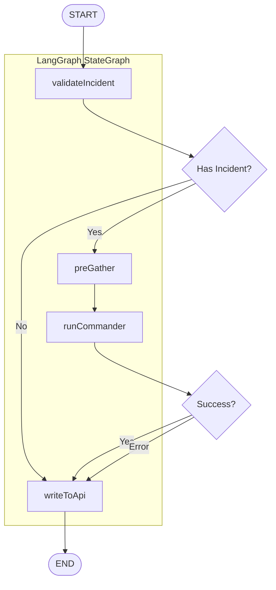
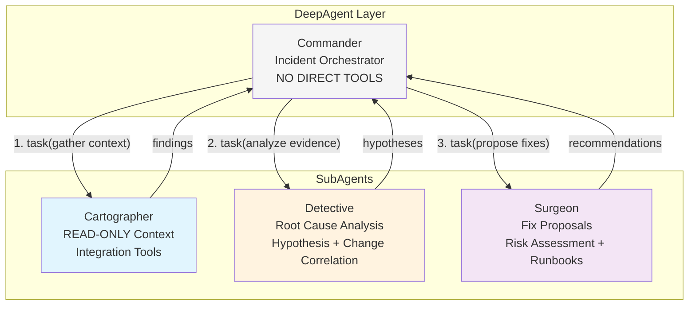
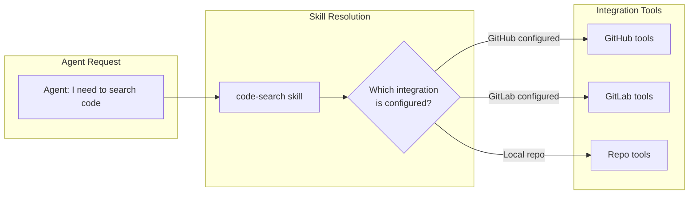
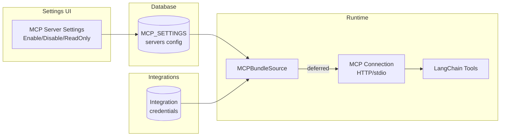
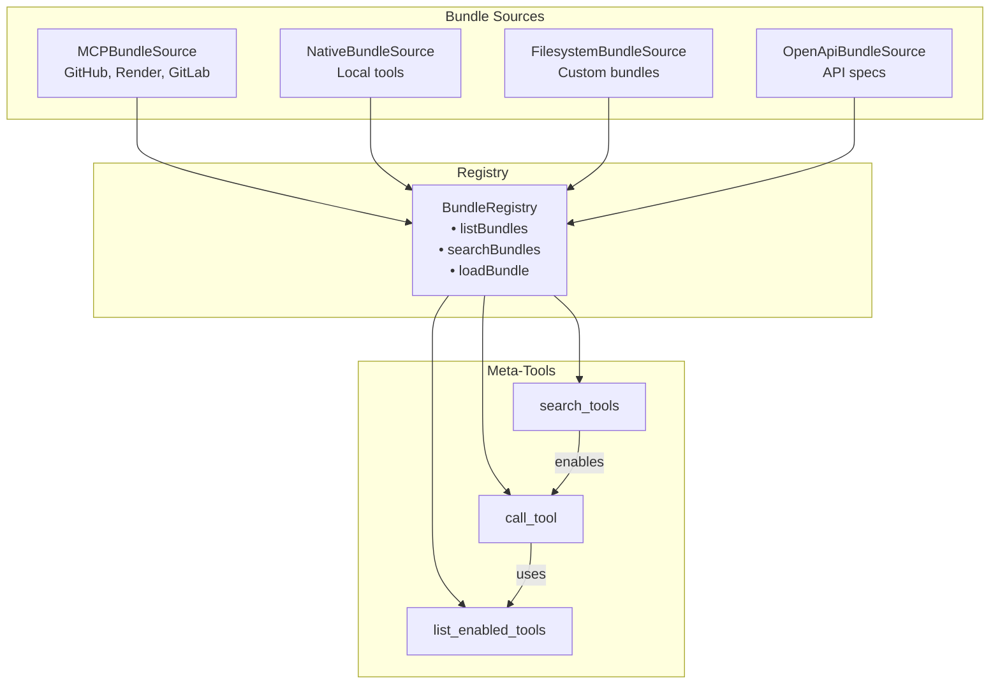
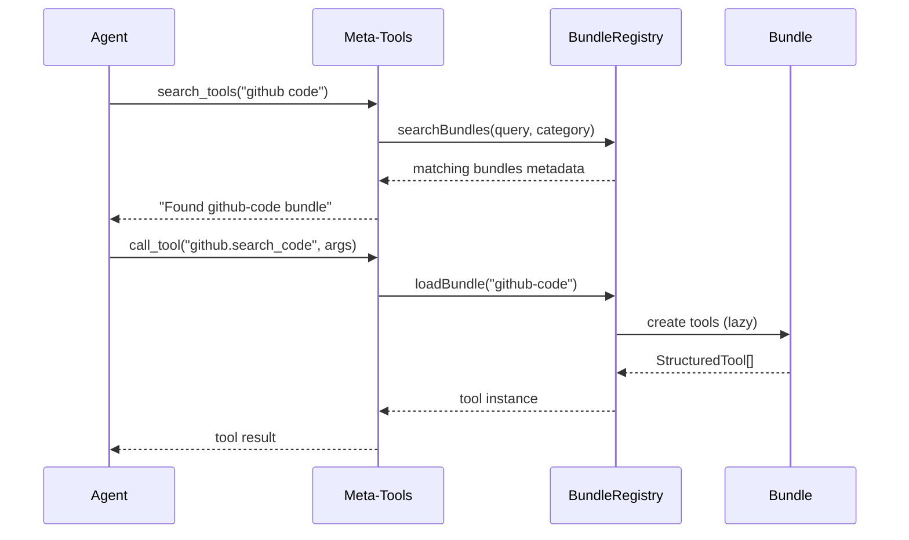
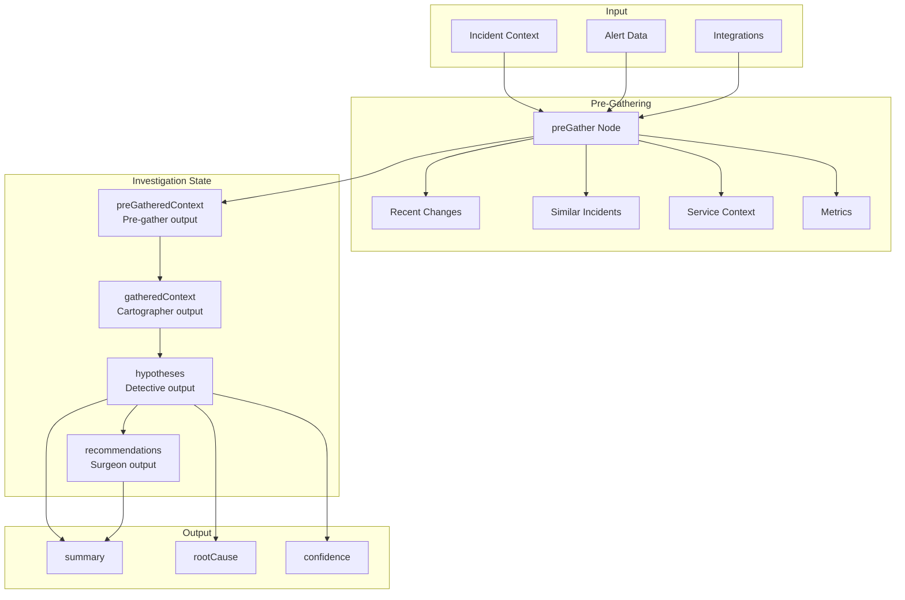

# @prismalens/agents

Multi-agent system for automated incident investigation using LangGraph and DeepAgents.

## Architecture

Two-layer graph architecture for incident investigation:

### Investigation Flow (LangGraph)



### Agent Hierarchy



**Key Design Principle**: Commander is a **pure coordinator** with no direct tools. It only uses DeepAgent built-ins (`write_todos`, `task`) to delegate work to SubAgents. This follows the "tools behind skills" pattern for cleaner separation of concerns.

### Investigation Graph (Outer)

Pipeline orchestration with PostgreSQL checkpointing:

- **validateIncident**: Validates incident context, calculates quality scores
- **preGather**: Fetches context before Commander (BigPanda pattern)
- **commander**: Runs the DeepAgent investigation
- **writeToApi**: Persists results to database

> **Note**: Investigations are incident-centric. Alerts are correlated into incidents before investigation begins. See [Alert Correlation](../../internal-docs/stories/04.1_Alert_Correlation.md).

### Pre-Gathering Phase

Before Commander starts, the `preGather` node fetches context in parallel using the BigPanda enrichment pattern (60-90% of incidents are change-related):

| Data Source | Purpose | Timeout |
|-------------|---------|---------|
| Full Alerts | Complete alert details with timeline | 15s |
| Recent Changes | Deployments, commits, config changes | 20s |
| Similar Incidents | Past resolutions for pattern matching | 15s |
| Service Context | Dependencies, health status | 10s |
| Metrics | MTTA, alert velocity, affected services | 5s |
| Log Preview | Error log samples | 20s |

**Graceful Degradation**: Each fetch can fail independently. Commander proceeds with whatever context was gathered, indicated by a quality score.

**Change Risk Scoring**: Deployments within 1-2 hours of incident time get high risk scores (BigPanda pattern). Factors include:
- Time proximity to incident (+30 within 1 hour, +20 within 2 hours)
- Failed or rolled-back deployments (+25)
- Database migrations (+20)
- Service affinity (+15)

**Similar Incident Hints**: If a past incident has ≥70% similarity, Commander receives a hint about the previous resolution and root cause.

**Commander Enrichment**: The pre-gathered context enhances Commander's initial message with:
- ⚠️ High-risk change warnings
- 📋 Similar incident hints with resolutions
- 🔄 Recurring pattern detection
- 📊 Alert velocity and timing metrics

See [06.1_Investigation_Triggers.md](../../internal-docs/stories/06.1_Investigation_Triggers.md) for full details.

### Commander Agent (Inner)

DeepAgent that orchestrates the investigation workflow. Commander has **no direct investigation tools** - it coordinates exclusively through delegation.

**Built-in Capabilities** (from DeepAgents framework):
- `write_todos` - Plan and track investigation tasks
- `task(subagent, description)` - Delegate work to SubAgents

**Workflow**:
1. Creates investigation plan using `write_todos`
2. Delegates context gathering to Cartographer via `task()`
3. Delegates analysis to Detective via `task()`
4. Delegates fix proposals to Surgeon via `task()` (only if confidence ≥70%)
5. Compiles findings into final report

**Why No Direct Tools?**: Commander's system prompt states "You DO NOT investigate directly." Having direct tools would create a contradiction. SubAgents have specialized tools and skills; Commander's job is pure coordination.

## SubAgents

Each SubAgent has specialized skills and optional MCP tools for deep code analysis.

### Cartographer (Context Gatherer)

**Role**: READ-ONLY exploration and context gathering. Cannot modify anything.

**Skills**:
- `log-analysis` - Fetch and analyze logs from deployment platforms
- `code-search` - Search codebase for error origins and patterns
- `deployment-check` - Check deployment status and history
- `recent-commits` - Analyze recent git commits for changes
- `dependency-trace` (MCP) - Trace file dependencies to find related code
- `code-structure` (MCP) - Analyze code structure using AST-based tools

**Output**: Returns structured summaries with findings, confidence levels, and suggested next steps.

### Detective (Root Cause Analyst)

**Role**: Analyze evidence and form hypotheses about root cause.

**Tools**:
- `form_hypothesis` - Record hypotheses with confidence levels and evidence
- `evaluate_hypothesis` - Update or reject hypotheses based on new evidence
- `correlate_with_changes` - Correlate incidents with recent deployments/changes
- `find_similar_incidents` - Search for historically similar incidents

**Skills**:
- `hypothesis-formation` - Form and validate root cause hypotheses
- `change-correlation` - Correlate with recent changes (60-90% of outages are caused by changes!)
- `incident-similarity` - Find similar past incidents and leverage past resolutions
- `timeline-analysis` - Build chronological event timelines
- `pattern-correlation` - Cross-reference patterns across data sources
- `error-origin-trace` (MCP) - Trace errors back to their actual source
- `cross-service-analysis` (MCP) - Analyze errors across services to find cascade origins

**Critical First Step**: Always check recent changes first. Industry data (BigPanda, New Relic) shows 60-90% of outages are caused by changes.

**Confidence Levels**:
- 90-100%: Direct evidence (stack trace, config diff)
- 70-89%: Strong circumstantial evidence
- 50-69%: Some supporting evidence but gaps remain
- Below 50%: Speculation, needs more investigation

**Key Rule**: Surgeon cannot proceed unless Detective has ≥70% confidence.

### Surgeon (Fix Proposer)

**Role**: Propose specific, actionable fixes for human review. Does NOT implement changes.

**Tools**:
- `propose_fix` - Create fix recommendations with code changes
- `validate_code_change` - Validate search/replace blocks exist in code
- `suggest_rollback` - Quickly recommend deployment rollbacks
- `lookup_runbook` - Search runbooks for proven remediation procedures
- `assess_change_risk` - Evaluate risk level and required approvals for proposed fixes

**Skills**:
- `code-fix` - Propose specific code changes with search/replace blocks
- `rollback-proposal` - Recommend deployment rollbacks
- `config-change` - Recommend configuration changes
- `runbook-lookup` - Search runbooks for proven solutions
- `risk-assessment` - Assess change risk and determine required approvals

**Risk Assessment**: Before finalizing any fix, Surgeon assesses:
- Blast radius (how many users/services affected)
- Reversibility (how easy to rollback)
- Complexity (how many files/services touched)
- Testing coverage (are there tests for this change)

**Approval Levels**:
- Low risk (0-25): Standard deployment
- Medium risk (26-50): Peer review recommended
- High risk (51-75): Team lead approval
- Critical risk (76-100): Change Advisory Board (CAB) approval

**Output**: Fix proposals including code changes, verification steps, priority, risk score, and required approvals.

## Skills System

Skills provide specialized workflows via SKILL.md files. Each skill contains step-by-step instructions that are loaded on-demand when the agent needs them.

### Capability-Based Skills

Skills represent **capabilities**, not integrations. The agent describes WHAT it needs, and skills resolve to the appropriate integration based on what's configured.



**Capability → Integration Mapping**:

| Capability | Possible Integrations |
|------------|----------------------|
| `code-search` | GitHub, GitLab, local repo |
| `log-analysis` | Datadog, OpenTelemetry, CloudWatch |
| `deployment-check` | Render, Kubernetes, AWS ECS |
| `metrics-search` | Datadog, Prometheus, Grafana |

This design allows:
- Agents to focus on WHAT they need, not HOW to get it
- Easy addition of new integrations without changing agent code
- Context-aware tool loading based on configured integrations

### Directory Structure

```
src/skills/
├── cartographer/
│   ├── log-analysis/SKILL.md
│   ├── code-search/SKILL.md
│   ├── deployment-check/SKILL.md
│   ├── recent-commits/SKILL.md
│   ├── dependency-trace/SKILL.md      # MCP-powered
│   └── code-structure/SKILL.md        # MCP-powered
├── detective/
│   ├── hypothesis-formation/SKILL.md
│   ├── change-correlation/SKILL.md    # NEW: Correlate with recent changes
│   ├── incident-similarity/SKILL.md   # NEW: Find similar past incidents
│   ├── timeline-analysis/SKILL.md
│   ├── pattern-correlation/SKILL.md
│   ├── error-origin-trace/SKILL.md    # MCP-powered
│   └── cross-service-analysis/SKILL.md # MCP-powered
└── surgeon/
    ├── code-fix/SKILL.md
    ├── rollback-proposal/SKILL.md
    ├── config-change/SKILL.md
    ├── runbook-lookup/SKILL.md        # NEW: Search runbooks for solutions
    └── risk-assessment/SKILL.md       # NEW: Assess change risk
```

### Custom Skills

Add custom skills via environment variables:

```bash
# Agent-specific custom skills
PRISMALENS_CARTOGRAPHER_SKILLS_DIR=/path/to/custom/cartographer
PRISMALENS_DETECTIVE_SKILLS_DIR=/path/to/custom/detective
PRISMALENS_SURGEON_SKILLS_DIR=/path/to/custom/surgeon

# Shared custom skills (looks for subagent-named subdirs)
PRISMALENS_ADDITIONAL_SKILLS_DIR=/path/to/additional/skills
```

### Creating a Skill

Create a `SKILL.md` file with frontmatter:

```markdown
---
name: my-skill
description: What this skill does
capability: search-code
integrations:
  - github
  - gitlab
  - repo
---

# My Skill

## Purpose
Why this skill exists...

## Process
1. Step one
2. Step two

## Output Format
What the agent should return...
```

## Industry Patterns

The Detective and Surgeon agents implement patterns from leading AIOps platforms:

### BigPanda Patterns

Based on [BigPanda Root Cause Analysis](https://www.bigpanda.io/our-product/root-cause-analysis/):

- **Root Cause Changes**: 60-90% of outages are caused by changes. Detective's `correlate_with_changes` tool automatically checks recent deployments and config changes.
- **Historical Similarity**: Find similar incidents from the past 30 days. Detective's `find_similar_incidents` tool uses a similarity threshold to match past issues.
- **Confidence Scoring**: Hypotheses include confidence levels to indicate certainty.

### New Relic Patterns

Based on [New Relic MCP Server](https://newrelic.com/blog/news/new-relic-ai-mcp-server-launch):

- **Probable Cause Ranking**: Detective ranks hypotheses by confidence to reduce noise.
- **Deployment Impact Analysis**: Correlate incidents with recent deployments.
- **Remediation Intelligence**: Surgeon searches runbooks and past remediations.

### Risk Assessment

Surgeon implements risk scoring inspired by change management best practices:

- **Blast Radius Analysis**: How many users/services could be affected?
- **Reversibility Assessment**: How easy is it to rollback if the fix fails?
- **Approval Gates**: Higher risk changes require more approvals (peer → team lead → CAB).

## Future: Knowledge Integration

A planned capability to give agents access to organizational knowledge (runbooks, past incidents, documentation) during investigations.

### Capability: `knowledge-search`

Will extend the existing capability system in `src/tools/capabilities.ts`:

```typescript
{
  name: "knowledge-search",
  description: "Search organizational knowledge including runbooks, past incidents, and documentation",
  integrations: ["confluence", "notion", "jira", "github-docs", "rag"],
}
```

### How Agents Would Use Knowledge

| Agent | Use Case |
|-------|----------|
| **Detective** | Search past incidents with similar symptoms to inform hypotheses |
| **Adversary** | Challenge hypotheses with evidence from runbooks ("runbook says X, but you concluded Y") |
| **Surgeon** | Propose fixes based on documented runbook procedures |
| **Cartographer** | Gather runbook references for affected services |

### Content Types

Knowledge will be classified by type for targeted searches:

| Type | Description | Example Sources |
|------|-------------|-----------------|
| `runbook` | Step-by-step remediation procedures | Confluence pages labeled "runbook" |
| `incident` | Past incident documentation | Post-mortems, incident reports |
| `architecture` | System design docs | ADRs, architecture diagrams |
| `issue` | Known bugs and issues | Jira tickets |

### Implementation Methods (Flexible)

The existing bundle source architecture supports multiple methods:

| Method | When to Use | Existing Support |
|--------|-------------|------------------|
| **MCP** | User has Confluence/Notion/Jira MCP server | `MCPBundleSource` ✅ |
| **REST API** | Direct API access | `NativeBundleSource` ✅ |
| **OpenAPI** | Auto-generated client from spec | `OpenApiBundleSource` ✅ |
| **RAG** | Local vector search (offline) | Needs `RAGBundleSource` |

### Architecture Fit

This extends the existing capability → integration pattern, not creates new architecture. See `src/tools/capabilities.ts` for the current implementation.

For detailed competitor research and industry trends, see [internal-docs/integrations/runbooks-playbooks.md](../../internal-docs/integrations/runbooks-playbooks.md).

## MCP Integration

MCP (Model Context Protocol) servers provide agents with access to external systems during investigations. MCP servers can be configured via the **Settings UI** or environment variables.

### MCP Server Configuration Flow



### Available MCP Servers

| Server | Purpose | Integration Required |
|--------|---------|---------------------|
| **GitHub MCP** | Search code, view commits, read files, check issues | GitHub OAuth |
| **Render MCP** | Fetch logs, check deployments, list services | Render API Key |
| **GitLab MCP** | Search code and commits (self-hosted) | GitLab OAuth |

### MCP Settings

MCP servers are configured in **Settings > MCP Servers**:

- **Enable/Disable**: Control which servers agents can use
- **Read-Only Mode**: Restrict to read-only operations (default: enabled)
- **Test Connection**: Verify credentials and connectivity

### Local MCP Servers (Code Analysis)

For deep code analysis, optional local MCP servers can be enabled:

**Code Pathfinder** (`@anthropic/code-pathfinder-mcp`)
- `mcp_get_callers` - Find all functions that call a given function
- `mcp_get_callees` - Find all functions called by a given function
- `mcp_find_symbol` - Locate a function, class, or symbol
- `mcp_resolve_import` - Resolve import paths to file locations

**Code Index** (`code-index-mcp`)
- `mcp_search_code_advanced` - Smart code search with regex and fuzzy matching
- `mcp_get_file_summary` - Analyze file structure (functions, imports, complexity)
- `mcp_build_deep_index` - Build full symbol index for deep analysis

**Ripgrep** (`mcp-ripgrep`)
- `mcp_search_pattern` - Fast text/regex search
- `mcp_count_matches` - Count pattern occurrences

### Enabling Local MCP Servers

```bash
# Code Pathfinder
PRISMALENS_MCP_CODE_PATHFINDER_ENABLED=true
PRISMALENS_MCP_CODE_PATHFINDER_PROJECT_PATH=/path/to/project

# Code Index
PRISMALENS_MCP_CODE_INDEX_ENABLED=true
PRISMALENS_MCP_CODE_INDEX_PROJECT_PATH=/path/to/project

# Ripgrep
PRISMALENS_MCP_RIPGREP_ENABLED=true
PRISMALENS_MCP_RIPGREP_BASE_DIR=/path/to/search
```

## Tools

### Tool Bundle Architecture



### Tool Bundles

Tools are organized into bundles with TOOLS.md manifests:

```
src/tools/manifests/
├── github/
│   ├── TOOLS.md        # Tool descriptions
│   └── openapi.json    # API spec
├── render/
│   ├── TOOLS.md
│   └── openapi.json
└── repo/
    └── TOOLS.md
```

**Available Bundles**:
- `github-code` - GitHub repository search and file access (read-only)
- `github-write` - GitHub issues, PRs, comments (requires write access)
- `render-logs` - Render.com deployment logs and status
- `gitlab-code` - GitLab repository access (self-hosted)
- `repo-files` - Local repository file operations

### Progressive Tool Disclosure

Token-efficient tool loading. Instead of loading all tools at once, agents discover tools on-demand:



```typescript
const agent = createCommander({
  integrations: [...],
  useProgressiveDisclosure: true,
  preEnabledBundles: ['repo-files'], // Pre-load essentials
});
```

With progressive disclosure, agents use meta-tools:
- `search_tools` - Find tools by describing what you need
- `call_tool` - Execute a tool from an enabled bundle
- `list_enabled_tools` - See currently available tools

## Investigation State

Investigations require an incident with correlated alerts. The correlation pipeline ensures alerts are grouped into incidents before investigation.



**State Fields**:

| Field | Source | Description |
|-------|--------|-------------|
| `preGatheredContext` | preGather node | Alerts, changes, similar incidents, service context, metrics |
| `pendingAlerts` | Investigation update service | Alerts that arrived during ongoing investigation |
| `gatheredContext` | Cartographer agent | Context gathered during agent execution |
| `hypotheses` | Detective agent | Root cause hypotheses with confidence |
| `recommendations` | Surgeon agent | Fix proposals with risk scores |

## Configuration

### Environment Variable Naming Convention

PrismaLens uses a consistent naming convention for environment variables:

| Category | Prefix | Examples |
|----------|--------|----------|
| **Internal config** | `PRISMALENS_*` | `PRISMALENS_LLM_PROVIDER`, `PRISMALENS_MCP_*` |
| **External services** | Standard names | `ANTHROPIC_API_KEY`, `GROQ_API_KEY`, `LANGSMITH_API_KEY` |

**Rationale**: External service API keys use standard names so they work with existing env vars. Internal configuration uses the `PRISMALENS_` prefix to avoid conflicts.

### Environment Variables

| Variable | Description | Default |
|----------|-------------|---------|
| **LLM Configuration** | | |
| `PRISMALENS_LLM_PROVIDER` | LLM provider: `anthropic`, `openai`, `google`, `groq`, `openrouter`, `nvidia`, `ollama` | `anthropic` |
| `ANTHROPIC_API_KEY` | Anthropic API key | - |
| `OPENAI_API_KEY` | OpenAI API key | - |
| `GOOGLE_API_KEY` | Google Gemini API key | - |
| `GROQ_API_KEY` | Groq API key (free tier available) | - |
| `OPENROUTER_API_KEY` | OpenRouter API key | - |
| `NVIDIA_API_KEY` | NVIDIA NIM API key (free tier available) | - |
| `OLLAMA_API_KEY` | Ollama Cloud API key (optional) | - |
| `PRISMALENS_OLLAMA_BASE_URL` | Ollama server URL | `http://localhost:11434` |
| **Model Overrides** | | |
| `COMMANDER_MODEL` | Model for Commander agent | Provider default |
| `CARTOGRAPHER_MODEL` | Model for Cartographer | Provider default |
| `DETECTIVE_MODEL` | Model for Detective | Provider default |
| `SURGEON_MODEL` | Model for Surgeon | Provider default |
| **Local MCP Servers** | | |
| `PRISMALENS_MCP_CODE_PATHFINDER_ENABLED` | Enable Code Pathfinder | `false` |
| `PRISMALENS_MCP_CODE_PATHFINDER_PROJECT_PATH` | Project path for analysis | - |
| `PRISMALENS_MCP_CODE_INDEX_ENABLED` | Enable Code Index | `false` |
| `PRISMALENS_MCP_CODE_INDEX_PROJECT_PATH` | Project path for indexing | - |
| `PRISMALENS_MCP_RIPGREP_ENABLED` | Enable Ripgrep | `false` |
| `PRISMALENS_MCP_RIPGREP_BASE_DIR` | Base directory for search | - |
| **Skills Configuration** | | |
| `PRISMALENS_CARTOGRAPHER_SKILLS_DIR` | Custom Cartographer skills | - |
| `PRISMALENS_DETECTIVE_SKILLS_DIR` | Custom Detective skills | - |
| `PRISMALENS_SURGEON_SKILLS_DIR` | Custom Surgeon skills | - |
| `PRISMALENS_ADDITIONAL_SKILLS_DIR` | Shared custom skills | - |
| **LangSmith Tracing** | | |
| `LANGSMITH_API_KEY` | LangSmith API key | - |
| `LANGSMITH_TRACING` | Enable LangSmith tracing | `false` |
| `LANGCHAIN_TRACING_V2` | Enable LangChain tracing v2 | `false` |
| `LANGCHAIN_PROJECT` | LangSmith project name | `prismalens-agents-dev` |

> **Note**: External MCP servers (GitHub, Render, GitLab) are configured via the Settings UI, not environment variables. See [MCP Integration](#mcp-integration).

### Free LLM Provider Options

For local development and testing, these free providers are available:

| Provider | Free Tier Limits | Best For |
|----------|------------------|----------|
| **Groq** (recommended) | 30 req/min, 100K tokens/day | Fast inference, testing |
| **NVIDIA NIM** | 40 req/min, unlimited tokens | Smart reasoning models |
| **OpenRouter** | 50 req/day (1000 with $10 credits) | Multiple model access |
| **Ollama** | Unlimited (local hardware) | Privacy, offline use |

To use Groq (free, fast):
```bash
PRISMALENS_LLM_PROVIDER=groq
GROQ_API_KEY=gsk_your_key_here
```

To use NVIDIA NIM (free, smart models):
```bash
PRISMALENS_LLM_PROVIDER=nvidia
NVIDIA_API_KEY=nvapi-your-key-here
```

### SubAgent Configuration

```typescript
import { createCommander } from "@prismalens/agents/agents";
import { createMCPClientManager } from "@prismalens/agents/mcp";

// Optional: Create MCP client manager for local analysis tools
const mcpManager = createMCPClientManager({
  PRISMALENS_MCP_CODE_PATHFINDER_ENABLED: true,
  PRISMALENS_MCP_CODE_PATHFINDER_PROJECT_PATH: '/path/to/project',
});
await mcpManager.connectAll();

const agent = createCommander({
  integrations: [
    { type: 'github', connectionId: '...', credentials: {...} },
    { type: 'render', connectionId: '...', credentials: {...} },
  ],
  models: {
    commander: 'claude-sonnet-4-20250514',
    cartographer: 'claude-sonnet-4-20250514',
    detective: 'claude-sonnet-4-20250514',
    surgeon: 'claude-sonnet-4-20250514',
  },
  incidentContext: {
    incidentId: 'inc-123',
    title: 'High CPU usage in API server',
    severity: 'high',
    priority: 'p2',
    serviceName: 'api-server',
    alertCount: 3,
  },
  enableSkills: true, // Enable SKILL.md loading (default: true)
  useProgressiveDisclosure: false, // On-demand tool loading
  mcpClientManager: mcpManager, // Optional local MCP tools
});
```

## Directory Structure

```
packages/@prismalens/agents/
├── src/
│   ├── agents/
│   │   ├── commander/
│   │   │   ├── agent.ts       # DeepAgent + LangGraph integration
│   │   │   ├── prompts.ts     # System prompts
│   │   │   └── index.ts
│   │   ├── subagents/
│   │   │   └── index.ts       # Cartographer, Detective, Surgeon
│   │   └── index.ts
│   ├── graph/
│   │   ├── graph.ts           # Investigation pipeline
│   │   ├── nodes/
│   │   │   └── pre-gathering/ # Pre-gather node implementation
│   │   │       ├── index.ts   # Main preGather node
│   │   │       ├── types.ts   # Configuration and types
│   │   │       ├── alerts.ts  # Alert fetching
│   │   │       ├── changes.ts # Change correlation (BigPanda pattern)
│   │   │       ├── similar-incidents.ts # Similarity matching
│   │   │       ├── service-context.ts   # Service topology
│   │   │       ├── metrics.ts # Metrics calculation
│   │   │       └── logs.ts    # Log preview
│   │   ├── persistence/
│   │   │   └── checkpointer.ts # PostgreSQL checkpointing
│   │   └── index.ts
│   ├── tools/
│   │   ├── bundles/           # Tool bundle system
│   │   │   ├── types.ts
│   │   │   ├── registry.ts
│   │   │   ├── manifest.ts
│   │   │   └── sources/       # MCP, Native, Filesystem, OpenAPI
│   │   ├── manifests/         # Tool descriptions
│   │   │   ├── github/
│   │   │   ├── render/
│   │   │   └── repo/
│   │   ├── github.ts          # GitHub tool creators (requires MCP bundles)
│   │   ├── render.ts          # Render tool creators (requires MCP bundles)
│   │   ├── repo.ts            # Local repo tools
│   │   ├── hypothesis.ts      # Detective tools (form_hypothesis, evaluate_hypothesis, correlate_with_changes, find_similar_incidents)
│   │   ├── fix-proposal.ts    # Surgeon tools (propose_fix, validate_code_change, suggest_rollback, lookup_runbook, assess_change_risk)
│   │   ├── capabilities.ts    # Capability registry for integration resolution
│   │   ├── factory.ts         # Tool creation
│   │   └── index.ts
│   ├── skills/                # SKILL.md files
│   │   ├── cartographer/
│   │   ├── detective/
│   │   └── surgeon/
│   ├── middleware/
│   │   ├── tool-disclosure.ts # Progressive disclosure
│   │   ├── system-reminders.ts # Agent reminders
│   │   └── index.ts
│   ├── mcp/
│   │   ├── client.ts          # MCP client manager
│   │   └── index.ts
│   ├── llm/
│   │   ├── factory.ts         # Multi-provider LLM creation
│   │   └── index.ts
│   ├── executor/              # Execution utilities
│   │   └── index.ts
│   ├── types/
│   │   ├── state.ts           # State definitions
│   │   └── index.ts
│   └── index.ts
├── evals/                     # LangSmith E2E evaluations
│   ├── graph/                 # [E2E] Graph tests
│   ├── components/            # [Agent] Detective, Surgeon tests
│   ├── tools/                 # [Tool] Hypothesis, Fix Proposal tests
│   ├── evaluators/            # Custom evaluator functions
│   ├── fixtures/              # Test data factories
│   ├── mocks/                 # Integration mock infrastructure
│   ├── scenarios/             # Test scenario definitions
│   └── setup/                 # Vitest setup files
├── langgraph.json             # LangGraph Studio config
├── vitest.eval.config.ts      # E2E evaluation config
└── package.json
```

## Usage

### Running an Investigation

```typescript
import { runInvestigation } from "@prismalens/agents/graph";

const result = await runInvestigation({
  investigationId: "inv-123",
  incidentId: "inc-456",
  alerts: [
    { alertId: "alert-1", title: "High CPU", severity: "high" }
  ],
  integrations: [
    { type: "github", connectionId: "...", credentials: {...} },
    { type: "render", connectionId: "...", credentials: {...} },
  ],
});

console.log(result.hypotheses);      // Root cause hypotheses
console.log(result.recommendations); // Fix proposals
console.log(result.summary);         // Investigation summary
```

### Resuming an Investigation

```typescript
import { resumeInvestigation } from "@prismalens/agents/graph";

// Resume from checkpoint
const result = await resumeInvestigation("inv-123");
```

## LangGraph Studio (Interactive Testing)

LangGraph Studio provides a visual interface for **interactive testing and debugging** of full agent workflows with real LLM calls.

### What You Can Do in Studio

- **Run full investigations** with real Commander/SubAgent execution
- **Time-travel debugging** - step through execution history
- **State editing** - modify state before/after node execution
- **Fork and edit** - branch from any point to try different approaches
- **Real-time visualization** - see agent decisions as they happen

### Prerequisites

1. **Node 22 via nvm** (LangGraph CLI only supports Node 20/22):
   ```bash
   nvm install 22
   ```

2. **API Keys**:
   - **LangSmith**: https://smith.langchain.com → Settings → API Keys
   - **Groq** (free, recommended): https://console.groq.com/keys

### VS Code Task Setup

The VS Code tasks are pre-configured in `.vscode/tasks.json`. Update with your API keys:

```json
"env": {
  "LANGSMITH_API_KEY": "lsv2_YOUR_KEY_HERE",
  "LANGSMITH_TRACING": "true",
  "LANGCHAIN_TRACING_V2": "true",
  "PRISMALENS_LLM_PROVIDER": "groq",
  "GROQ_API_KEY": "gsk_YOUR_KEY_HERE"
}
```

> **Note**: `.vscode/` is gitignored, so your API keys won't be committed.

### Running LangGraph Studio

1. Build the package first:
   ```bash
   pnpm --filter @prismalens/agents build
   ```

2. Run via VS Code task:
   - `Ctrl+Shift+P` → "Tasks: Run Task" → "Agents: LangSmith Studio"

3. Open Studio:
   - Click the URL in terminal output, or
   - Go to: `https://smith.langchain.com/studio/?baseUrl=http://127.0.0.1:2024`

### Providing Test Input

In LangGraph Studio, provide the following state to run a full investigation:

```json
{
  "investigationId": "test-inv-001",
  "incidentId": "test-inc-001",
  "incident": {
    "incidentId": "test-inc-001",
    "title": "High CPU usage in API server",
    "description": "CPU consistently above 90% for 10 minutes",
    "severity": "high",
    "priority": "p2",
    "serviceName": "api-server",
    "alertCount": 1
  },
  "alerts": [
    {
      "alertId": "alert-001",
      "title": "CPU > 90% for 5 minutes",
      "severity": "high",
      "source": "prometheus",
      "serviceName": "api-server"
    }
  ],
  "integrations": []
}
```

**Required Fields**:
| Field | Description |
|-------|-------------|
| `investigationId` | Unique ID for this investigation |
| `incidentId` | ID of the incident being investigated |
| `incident` | Incident details (title, severity, priority, serviceName, alertCount) |

**Optional Fields**:
| Field | Description |
|-------|-------------|
| `alerts` | Array of correlated alerts |
| `integrations` | Integration credentials for tool access (GitHub, Render, etc.) |

### Task Variants

| Task | Use Case |
|------|----------|
| **Agents: LangSmith Studio** | Standard local development |
| **Agents: LangSmith Studio (with tunnel)** | Use if Safari blocks localhost |
| **Agents: LangSmith Studio (debug)** | Attach VS Code debugger (port 5678) |

### studio.ts vs graph.ts

The codebase has two graph files that serve different purposes:

| File | Purpose | Used By |
|------|---------|---------|
| `src/graph/studio.ts` | LangGraph Studio entry point | LangGraph CLI (`langgraph dev`) |
| `src/graph/graph.ts` | Production implementation | `packages/api`, `packages/worker` |

**Why two files?**

The LangGraph CLI has a TypeScript parser that extracts graph schema for the Studio UI. This parser **fails on workspace dependencies** (`@prismalens/*`) because it can't resolve them.

**Solution**: `studio.ts` uses **dynamic imports** to bypass the parser:

```typescript
// studio.ts - Parser sees no @prismalens/* imports
import { StateGraph } from "@langchain/langgraph";

async function commander(state) {
  // Dynamic import executes at RUNTIME, not parse time
  const { createCommanderFromState } = await import("../agents/commander/agent.js");
  return createCommanderFromState(state).invoke(...);
}
```

Both files run the **same real agent logic** - the difference is only in how dependencies are loaded.

### Node Version Note

The `node_version: "22"` in `langgraph.json` only affects LangSmith Studio, not the package runtime:

| Context | Node Version | Uses langgraph.json? |
|---------|--------------|---------------------|
| `pnpm build` | Node 24 | No |
| `packages/api` runtime | Node 24 | No |
| `packages/worker` runtime | Node 24 | No |
| LangSmith Studio (CLI) | Node 22 (via nvm) | Yes |

### langgraph.json Configuration

```json
{
  "node_version": "22",
  "dependencies": ["."],
  "graphs": {
    "investigation": "./src/graph/studio.ts:graph"
  }
}
```

The graph points to `studio.ts` (TypeScript source), which uses dynamic imports to call the real implementation at runtime.

## Exports

```typescript
// Main graph
import { runInvestigation, resumeInvestigation } from "@prismalens/agents/graph";

// Commander agent
import { createCommander } from "@prismalens/agents/agents";

// Tools
import { createToolsForAgent } from "@prismalens/agents/tools";

// MCP
import { createMCPClientManager, createMCPClients } from "@prismalens/agents/mcp";

// Types
import type { InvestigationState, IntegrationContext } from "@prismalens/agents/types";

// LLM factory
import { createLLM } from "@prismalens/agents/llm";
```

## Development

```bash
pnpm build        # Build package
pnpm typecheck    # Type check
pnpm eval         # Run all evaluations
pnpm eval:smoke   # Quick smoke tests
pnpm eval:e2e     # Full E2E graph tests
```

## Testing Strategy

The agent system uses **LangSmith + AgentEvals** for comprehensive testing with real LLM calls.

### Why This Stack?

| Tool | Purpose |
|------|---------|
| **LangSmith** | Tracing, datasets, experiments, UI dashboard |
| **AgentEvals** | Trajectory evaluation, tool call validation |
| **Vitest** | Test runner with LangSmith reporter integration |

This combination provides:
- Full LangGraph integration (native support)
- Time-travel debugging via LangGraph Studio
- Trajectory matching for agent behavior validation
- Human evaluation via annotation queues

### Setup

1. **Get API Keys**:
   - LangSmith: https://smith.langchain.com → Settings → API Keys
   - Groq (free): https://console.groq.com/keys

2. **Create `.env` file** in `packages/@prismalens/agents/`:
   ```bash
   # LangSmith (required for tracing & UI)
   LANGSMITH_API_KEY=lsv2_pt_xxx
   LANGSMITH_TRACING=true
   LANGCHAIN_TRACING_V2=true
   LANGCHAIN_PROJECT=prismalens-agents-dev

   # LLM Provider (Groq free tier recommended)
   PRISMALENS_LLM_PROVIDER=groq
   GROQ_API_KEY=gsk_xxx
   ```

3. **Run evaluations**:
   ```bash
   pnpm eval
   ```

4. **View results** at https://smith.langchain.com

### Test Commands

```bash
pnpm eval              # Run all evaluations
pnpm eval:watch        # Watch mode for development
pnpm eval:e2e          # [E2E] Graph tests only
pnpm eval:agents       # [Agent] Detective, Surgeon tests only
pnpm eval:tools        # [Tool] Hypothesis, Fix Proposal tests only
pnpm eval:smoke        # Run smoke tests only (fastest)
```

### Test Structure

Tests use hierarchical naming for better organization in VSCode's Vitest extension.

```
evals/
├── graph/                            # [E2E] Full graph tests
│   └── full-investigation.eval.ts    # [E2E] Graph › Smoke Test, Easy/Medium/Hard Scenarios
├── components/                       # [Agent] Component-level tests
│   ├── detective.eval.ts             # [Agent] Detective › Hypothesis Formation, Trajectory, Classification
│   └── surgeon.eval.ts               # [Agent] Surgeon › Recommendation Quality, Risk Assessment
├── tools/                            # [Tool] Tool unit tests
│   ├── hypothesis.eval.ts            # [Tool] Hypothesis › Schema, Evidence, Confidence, Categories
│   └── fix-proposal.eval.ts          # [Tool] Fix Proposal › Schema, Verification, Risk, Priority
├── evaluators/                       # Custom evaluators
│   ├── hypothesis.evaluator.ts       # Hypothesis quality scoring
│   ├── trajectory.evaluator.ts       # Agent trajectory validation
│   ├── recommendation.evaluator.ts   # Recommendation actionability
│   └── index.ts
├── fixtures/                         # Test data factories
│   ├── incidents.ts                  # Incident/alert generators
│   └── index.ts
├── mocks/                            # Integration mock infrastructure
│   └── index.ts                      # GitHub + Render mocks
├── scenarios/                        # Test scenario definitions
│   ├── types.ts                      # ScenarioWithMocks type
│   ├── code-bugs.scenarios.ts        # NullPointer, type errors
│   ├── config-issues.scenarios.ts    # DB connection, rate limits
│   └── infrastructure.scenarios.ts   # Memory, CPU, disk
└── setup/                            # Vitest setup
    └── vitest.setup.ts
```

### Test Naming Convention

Tests use prefixes for hierarchy in test explorers:

| Prefix | Category | Examples |
|--------|----------|----------|
| `[E2E] Graph ›` | Full investigation flow | Smoke Test, Easy Scenarios, Trajectory Validation |
| `[Agent] Detective ›` | Detective subagent | Hypothesis Formation, Category Classification |
| `[Agent] Surgeon ›` | Surgeon subagent | Recommendation Quality, Tool Usage Trajectory |
| `[Tool] Hypothesis ›` | Hypothesis tool | Schema, Evidence Quality, Confidence |
| `[Tool] Fix Proposal ›` | Fix proposal tool | Schema, Verification Steps, Risk Assessment |

### Test Categories

| Category | What's Tested | Difficulty |
|----------|---------------|------------|
| **Code Bugs** | NullPointer, TypeErrors, OutOfBounds | Easy |
| **Config Issues** | DB connection, rate limits, feature flags | Medium |
| **Infrastructure** | Memory, CPU, disk, network | Medium |
| **Cascading** | Multi-service failures | Hard |
| **Ambiguous** | Intermittent issues, race conditions | Hard |

### Adding Test Scenarios

Create scenarios in `evals/scenarios/`:

```typescript
// evals/scenarios/code-bugs.scenarios.ts
import type { ScenarioWithMocks } from "./types.js";

export const nullPointerException: ScenarioWithMocks = {
  ...createCodeBugScenario("null-pointer-exception", {
    difficulty: "easy",
    input: {
      investigationId: "eval-npe-001",
      incidentId: "inc-npe-001",
      priority: "high",
      incident: createIncident({
        incidentId: "inc-npe-001",
        title: "High 5xx error rate on /api/users endpoint",
        description: "NullPointerException in UserService.getUser()...",
        severity: "high",
        serviceName: "api-server",
        alertCount: 3,
      }),
      alerts: [...],
    },
    expected: {
      status: "completed",
      minConfidence: 50,
      rootCauseCategory: "code",
      shouldHaveRecommendations: true,
    },
  }),
  // Scenario-embedded mocks for GitHub + Render
  mocks: {
    github: {
      searchCode: [
        { file: "src/UserService.java", line: 42, snippet: "return user.getId();" }
      ],
      getFile: {
        "src/UserService.java": `public class UserService { ... }`
      },
      listCommits: [
        { sha: "abc123", message: "Remove null check", date: "2024-01-14" }
      ],
    },
    render: {
      getLogs: [
        { timestamp: "...", level: "error", message: "NPE at line 42" }
      ],
    },
  },
  solutionHint: "Connect NPE to missing null check in recent commit...",
  tags: ["easy", "npe", "java"],
};
```

### Mock-Based Testing

The evaluation system uses **scenario-embedded mocks** to provide controlled, repeatable testing without hitting real APIs.

#### Why Mocks?

| Approach | Pros | Cons |
|----------|------|------|
| **Real APIs** | Tests full integration | Requires credentials, flaky, unpredictable |
| **Mock APIs** | Controlled, repeatable, no credentials | Doesn't test real integrations |

**Solution**: Use mocks for automated evals, real APIs for manual testing in LangSmith Studio.

#### Supported Integrations

| Integration | Mock Tools | When to Use |
|-------------|------------|-------------|
| **GitHub** | `searchCode`, `getFile`, `listCommits` | Code search, file access, commit history |
| **Render** | `getLogs`, `listServices` | Log analysis, deployment status |

Future integrations (GitLab, Datadog, Kubernetes) can be added by extending the `IntegrationMocks` interface.

#### Creating Mock Data

Mock data should be **realistic enough to challenge the agent**:

```typescript
// BAD: Too obvious, doesn't test reasoning
mocks: {
  github: {
    searchCode: [{ file: "Bug.java", snippet: "THE BUG IS HERE" }]
  }
}

// GOOD: Realistic data requiring actual analysis
mocks: {
  github: {
    searchCode: [
      // Primary result
      { file: "src/service/UserService.java", line: 42, snippet: "return user.getId();" },
      // Context
      { file: "src/service/UserService.java", line: 38, snippet: "User user = repository.findById(id);" },
      // Red herring
      { file: "src/repository/UserRepo.java", line: 15, snippet: "return jdbcTemplate.query(...);" }
    ],
    getFile: {
      "src/service/UserService.java": `
public class UserService {
    public User getUser(String id) {
        User user = repository.findById(id);
        return user.getId(); // NPE if user is null
    }
}`,
    },
    listCommits: [
      // The problematic commit
      { sha: "abc123", message: "perf: remove null check", date: "2024-01-14T15:30:00Z" },
      // Noise
      { sha: "def456", message: "feat: add user caching", date: "2024-01-13T10:00:00Z" }
    ]
  },
  render: {
    getLogs: [
      { timestamp: "...", level: "error", message: "NPE at UserService.java:42" },
      { timestamp: "...", level: "info", message: "Request GET /api/users/nonexistent-123" }
    ]
  }
}
```

The agent must:
1. Connect the NPE stack trace to the code
2. Find the recent commit that removed the null check
3. Understand this is a regression bug

#### Using Mocks in Tests

```typescript
import { applyMocks, clearMocks } from "../mocks/index.js";
import { nullPointerException } from "../scenarios/code-bugs.scenarios.js";

describe("Detective Agent", () => {
  beforeEach(() => {
    applyMocks(nullPointerException.mocks);
  });

  afterEach(() => {
    clearMocks();
  });

  it("should identify null pointer exception", async () => {
    const result = await runDetective(nullPointerException.input);
    expect(result.hypotheses[0].category).toBe("code");
    expect(result.hypotheses[0].confidence).toBeGreaterThan(60);
  });
});
```

#### Adding New Integration Mocks

To add support for a new integration (e.g., GitLab):

1. **Extend types** in `evals/mocks/index.ts`:
```typescript
export interface GitLabMocks {
  searchCode?: GitHubCodeSearchResult[];  // Reuse compatible types
  getFile?: Record<string, string>;
}

export interface IntegrationMocks {
  github?: GitHubMocks;
  render?: RenderMocks;
  gitlab?: GitLabMocks;  // Add new integration
}
```

2. **Add mock handler** in `applyMocks()`:
```typescript
if (mocks.gitlab) {
  applyGitLabMocks(mocks.gitlab);
}
```

3. **Update scenarios** to include GitLab mock data when needed

### Manual Testing with Real APIs

For testing with real GitHub/Render APIs, use **LangSmith Studio**:

1. **Start Studio**:
```bash
pnpm --filter @prismalens/agents build
# VS Code: Run task "Agents: LangSmith Studio"
```

2. **Open**: https://smith.langchain.com/studio/?baseUrl=http://127.0.0.1:2024

3. **Configure real integrations** in the input JSON:
```json
{
  "investigationId": "test-001",
  "incident": {
    "incidentId": "inc-001",
    "title": "500 errors on /api/todos",
    "description": "Intermittent 503 errors when creating todos",
    "severity": "high",
    "serviceName": "todo-api",
    "alertCount": 3
  },
  "alerts": [...],
  "integrations": [
    {
      "type": "github",
      "connectionId": "manual-test",
      "credentials": {
        "accessToken": "ghp_YOUR_REAL_TOKEN"
      },
      "config": {
        "owner": "your-org",
        "repo": "your-repo"
      }
    },
    {
      "type": "render",
      "connectionId": "manual-test",
      "credentials": {
        "apiKey": "rnd_YOUR_REAL_KEY"
      },
      "config": {
        "serviceId": "srv-xxx"
      }
    }
  ]
}
```

4. **Run and debug** using Studio's time-travel debugging

**Important**: Credentials in Studio are embedded in the input JSON, NOT fetched from database. Keep your tokens secure!

### LangSmith UI Features

#### Traces Dashboard
- Nested traces showing Commander → SubAgent delegation
- Token/cost tracking per investigation
- Latency analysis for slow nodes
- Click any failed step to see full context

#### Datasets & Experiments
- Scenarios auto-saved as datasets on first run
- Compare experiments across code changes
- Track regression over time

#### Annotation Queues (Human Evaluation)

Set up quality review for agent outputs:

1. **Create Queue**: LangSmith UI → Annotation Queues → Create Queue
   - Name: `investigation-quality-review`

2. **Define Rubric**:
   ```
   Hypothesis Quality (1-5):
   - 5: Correct root cause with strong evidence
   - 3: Plausible but needs more investigation
   - 1: Incorrect or no hypothesis

   Recommendation Actionability (1-5):
   - 5: Clear fix with verification steps
   - 3: General direction, needs details
   - 1: No recommendation or harmful

   Overall Trust (Yes/No):
   - Would you trust this investigation?
   ```

3. **Add Traces**: Select traces → Actions → Add to Queue

4. **Review**: Team members score using rubric

5. **Improve**: Use feedback to enhance prompts/tools

### Integration Testing: Single Source of Truth

Evals use the **same code path as production** with a dedicated test database:

```
test.db (seeded) → oRPC → IntegrationContext → Tools → Real External APIs
```

**Key principle**: Database is the single source of truth for credentials. No env var fallbacks in the app.

**Test database seeding** (credentials from CI secrets):
```bash
# .env.test (for local eval runs)
TEST_GITHUB_TOKEN=ghp_xxx    # Personal access token (repo scope)
TEST_GITHUB_OWNER=your-org
TEST_GITHUB_REPO=your-repo

# Optional
TEST_RENDER_API_KEY=rnd_xxx
TEST_RENDER_SERVICE_ID=srv-xxx
```

These env vars are **only used for seeding `test.db`**, not by the app directly.

**Graceful Degradation**: Tests still pass without integrations - agent uses incident/alert context only.

### Component vs E2E Testing

| Test Type | Prefix | Scope | Speed |
|-----------|--------|-------|-------|
| **E2E Graph** | `[E2E] Graph ›` | Full Commander → SubAgents flow | Slow (~3-5min) |
| **Agent Tests** | `[Agent] *` | Single subagent (Detective, Surgeon) | Fast (~30s) |
| **Tool Tests** | `[Tool] *` | Individual tool functions | Instant |

**When to use each:**
- **`pnpm eval:e2e`**: Full investigation workflow with real data
- **`pnpm eval:agents`**: Subagent prompts, skill usage, tool selection
- **`pnpm eval:tools`**: Tool input/output schemas, state mutations
- **`pnpm eval:smoke`**: Quick sanity check (fastest)

### Interpreting LangSmith Results

After running `pnpm eval`, check results at https://smith.langchain.com:

1. **Datasets & Experiments** → Select your dataset
2. **Compare Experiments** → View metrics across runs:
   - **Pass Rate**: % of tests passing assertions
   - **Avg Confidence**: Mean confidence score across investigations
   - **Latency (p50/p95)**: Execution time distribution
   - **Token Usage**: Cost per investigation

3. **Regression Detection**:
   - Compare current run vs previous baseline
   - Look for drops in pass rate or confidence
   - Check for latency increases (may indicate tool issues)

4. **Drill into Failures**:
   - Click failed test → View full trace
   - Inspect each node (validateIncident → preGather → commander → writeToApi)
   - Check tool calls and LLM reasoning

### Cost Estimates

| Provider | Per Scenario | Notes |
|----------|--------------|-------|
| **Groq (free tier)** | **Free** | Recommended for development |
| Claude 3.5 Sonnet | ~$0.05 | Production quality |
| GPT-4o | ~$0.08 | Alternative |

Groq free tier (100k tokens/day) is sufficient for daily development runs.
GitHub API (5000 req/hour authenticated) is more than enough for evals.

### Interactive Testing with LangGraph Studio

For debugging and exploring agent behavior interactively:

```bash
# Run via VS Code task
Ctrl+Shift+P → "Tasks: Run Task" → "Agents: LangSmith Studio"
```

**Studio Features**:
- **Time Travel**: Step through execution history
- **State Editing**: Modify state at any checkpoint
- **Fork & Replay**: Branch to try different approaches
- **No-Code Eval**: Run evaluations directly in UI

See [LangGraph Studio section](#langgraph-studio-interactive-testing) for full setup details.
