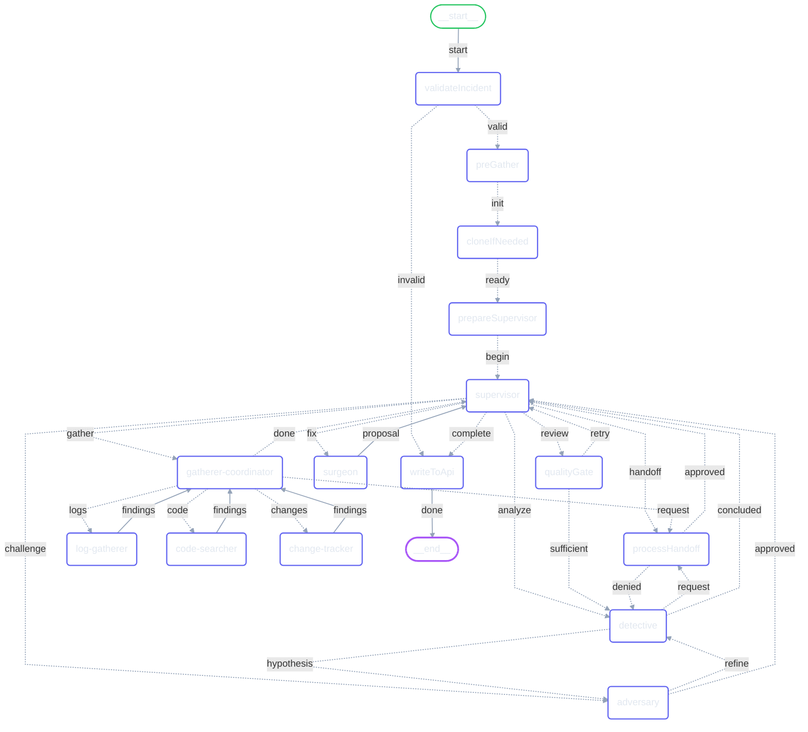

# @prismalens/agents - Generated Documentation

> Auto-generated on 2026-02-03 | Regenerate: `pnpm docs:generate`

**19 tools** | **20 skills** | **9 state fields**

## Graph Structure

## State Schema

| Field | Type | Description |
|-------|------|-------------|
| `investigationId` | `string` | Unique investigation identifier |
| `incidentId` | `string` | Incident being investigated |
| `phase` | `SupervisorPhase` | Current workflow phase (gathering, analyzing, fixing, complete) |
| `findings` | `Finding[]` | Evidence from gatherer agents |
| `hypotheses` | `Hypothesis[]` | Root cause hypotheses from Detective |
| `recommendations` | `Recommendation[]` | Fix proposals from Surgeon |
| `fix` | `Fix` | Final fix proposal |
| `status` | `string` | Workflow status (pending, running, completed, failed) |
| `confidence` | `number` | Overall confidence score (0-100) |

## Tools

### Detective (7)

| Tool | Description |
|------|-------------|
| `form_hypothesis` | Form a root cause hypothesis with supporting evidence. |
| `evaluate_hypothesis` | Re-evaluate an existing hypothesis based on new evidence. |
| `correlate_with_changes` | Correlate an incident with recent changes to identify cha... |
| `find_similar_incidents` | Find historically similar incidents to leverage past reso... |
| `request_more_data` | Request additional data from a specific gatherer when cur... |
| `analyze_findings` | Structure your analysis of gathered findings. |
| `correlate_events` | Correlate events to find temporal patterns. |

Tool parameters

- **form_hypothesis**: `claim` (string), `confidence` (number), `evidence` (array), `category` (string)
- **evaluate_hypothesis**: `hypothesisIndex` (number), `newConfidence` (number), `additionalEvidence` (array), `rejected` (boolean), `rejectionReason` (string)
- **correlate_with_changes**: `incidentTime` (string), `changes` (array)
- **find_similar_incidents**: `currentIncident` (object), `historicalIncidents` (array)
- **request_more_data**: `gatherer` (string), `query` (string), `reason` (string)
- **analyze_findings**: `findingsToAnalyze` (array), `analysisType` (string), `context` (string)
- **correlate_events**: `events` (array), `windowMinutes` (number)

### Surgeon (5)

| Tool | Description |
|------|-------------|
| `propose_fix` | Propose a fix or recommendation based on the root cause a... |
| `validate_code_change` | Validate a proposed code change by checking if the search... |
| `suggest_rollback` | Quickly suggest rolling back a deployment when evidence p... |
| `lookup_runbook` | Search runbooks and documentation for remediation steps r... |
| `assess_change_risk` | Assess the risk level of a proposed change before impleme... |

Tool parameters

- **propose_fix**: `title` (string), `description` (string), `priority` (string), `category` (string), `urgency` (string), `estimatedEffort` (string), `codeChanges` (array)
- **validate_code_change**: `recommendationIndex` (number), `codeChangeIndex` (number), `searchFound` (boolean), `syntaxValid` (boolean), `notes` (string)
- **suggest_rollback**: `service` (string), `deploymentId` (string), `commitSha` (string), `reason` (string)
- **lookup_runbook**: `query` (string), `category` (string), `service` (string)
- **assess_change_risk**: `changeTitle` (string), `category` (string), `filesAffected` (number), `servicesAffected` (array), `isReversible` (boolean), `hasTests` (boolean), `blastRadiusScope` (string)

### Adversary (3)

| Tool | Description |
|------|-------------|
| `challenge_hypothesis` | Challenge a hypothesis using Socratic questioning and evi... |
| `refine_hypothesis` | Propose a refined version of a hypothesis based on challe... |
| `pattern_match` | Match text against known incident patterns to find releva... |

Tool parameters

- **challenge_hypothesis**: `hypothesisId` (string), `originalConfidence` (number), `originalEvidenceCount` (number), `challenges` (array), `alternativeHypotheses` (array), `recommendedConfidenceAdjustment` (number), `skillsUsed` (array)
- **refine_hypothesis**: `hypothesisId` (string), `originalClaim` (string), `refinedClaim` (string), `refinedConfidence` (number), `additionalEvidence` (array), `refinementReason` (string)
- **pattern_match**: `text` (string), `categories` (array)

### Gatherers (4)

| Tool | Description |
|------|-------------|
| `repo_read_file` | Read contents of a file from the local repository. |
| `repo_list_directory` | List contents of a directory in the local repository. |
| `repo_search_text` | Search for text pattern in repository files. |
| `repo_get_file_info` | Get metadata about a file or directory in the repository. |

Tool parameters

- **repo_read_file**: `filePath` (string)
- **repo_list_directory**: `dirPath` (string), `recursive` (boolean)
- **repo_search_text**: `pattern` (string), `fileExtension` (string), `dirPath` (string)
- **repo_get_file_info**: `filePath` (string)

## Skills

### Adversary (2)

`hypothesis-challenge` | `knowledge-search`

Skill descriptions

- **hypothesis-challenge**: Challenge hypotheses to strengthen root cause analysis using Socratic questio...
- **knowledge-search**: Search organizational knowledge for evidence to support or contradict hypothe...

### Gatherer (6)

`code-search` | `code-structure` | `dependency-trace` | `deployment-check` | `log-analysis` | `recent-commits`

Skill descriptions

- **code-search**: Searches the codebase for error origins, patterns, and relevant code sections...
- **code-structure**: Analyzes code structure using AST-based tools to find function definitions, u...
- **dependency-trace**: Traces file dependencies to find related code that might be the actual error ...
- **deployment-check**: Checks deployment status, health, and recent deployment history to identify d...
- **log-analysis**: Fetches and analyzes logs from deployment/observability platforms to identify...
- **recent-commits**: Retrieves and analyzes recent git commits to identify changes that may have c...

### Detective (7)

`change-correlation` | `cross-service-analysis` | `error-origin-trace` | `hypothesis-formation` | `incident-similarity` | `pattern-correlation` | `timeline-analysis`

Skill descriptions

- **change-correlation**: Correlates incidents with recent changes (deployments, config, code) to ident...
- **cross-service-analysis**: Analyzes errors across multiple services to find cascade origins in distribut...
- **error-origin-trace**: Traces an error back to its actual source using MCP-based code analysis.
- **hypothesis-formation**: Forms and validates root cause hypotheses based on gathered evidence, assigni...
- **incident-similarity**: Finds historically similar incidents to leverage past resolutions and patterns.
- **pattern-correlation**: Correlates patterns across multiple data sources (logs, metrics, code changes...
- **timeline-analysis**: Builds a chronological timeline of events leading to and during the incident ...

### Surgeon (5)

`code-fix` | `config-change` | `risk-assessment` | `rollback-proposal` | `runbook-lookup`

Skill descriptions

- **code-fix**: Proposes specific code changes with search/replace blocks to fix identified b...
- **config-change**: Recommends configuration changes (environment variables, feature flags, thres...
- **risk-assessment**: Assesses the risk level of proposed changes and provides blast radius analysi...
- **rollback-proposal**: Recommends deployment rollbacks when a recent deployment is identified as the...
- **runbook-lookup**: Searches runbooks and documentation for relevant remediation steps and past s...

